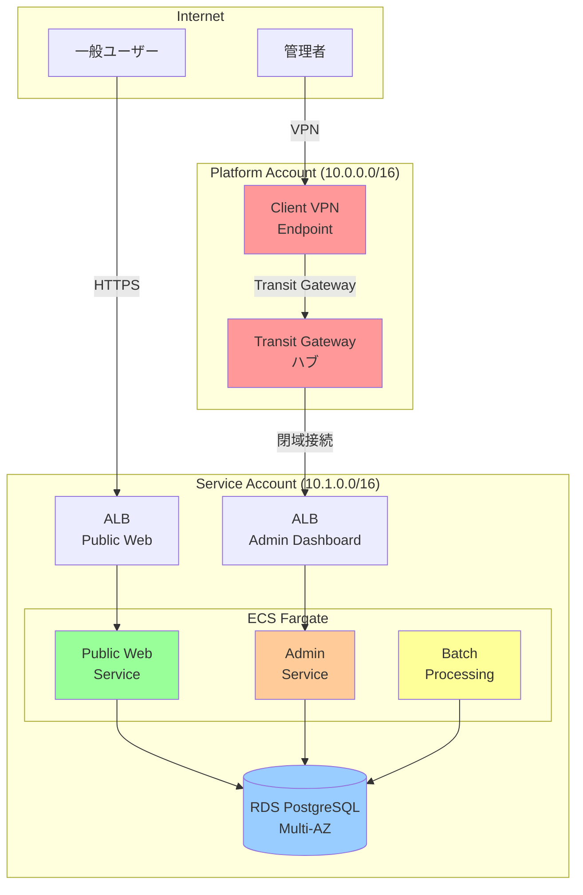
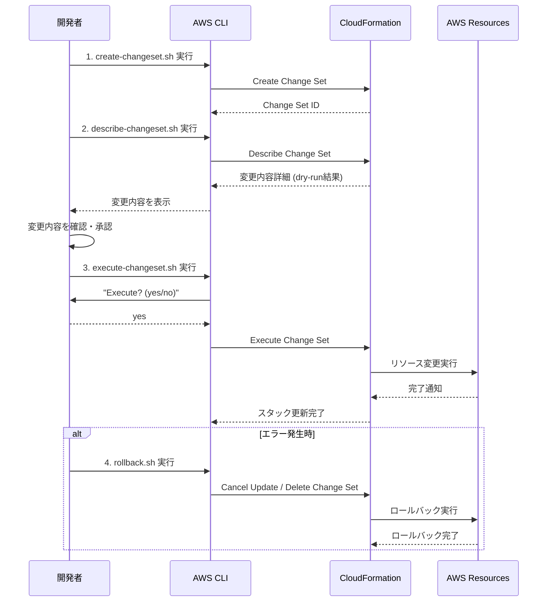

# 00_概要

> AWS Multi-Account Sample Application - システム概要

**作成日**: 2025-10-24 (Round 3)
**バージョン**: 3.0

---

## 1. システム概要

### 1.1 システムの目的

本システムは、AWS Multi-Account構成とTransit Gatewayによる拠点間閉域接続の技術検証を目的とした、社内向け技術デモ・PoC用のリファレンスアーキテクチャです。

**主な検証項目**:
- Transit Gateway による拠点間閉域接続
- Multi-Account 構成 (Platform Account + Service Account)
- 3サービス構成 (Public Web / Admin Dashboard / Batch Processing)
- CloudFormation による Infrastructure as Code
- **Change Set による段階的デプロイフロー** (⭐⭐⭐ Round 3 重点)

### 1.2 システム全体像

### 1.3 アーキテクチャ方針

#### 1.3.1 責任分離原則

**Platform Account (共通基盤)**:
- Shared VPC (10.0.0.0/16)
- Transit Gateway (拠点間接続ハブ)
- Client VPN (管理者アクセス)

**Service Account (アプリケーション基盤)**:
- Service VPC (10.1.0.0/16)
- RDS PostgreSQL (アプリケーションDB)
- ECS Fargate (3サービス)
- Application Load Balancer

#### 1.3.2 スタック分割原則

**Platform Account スタック**:
1. `platform-network`: VPC, Subnets, IGW, NAT GW
2. `platform-tgw`: Transit Gateway, RAM Share

**Service Account スタック**:
1. `service-network`: VPC, Subnets, NAT GW, TGW Attachment
2. `service-database`: RDS PostgreSQL (Multi-AZ)
3. `service-compute`: ECS Cluster, Task Definition, Service, ALB
4. `service-monitoring`: CloudWatch Alarms, Dashboard

#### 1.3.3 段階的デプロイ原則 (⭐⭐⭐ Round 3 重点)

CloudFormation Change Set を使った安全なデプロイフロー:

**メリット**:
- **dry-run**: 本番適用前に変更内容を確認可能
- **承認プロセス**: ユーザー確認後に実行
- **ロールバック**: 問題発生時に即座に復旧

---

## 2. 3サービス構成

### 2.1 Public Web App (一般ユーザー向け)

**アクセス経路**: インターネット → ALB (HTTPS) → ECS Fargate

**用途**:
- 商品一覧表示
- 商品詳細表示
- 注文作成

**ポート**: 443 (HTTPS)

### 2.2 Admin Dashboard (管理者向け)

**アクセス経路**: Client VPN → Transit Gateway → Service VPC → ALB → ECS Fargate

**用途**:
- システム管理操作
- データ管理
- レポート閲覧

**ポート**: VPN経由のみ (インターネット直接アクセス不可)

### 2.3 Batch Processing (バッチ処理)

**アクセス経路**: ECS Scheduled Task (EventBridge)

**用途**:
- データ集計
- レポート生成
- データクレンジング

**実行タイミング**: 定期実行 (例: 毎日深夜1時)

---

## 3. 技術スタック

### 3.1 Infrastructure

| カテゴリ | 技術 | バージョン | 備考 |
|---------|------|-----------|------|
| IaC | CloudFormation | - | **Change Set 使用** ⭐⭐⭐ |
| ネットワーク | VPC, Transit Gateway | - | Multi-Account 構成 |
| VPN | Client VPN | - | 管理者アクセス用 |
| コンテナ | ECS Fargate | - | サーバーレス実行 |
| データベース | RDS PostgreSQL | 15 | Multi-AZ 構成 |
| ロードバランサー | ALB | - | HTTPS 終端 |
| 監視 | CloudWatch | - | Alarms + Dashboard |

### 3.2 Application

| カテゴリ | 技術 | バージョン | 備考 |
|---------|------|-----------|------|
| ランタイム | Node.js | 20 | LTS |
| パッケージマネージャー | npm | - | workspaces (モノレポ) |
| コンテナ | Docker | - | Multi-stage build |

---

## 4. 性能目標

| 項目 | 目標値 | 測定方法 |
|------|--------|----------|
| レスポンスタイム | 2秒以内 | ALB → ECS → RDS 往復 |
| ネットワークレイテンシ | 50ms以内 | Transit Gateway 経由通信 |
| 同時接続数 | 100接続 | 負荷テスト (Artillery) |
| 可用性 | 99% | Multi-AZ 構成 |

---

## 5. セキュリティ方針

### 5.1 ネットワークセキュリティ

- **最小権限の原則**: セキュリティグループで必要最小限のポート開放
- **閉域接続**: 管理系は VPN 経由のみ
- **Multi-AZ**: 高可用性確保

### 5.2 データ保護

- **通信暗号化**: ALB で TLS 1.2以上
- **保存データ暗号化**: RDS AES-256、EBS 暗号化

### 5.3 監査・ログ

- CloudWatch Logs (アプリケーションログ)
- ALB Access Logs (S3保存)
- VPC Flow Logs (CloudWatch Logs保存)

**参照**: `06_セキュリティ設計.md`, `.claude/docs/40_standards/49_security.md`

---

## 6. 非機能要件対応

| 非機能要件 | 対応方針 | 備考 |
|-----------|---------|------|
| 可用性 | Multi-AZ 構成 | VPC, RDS, ALB |
| スケーラビリティ | ECS Auto Scaling | CPU 70% でスケールアウト |
| 保守性 | CloudFormation | Infrastructure as Code |
| 監視性 | CloudWatch | Alarms + Dashboard |
| セキュリティ | VPN閉域接続 | 管理系は VPN経由のみ |

**参照**: `12_非機能要件対応.md`

---

## 7. プロジェクト情報

### 7.1 プロジェクト目標

- Transit Gateway 技術検証
- Multi-Account 構成ベストプラクティス確立
- CloudFormation 実装パターン確立
- **Change Set デプロイフロー確立** (⭐⭐⭐ Round 3 目標)

### 7.2 成功基準

| 項目 | 目標 | Round 3 目標 |
|------|------|-------------|
| 基本設計書 | 13/13章 | 13/13章 ✅ |
| CloudFormation | スタック分割 | スタック分割 ✅ |
| Change Set 対応 | - | **4スクリプト生成** ⭐⭐⭐ |
| デプロイ手順書 | - | **Change Set 手順記載** ⭐⭐⭐ |

---

## 8. 参照ドキュメント

### 8.1 企画・要件

- [企画書](../../01_企画書.md)
- [要件定義書](../../02_要件定義書.md)

### 8.2 技術標準

- `.claude/docs/40_standards/45_cloudformation.md` (CloudFormation 3 Principles)
- `.claude/docs/40_standards/47_python.md` (Python コーディング規約)
- `.claude/docs/40_standards/49_security.md` (セキュリティ・運用基準)

### 8.3 Round 1, 2 成果物

- Round 1: `.aidev-temp/test/round1/`
- Round 2: `.aidev-temp/test/round2/`

---

## 9. Round 3 の重点項目

### 9.1 Change Set デプロイフロー実装 (⭐⭐⭐最重要)

**目標**: CloudFormation 3 Principles の「段階的デプロイ原則」を完全実装

**生成すべきスクリプト**:
1. `scripts/create-changeset.sh` - Change Set 作成 (dry-run)
2. `scripts/describe-changeset.sh` - 変更内容確認
3. `scripts/execute-changeset.sh` - ユーザー承認後に実行
4. `scripts/rollback.sh` - ロールバック処理

**詳細**: [09_インフラ設計・コスト設計.md](./09_インフラ設計・コスト設計.md)

---

**次章**: [01_制約事項・前提条件.md](./01_制約事項・前提条件.md)
