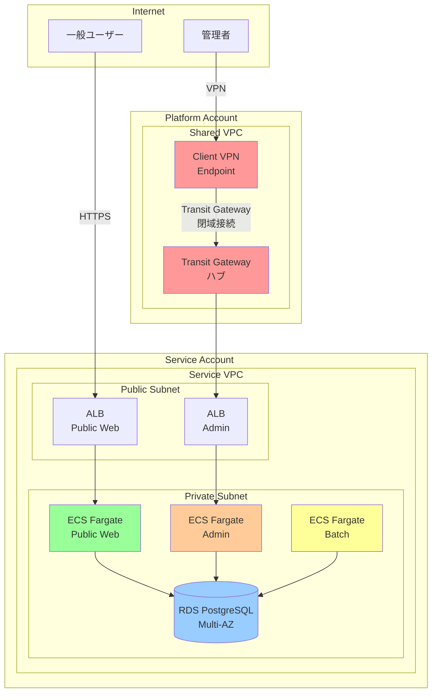

# 02_アーキテクチャ設計

> AWS Multi-Account Sample Application - アーキテクチャ設計

**作成日**: 2025-10-24 (Round 3)
**バージョン**: 3.0

---

## 1. アーキテクチャ全体像

### 1.1 論理アーキテクチャ



### 1.2 Multi-Account 構成

**責任分離原則**:

| Account | 責務 | 主要リソース | 管理者 |
|---------|------|-------------|--------|
| Platform Account | 共通ネットワーク基盤 | Shared VPC, Transit Gateway, Client VPN | ネットワーク管理者 |
| Service Account | アプリケーション基盤 | Service VPC, ECS, RDS, ALB | アプリケーション管理者 |

**メリット**:
- 責任範囲の明確化
- 障害影響範囲の分離
- セキュリティ境界の明確化
- 将来的な拡張性 (複数 Service Account 追加可能)

---

## 2. ネットワークアーキテクチャ

### 2.1 VPC 設計

#### 2.1.1 Platform VPC (10.0.0.0/16)

**用途**: 共通ネットワーク基盤

| サブネット | CIDR | AZ | タイプ | 用途 |
|-----------|------|----|--------|------|
| platform-public-1a | 10.0.1.0/24 | ap-northeast-1a | Public | NAT GW, VPN Endpoint |
| platform-public-1c | 10.0.2.0/24 | ap-northeast-1c | Public | NAT GW |
| platform-private-1a | 10.0.11.0/24 | ap-northeast-1a | Private | 将来拡張用 |
| platform-private-1c | 10.0.12.0/24 | ap-northeast-1c | Private | 将来拡張用 |

#### 2.1.2 Service VPC (10.1.0.0/16)

**用途**: アプリケーション基盤

| サブネット | CIDR | AZ | タイプ | 用途 |
|-----------|------|----|--------|------|
| service-public-1a | 10.1.1.0/24 | ap-northeast-1a | Public | ALB |
| service-public-1c | 10.1.2.0/24 | ap-northeast-1c | Public | ALB (Multi-AZ) |
| service-private-1a | 10.1.11.0/24 | ap-northeast-1a | Private | ECS, RDS Primary |
| service-private-1c | 10.1.12.0/24 | ap-northeast-1c | Private | ECS, RDS Standby |

### 2.2 Transit Gateway 設計

#### 2.2.1 Transit Gateway 仕様

| 項目 | 設定値 | 備考 |
|------|--------|------|
| Amazon Side ASN | 64512 | AWS 推奨値 |
| DNS Support | enable | VPC 間名前解決 |
| Default Route Table Association | enable | 自動ルート伝播 |
| Default Route Table Propagation | enable | 自動ルート伝播 |

#### 2.2.2 VPC Attachment

| VPC | Account | Subnet | 備考 |
|-----|---------|--------|------|
| Platform VPC | Platform Account | platform-private-1a, 1c | TGW 所有者 |
| Service VPC | Service Account | service-private-1a, 1c | RAM Share 経由で接続 |

#### 2.2.3 ルートテーブル

**Platform VPC Route Table** (Private Subnet):
| Destination | Target | 備考 |
|-------------|--------|------|
| 10.0.0.0/16 | local | VPC 内通信 |
| 10.1.0.0/16 | Transit Gateway | Service VPC へ |
| 0.0.0.0/0 | NAT Gateway | インターネット |

**Service VPC Route Table** (Private Subnet):
| Destination | Target | 備考 |
|-------------|--------|------|
| 10.1.0.0/16 | local | VPC 内通信 |
| 10.0.0.0/16 | Transit Gateway | Platform VPC へ |
| 0.0.0.0/0 | NAT Gateway | インターネット |

---

## 3. 代替案・トレードオフ分析 (⭐⭐⭐必須)

### 3.1 トレードオフ1: Transit Gateway vs VPC Peering

#### 3.1.1 選択肢

**選択肢A: Transit Gateway** (⭐採用)
- Hub-and-Spoke 型ネットワーク
- 複数 VPC 間接続のハブとして機能
- スケーラブルなネットワーク設計

**選択肢B: VPC Peering**
- VPC 間を1対1で接続
- シンプルな構成
- 低コスト

#### 3.1.2 比較表

| 項目 | Transit Gateway | VPC Peering | 評価 |
|------|----------------|-------------|------|
| **コスト (月額)** | $72 ($36 × 2 Attachments) | $0 (データ転送のみ) | VPC Peering 優位 |
| **スケーラビリティ** | 最大 5,000 VPC 接続 | N対N で接続数爆発 | Transit Gateway 優位 |
| **管理性** | 一元管理 | 個別管理 (N×(N-1)/2 接続) | Transit Gateway 優位 |
| **将来拡張性** | Service Account 追加容易 | 接続数爆発 | Transit Gateway 優位 |
| **レイテンシ** | 1-2ms 追加 | ほぼゼロ | VPC Peering 優位 |
| **設定複雑性** | 中程度 | シンプル | VPC Peering 優位 |

#### 3.1.3 コスト詳細

**Transit Gateway コスト** (ap-northeast-1):
- Transit Gateway 時間料金: $0.05/時間 = $36/月
- VPC Attachment 料金: $0.05/時間 × 2 = $72/月 (Platform + Service)
- データ転送料金: $0.02/GB
- **合計**: 約 $72/月 + データ転送量

**VPC Peering コスト**:
- 接続料金: $0
- データ転送料金: $0.01/GB (同一 AZ), $0.02/GB (異なる AZ)
- **合計**: データ転送量のみ

#### 3.1.4 決定理由

**採用**: Transit Gateway ⭐

**理由**:
1. **将来拡張性**: Service Account を追加する際、VPC Peering では接続数が爆発的に増加 (N×(N-1)/2)
2. **管理性**: 一元管理により運用負荷軽減
3. **技術検証目的**: Transit Gateway の実装パターン確立が本プロジェクトの目的
4. **コスト許容**: 検証用のため月額 $72 は許容範囲
5. **Hub-and-Spoke**: Client VPN からのアクセス経路を一元化

**トレードオフ**:
- コスト増加 (月額 $72) を受け入れ、将来拡張性と管理性を優先

---

### 3.2 トレードオフ2: RDS PostgreSQL vs Aurora PostgreSQL

#### 3.2.1 選択肢

**選択肢A: RDS PostgreSQL** (⭐採用)
- 従来型 RDS
- シンプルな構成
- 低コスト

**選択肢B: Aurora PostgreSQL**
- AWS 独自 DB エンジン
- 高性能・高可用性
- ストレージ自動スケーリング

#### 3.2.2 比較表

| 項目 | RDS PostgreSQL | Aurora PostgreSQL | 評価 |
|------|---------------|-------------------|------|
| **コスト (月額)** | $50 (db.t3.medium) | $100 (db.t3.medium × 2) | RDS 優位 |
| **性能** | 標準 | 3-5倍高速 (AWS 公称) | Aurora 優位 |
| **可用性** | Multi-AZ (自動フェイルオーバー) | 自動フェイルオーバー (10-30秒) | Aurora 優位 |
| **ストレージ** | 手動スケーリング | 自動スケーリング (10GB単位) | Aurora 優位 |
| **バックアップ** | 自動バックアップ (7日) | 継続的バックアップ | Aurora 優位 |
| **学習コスト** | 低 (PostgreSQL 標準) | 中 (Aurora 固有機能) | RDS 優位 |
| **リードレプリカ** | 最大 5個 | 最大 15個 | Aurora 優位 |

#### 3.2.3 コスト詳細

**RDS PostgreSQL コスト** (ap-northeast-1):
- db.t3.medium (2 vCPU, 4GB RAM): $0.068/時間
- Multi-AZ: $0.068/時間 × 2 = $0.136/時間
- **月額**: $0.136 × 730時間 ≈ **$99** (約¥15,000)

**Aurora PostgreSQL コスト**:
- db.t3.medium × 2 (Primary + Replica): $0.082/時間 × 2 = $0.164/時間
- ストレージ: $0.10/GB/月
- I/O: $0.20/100万リクエスト
- **月額**: $0.164 × 730時間 ≈ **$120** + ストレージ + I/O (約¥20,000)

#### 3.2.4 決定理由

**採用**: RDS PostgreSQL ⭐

**理由**:
1. **コスト**: 検証用のため低コスト優先 (月額 $99 vs $120)
2. **十分な性能**: 検証用トラフィック (100ユーザー程度) では RDS で十分
3. **シンプルさ**: PostgreSQL 標準機能のみで学習コスト低減
4. **Multi-AZ**: RDS Multi-AZ で十分な可用性確保
5. **検証目的**: Aurora 固有機能の検証は本プロジェクトの目的外

**トレードオフ**:
- 性能・可用性の向上を犠牲に、コストとシンプルさを優先

**将来的な移行パス**:
- 本番運用時は Aurora への移行を検討
- RDS → Aurora の移行は比較的容易 (スナップショット復元)

---

### 3.3 トレードオフ3: ECS EC2 vs ECS Fargate

#### 3.3.1 選択肢

**選択肢A: ECS EC2**
- EC2 インスタンス上でコンテナ実行
- インスタンス管理が必要
- コスト効率が高い (大規模時)

**選択肢B: ECS Fargate** (⭐採用)
- サーバーレスコンテナ実行
- インスタンス管理不要
- オンデマンド課金

#### 3.3.2 比較表

| 項目 | ECS EC2 | ECS Fargate | 評価 |
|------|---------|-------------|------|
| **コスト (小規模)** | $30/月 (t3.small × 2) | $50/月 (0.25 vCPU × 3 タスク) | EC2 優位 |
| **コスト (大規模)** | スケールメリット大 | 割高 | EC2 優位 |
| **管理負荷** | EC2 管理必要 (OS パッチ等) | 管理不要 | Fargate 優位 |
| **スケーラビリティ** | Auto Scaling 設定必要 | 自動スケール | Fargate 優位 |
| **起動時間** | 数分 (インスタンス起動) | 数秒 (コンテナ起動) | Fargate 優位 |
| **リソース効率** | 複数コンテナ配置可能 | タスクごと課金 | EC2 優位 |
| **学習コスト** | 高 (EC2 + ECS 知識必要) | 低 (ECS のみ) | Fargate 優位 |

#### 3.3.3 コスト詳細

**ECS EC2 コスト** (ap-northeast-1):
- t3.small (2 vCPU, 2GB RAM) × 2 (Multi-AZ): $0.0208/時間 × 2
- **月額**: $0.0416 × 730時間 ≈ **$30** (約¥4,500)

**ECS Fargate コスト**:
- 0.25 vCPU, 0.5GB RAM × 3 タスク: $0.01238/時間 × 3
- **月額**: $0.03714 × 730時間 ≈ **$27** (約¥4,000)

**注**: タスク数が増えると Fargate の方が割高になる傾向

#### 3.3.4 決定理由

**採用**: ECS Fargate ⭐

**理由**:
1. **管理負荷軽減**: OS パッチ、セキュリティ管理が不要
2. **学習コスト**: ECS のみ習得で済む (EC2 管理知識不要)
3. **スケーラビリティ**: タスクレベルでの自動スケール
4. **起動速度**: 数秒でスケールアウト可能
5. **検証目的**: コンテナ技術検証が主目的、インフラ管理は最小化したい
6. **小規模構成**: 3サービス × 1タスク程度ではコスト差が小さい

**トレードオフ**:
- 大規模化時のコスト増加を受け入れ、管理負荷軽減とシンプルさを優先

**将来的な移行パス**:
- 大規模化時は ECS EC2 への移行を検討
- コスト試算: タスク数 10個以上で EC2 が有利

---

### 3.4 トレードオフ4: Change Set Deploy vs Direct Deploy (⭐⭐⭐ Round 3 追加)

#### 3.4.1 選択肢

**選択肢A: Direct Deploy** (Round 1, 2 で使用)
- `aws cloudformation deploy` で直接デプロイ
- シンプルな実行
- 変更内容の事前確認なし

**選択肢B: Change Set Deploy** (⭐Round 3 で採用)
- Change Set 作成 → 確認 → 実行
- dry-run で変更内容を事前確認
- ユーザー承認プロセス

#### 3.4.2 比較表

| 項目 | Direct Deploy | Change Set Deploy | 評価 |
|------|--------------|-------------------|------|
| **安全性** | 低 (いきなり変更) | 高 (事前確認可能) | Change Set 優位 |
| **実行速度** | 速い (1ステップ) | 遅い (3ステップ) | Direct 優位 |
| **変更内容確認** | 不可 | 可能 (dry-run) | Change Set 優位 |
| **ロールバック** | 手動 (スタック削除) | 容易 (Change Set 削除) | Change Set 優位 |
| **学習コスト** | 低 (簡単) | 中 (3スクリプト理解必要) | Direct 優位 |
| **本番運用適性** | 低 (リスク高) | 高 (安全性確保) | Change Set 優位 |

#### 3.4.3 実装コスト

**Direct Deploy**:
```bash
# 1スクリプトのみ
aws cloudformation deploy \
  --template-file template.yaml \
  --stack-name my-stack \
  --parameter-overrides Environment=dev
```

**Change Set Deploy**:
```bash
# 4スクリプト必要
1. create-changeset.sh   # Change Set 作成
2. describe-changeset.sh # 変更内容確認
3. execute-changeset.sh  # ユーザー承認 + 実行
4. rollback.sh           # ロールバック
```

**実装工数**:
- Direct Deploy: 1時間
- Change Set Deploy: 4時間

#### 3.4.4 決定理由

**採用**: Change Set Deploy ⭐⭐⭐

**理由**:
1. **CloudFormation 3 Principles 準拠**: 原則3「段階的デプロイ原則」必須
2. **安全性**: 本番環境を想定した安全なデプロイフロー
3. **dry-run**: 変更内容を事前確認することで、意図しない削除を防止
4. **ユーザー承認**: 人間の判断を介在させることでミス防止
5. **ロールバック**: Change Set 削除で即座に元に戻せる
6. **技術検証目的**: Change Set デプロイフローの確立が Round 3 の目標
7. **ベストプラクティス**: AWS 推奨のデプロイ方法

**トレードオフ**:
- 実装工数増加 (4時間) を受け入れ、安全性と本番運用適性を優先
- 実行速度低下 (3ステップ) を受け入れ、事前確認プロセスを導入

**重要性**: ⭐⭐⭐ (Round 3 の最重要項目)

**詳細設計**: [09_インフラ設計・コスト設計.md](./09_インフラ設計・コスト設計.md) の「Change Set デプロイフロー設計」を参照

---

## 4. コンピュートアーキテクチャ

### 4.1 ECS Fargate 設計

#### 4.1.1 クラスター構成

| クラスター名 | Account | 用途 |
|------------|---------|------|
| service-cluster | Service Account | 3サービス実行 |

#### 4.1.2 サービス別 Task Definition

**Public Web Service**:
| 項目 | 設定値 |
|------|--------|
| CPU | 0.25 vCPU |
| Memory | 0.5 GB |
| Desired Count | 2 (Multi-AZ) |
| Image | {account-id}.dkr.ecr.ap-northeast-1.amazonaws.com/public-web:latest |
| Port | 3000 |

**Admin Service**:
| 項目 | 設定値 |
|------|--------|
| CPU | 0.25 vCPU |
| Memory | 0.5 GB |
| Desired Count | 1 |
| Image | {account-id}.dkr.ecr.ap-northeast-1.amazonaws.com/admin:latest |
| Port | 3001 |

**Batch Service**:
| 項目 | 設定値 |
|------|--------|
| CPU | 0.25 vCPU |
| Memory | 0.5 GB |
| Schedule | cron(0 1 * * ? *) (毎日深夜1時) |
| Image | {account-id}.dkr.ecr.ap-northeast-1.amazonaws.com/batch:latest |

### 4.2 Auto Scaling 設計

**Target Tracking Scaling Policy**:
| メトリクス | 目標値 | スケールアウト閾値 | スケールイン閾値 |
|----------|--------|------------------|----------------|
| CPU 使用率 | 70% | 70% 超過 | 50% 未満 |
| Memory 使用率 | 80% | 80% 超過 | 60% 未満 |

**スケール範囲**:
- Min: 1 タスク
- Max: 10 タスク
- Desired: 2 タスク

---

## 5. データベースアーキテクチャ

### 5.1 RDS PostgreSQL 設計

| 項目 | 設定値 | 備考 |
|------|--------|------|
| エンジン | PostgreSQL 15 | 最新安定版 |
| インスタンスクラス | db.t3.medium | 2 vCPU, 4GB RAM |
| Multi-AZ | 有効 | Primary (1a), Standby (1c) |
| ストレージ | 50GB (gp3) | 自動拡張有効 |
| 暗号化 | 有効 (AES-256) | KMS 管理キー |
| バックアップ | 7日間保持 | 自動バックアップ |
| メンテナンスウィンドウ | 日曜 3:00-4:00 | 影響最小化 |

### 5.2 接続プール設計

**pgBouncer** (アプリケーション側):
- Pool Size: 20 接続
- Max Client Connections: 100
- Pool Mode: transaction

---

## 6. ロードバランサーアーキテクチャ

### 6.1 ALB 設計

#### 6.1.1 Public Web ALB

| 項目 | 設定値 |
|------|--------|
| スキーム | internet-facing |
| サブネット | service-public-1a, 1c |
| セキュリティグループ | alb-public-sg (443 from 0.0.0.0/0) |
| リスナー | HTTPS:443 → ECS Fargate (3000) |
| ヘルスチェック | GET /health (30秒間隔) |

#### 6.1.2 Admin ALB

| 項目 | 設定値 |
|------|--------|
| スキーム | internal |
| サブネット | service-private-1a, 1c |
| セキュリティグループ | alb-admin-sg (443 from 10.0.0.0/16) |
| リスナー | HTTPS:443 → ECS Fargate (3001) |
| ヘルスチェック | GET /health (30秒間隔) |

---

## 7. CloudFormation スタック構成 (⭐⭐⭐ Round 3 重点)

### 7.1 スタック分割戦略

**Platform Account**:
```
platform-network
  ├── VPC (10.0.0.0/16)
  ├── Subnets (Public/Private × Multi-AZ)
  ├── Internet Gateway
  ├── NAT Gateway × 2
  └── Outputs: VpcId, SubnetIds

platform-tgw
  ├── Transit Gateway
  ├── RAM Resource Share
  └── Outputs: TransitGatewayId
```

**Service Account**:
```
service-network
  ├── VPC (10.1.0.0/16)
  ├── Subnets (Public/Private × Multi-AZ)
  ├── NAT Gateway × 2
  ├── Transit Gateway Attachment (ImportValue: TransitGatewayId)
  └── Outputs: VpcId, SubnetIds

service-database
  ├── RDS PostgreSQL (Multi-AZ)
  ├── DB Subnet Group
  └── Outputs: DBEndpoint, DBPort

service-compute
  ├── ECS Cluster
  ├── Task Definition × 3 (Public/Admin/Batch)
  ├── ECS Service × 2 (Public/Admin)
  ├── ALB × 2 (Public/Admin)
  └── Outputs: ALBEndpoints

service-monitoring
  ├── CloudWatch Alarms
  ├── CloudWatch Dashboard
  └── SNS Topics
```

### 7.2 Change Set デプロイフロー (⭐⭐⭐ Round 3 重点)

**デプロイ順序**:
```
1. Platform Account
   create-changeset.sh platform-network → describe → execute
   ↓
   create-changeset.sh platform-tgw → describe → execute

2. Service Account
   create-changeset.sh service-network → describe → execute
   ↓
   create-changeset.sh service-database → describe → execute
   ↓
   create-changeset.sh service-compute → describe → execute
   ↓
   create-changeset.sh service-monitoring → describe → execute
```

**詳細**: [09_インフラ設計・コスト設計.md](./09_インフラ設計・コスト設計.md)

---

## 8. セキュリティアーキテクチャ

### 8.1 セキュリティグループ設計

| SG 名 | ソース | ポート | 宛先 | 用途 |
|-------|-------|--------|------|------|
| alb-public-sg | 0.0.0.0/0 | 443 | - | Public Web ALB |
| alb-admin-sg | 10.0.0.0/16 | 443 | - | Admin ALB (VPN 経由のみ) |
| ecs-public-sg | alb-public-sg | 3000 | - | Public Web ECS |
| ecs-admin-sg | alb-admin-sg | 3001 | - | Admin ECS |
| ecs-batch-sg | - | - | RDS | Batch ECS |
| rds-sg | ecs-*-sg | 5432 | - | RDS PostgreSQL |

**最小権限の原則**: 必要最小限のポートのみ開放

### 8.2 VPN セキュリティ

**Client VPN 設計**:
- 認証方式: 相互認証 (サーバー証明書 + クライアント証明書)
- プロトコル: OpenVPN (UDP 1194)
- Split Tunnel: 無効 (全トラフィック VPN 経由)

---

## 9. 監視アーキテクチャ

### 9.1 CloudWatch 統合監視

**監視対象**:
- ECS Fargate (CPU/メモリ使用率、タスク数)
- RDS PostgreSQL (CPU/接続数/ストレージ/レプリケーションラグ)
- ALB (リクエスト数/エラー率/レスポンスタイム/ターゲット異常数)
- Transit Gateway (パケット数/ドロップ数)

**詳細**: [08_運用設計.md](./08_運用設計.md)

---

## 10. アーキテクチャ原則まとめ

### 10.1 設計原則

1. **責任分離**: Platform / Service Account 分離
2. **スタック分割**: Network / Database / Compute / Monitoring 分離
3. **段階的デプロイ**: Change Set 使用 (⭐⭐⭐ Round 3 重点)
4. **最小権限**: セキュリティグループで必要最小限のポート開放
5. **Multi-AZ**: すべてのリソースを Multi-AZ 構成

### 10.2 トレードオフまとめ

| トレードオフ | 採用 | 犠牲にしたもの | 優先したもの |
|------------|------|--------------|------------|
| Transit Gateway vs VPC Peering | Transit Gateway | コスト ($72/月) | 将来拡張性、管理性 |
| RDS vs Aurora | RDS PostgreSQL | 性能、高可用性 | コスト、シンプルさ |
| EC2 vs Fargate | ECS Fargate | 大規模時のコスト効率 | 管理負荷軽減、学習コスト |
| Direct vs Change Set | Change Set Deploy | 実行速度、実装工数 | 安全性、本番運用適性 ⭐⭐⭐ |

---

**前章**: [01_制約事項・前提条件.md](./01_制約事項・前提条件.md)
**次章**: [03_システム構成図.md](./03_システム構成図.md)
