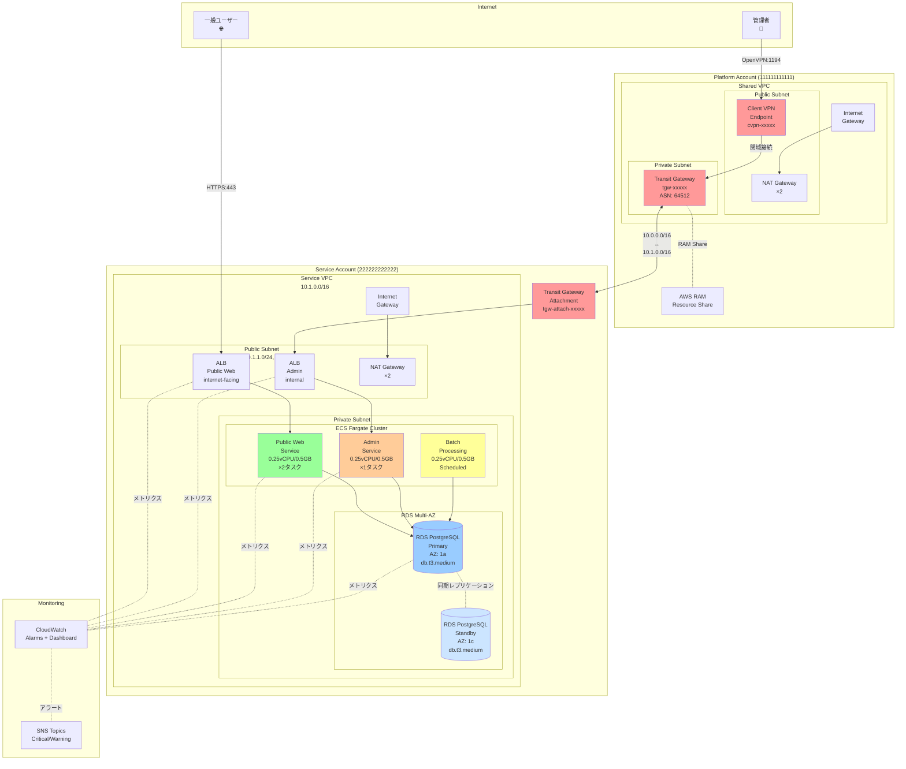
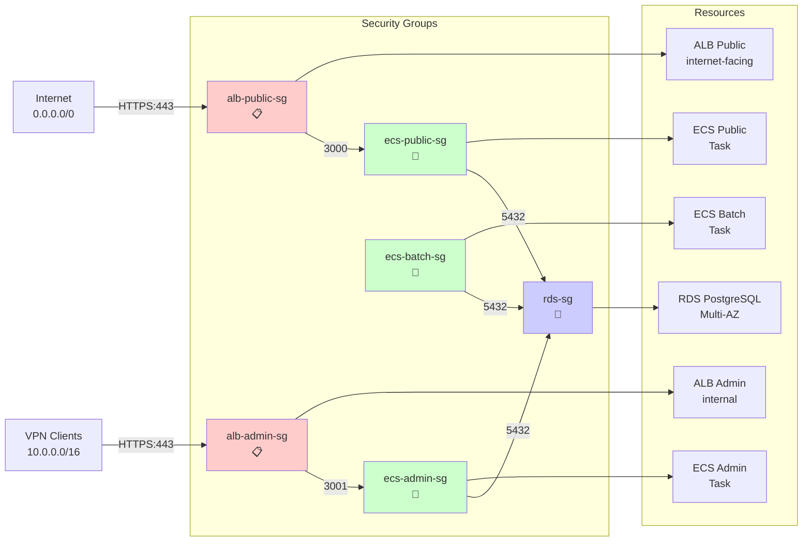
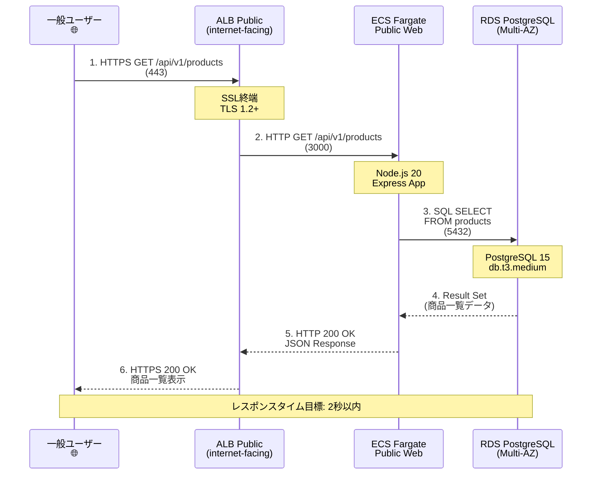
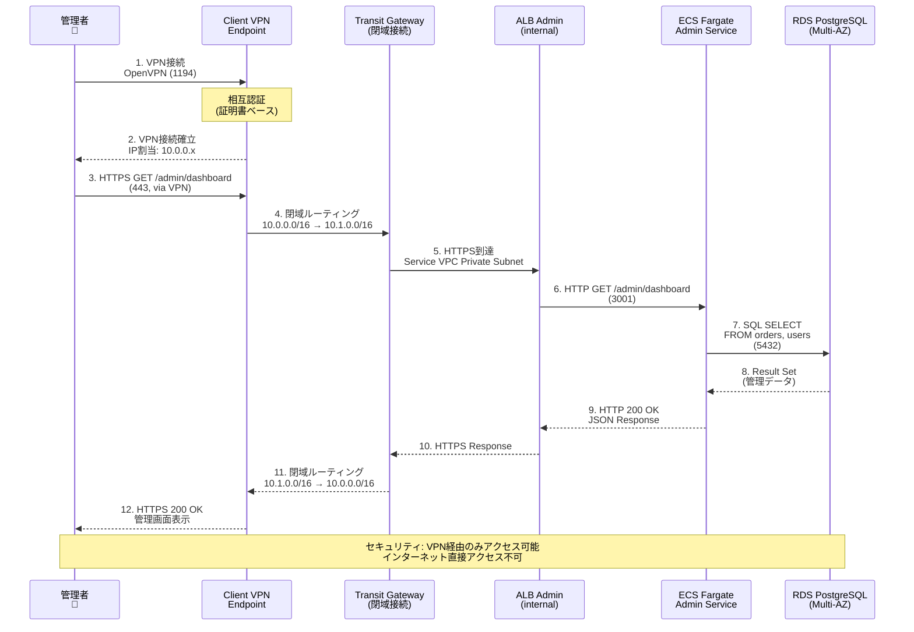
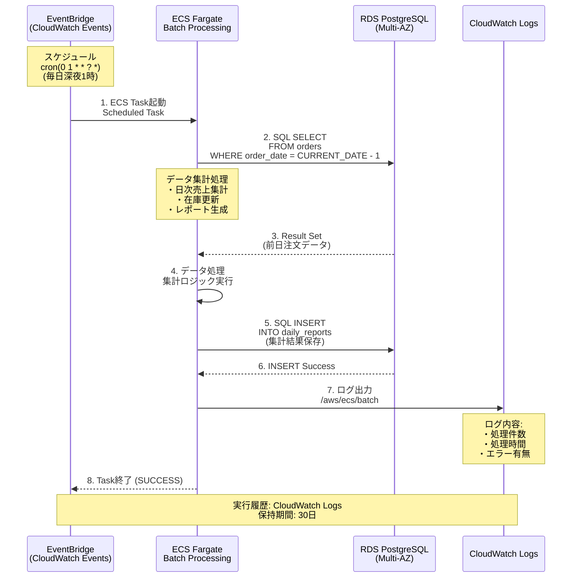

# 03_システム構成図

> AWS Multi-Account Sample Application - システム構成図

**作成日**: 2025-10-24 (Round 3)
**バージョン**: 3.0

---

## 1. Multi-Account 全体構成図

### 1.1 物理構成図



---

## 2. ネットワーク詳細構成図

### 2.1 VPC 構成図

```mermaid
graph TB
    subgraph "Platform VPC<br/>10.0.0.0/16"
        subgraph "AZ: ap-northeast-1a"
            PubSub_P_1a[Public Subnet<br/>10.0.1.0/24<br/>256 IPs]
            PrivSub_P_1a[Private Subnet<br/>10.0.11.0/24<br/>256 IPs]
        end

        subgraph "AZ: ap-northeast-1c"
            PubSub_P_1c[Public Subnet<br/>10.0.2.0/24<br/>256 IPs]
            PrivSub_P_1c[Private Subnet<br/>10.0.12.0/24<br/>256 IPs]
        end

        IGW_Platform[Internet Gateway<br/>igw-platform-xxxxx]
        NAT_P_1a[NAT Gateway<br/>nat-platform-1a<br/>EIP: xx.xx.xx.xx]
        NAT_P_1c[NAT Gateway<br/>nat-platform-1c<br/>EIP: yy.yy.yy.yy]

        VPN_Endpoint[Client VPN Endpoint<br/>cvpn-endpoint-xxxxx<br/>10.0.0.0/22]

        TGW_Hub[Transit Gateway<br/>tgw-xxxxx]
    end

    subgraph "Service VPC<br/>10.1.0.0/16"
        subgraph "AZ: ap-northeast-1a"
            PubSub_S_1a[Public Subnet<br/>10.1.1.0/24<br/>256 IPs]
            PrivSub_S_1a[Private Subnet<br/>10.1.11.0/24<br/>256 IPs]
        end

        subgraph "AZ: ap-northeast-1c"
            PubSub_S_1c[Public Subnet<br/>10.1.2.0/24<br/>256 IPs]
            PrivSub_S_1c[Private Subnet<br/>10.1.12.0/24<br/>256 IPs]
        end

        IGW_Service[Internet Gateway<br/>igw-service-xxxxx]
        NAT_S_1a[NAT Gateway<br/>nat-service-1a<br/>EIP: zz.zz.zz.zz]
        NAT_S_1c[NAT Gateway<br/>nat-service-1c<br/>EIP: ww.ww.ww.ww]

        TGW_Attach_Service[TGW Attachment<br/>tgw-attach-service]
    end

    Internet[Internet<br/>🌐]

    Internet <--> IGW_Platform
    Internet <--> IGW_Service

    IGW_Platform --> PubSub_P_1a
    IGW_Platform --> PubSub_P_1c

    IGW_Service --> PubSub_S_1a
    IGW_Service --> PubSub_S_1c

    PubSub_P_1a --> NAT_P_1a
    PubSub_P_1c --> NAT_P_1c

    PubSub_S_1a --> NAT_S_1a
    PubSub_S_1c --> NAT_S_1c

    NAT_P_1a --> PrivSub_P_1a
    NAT_P_1c --> PrivSub_P_1c

    NAT_S_1a --> PrivSub_S_1a
    NAT_S_1c --> PrivSub_S_1c

    PrivSub_P_1a --> TGW_Hub
    PrivSub_P_1c --> TGW_Hub

    PrivSub_S_1a --> TGW_Attach_Service
    PrivSub_S_1c --> TGW_Attach_Service

    TGW_Hub <-.閉域接続.- TGW_Attach_Service

    VPN_Endpoint --> PrivSub_P_1a
    VPN_Endpoint --> PrivSub_P_1c

    style TGW_Hub fill:#ff9999
    style TGW_Attach_Service fill:#ff9999
    style VPN_Endpoint fill:#ff9999
```

---

## 3. セキュリティグループ構成図

### 3.1 セキュリティグループ関係図



### 3.2 セキュリティグループルール詳細

#### 3.2.1 alb-public-sg

**Inbound**:
| プロトコル | ポート | ソース | 用途 |
|----------|--------|--------|------|
| TCP | 443 | 0.0.0.0/0 | HTTPS (Public Web) |

**Outbound**:
| プロトコル | ポート | 宛先 | 用途 |
|----------|--------|------|------|
| TCP | 3000 | ecs-public-sg | ECS Public へ |

#### 3.2.2 alb-admin-sg

**Inbound**:
| プロトコル | ポート | ソース | 用途 |
|----------|--------|--------|------|
| TCP | 443 | 10.0.0.0/16 | HTTPS (Admin、VPN経由のみ) |

**Outbound**:
| プロトコル | ポート | 宛先 | 用途 |
|----------|--------|------|------|
| TCP | 3001 | ecs-admin-sg | ECS Admin へ |

#### 3.2.3 ecs-public-sg, ecs-admin-sg, ecs-batch-sg

**Inbound**:
| プロトコル | ポート | ソース | 用途 |
|----------|--------|--------|------|
| TCP | 3000 | alb-public-sg | ALB Public から (Public のみ) |
| TCP | 3001 | alb-admin-sg | ALB Admin から (Admin のみ) |

**Outbound**:
| プロトコル | ポート | 宛先 | 用途 |
|----------|--------|------|------|
| TCP | 5432 | rds-sg | RDS PostgreSQL へ |
| TCP | 443 | 0.0.0.0/0 | インターネット (npm install等) |

#### 3.2.4 rds-sg

**Inbound**:
| プロトコル | ポート | ソース | 用途 |
|----------|--------|--------|------|
| TCP | 5432 | ecs-public-sg | ECS Public から |
| TCP | 5432 | ecs-admin-sg | ECS Admin から |
| TCP | 5432 | ecs-batch-sg | ECS Batch から |

**Outbound**: なし (RDS からの Outbound 不要)

---

## 4. アプリケーションフロー図

### 4.1 ユーザーリクエストフロー (Public Web)



### 4.2 管理者アクセスフロー (Admin Dashboard)



### 4.3 バッチ処理フロー



---

## 5. Multi-AZ 可用性構成図

### 5.1 可用性アーキテクチャ

```mermaid
graph TB
    subgraph "Internet"
        Users[ユーザー<br/>トラフィック]
    end

    subgraph "Service VPC - AZ: ap-northeast-1a"
        subgraph "Public Subnet 1a"
            ALB_1a[ALB<br/>Public Web<br/>(Primary)]
        end

        subgraph "Private Subnet 1a"
            ECS_1a[ECS Fargate<br/>Task 1<br/>(Active)]
            RDS_Primary[(RDS PostgreSQL<br/>Primary<br/>(Read/Write))]
        end
    end

    subgraph "Service VPC - AZ: ap-northeast-1c"
        subgraph "Public Subnet 1c"
            ALB_1c[ALB<br/>Public Web<br/>(Standby)]
        end

        subgraph "Private Subnet 1c"
            ECS_1c[ECS Fargate<br/>Task 2<br/>(Active)]
            RDS_Standby[(RDS PostgreSQL<br/>Standby<br/>(Read Only))]
        end
    end

    Users --> ALB_1a
    Users --> ALB_1c

    ALB_1a --> ECS_1a
    ALB_1c --> ECS_1c

    ECS_1a --> RDS_Primary
    ECS_1c --> RDS_Primary

    RDS_Primary -.同期レプリケーション<br/>(Synchronous).- RDS_Standby

    Note_AZ1a[障害時:<br/>1. ALB が自動で 1c へ<br/>2. ECS Task 1 停止<br/>3. RDS Standby が Primary に昇格]
    Note_AZ1c[正常時:<br/>1. ALB が両 AZ にルーティング<br/>2. ECS Task が両 AZ で稼働<br/>3. RDS Primary が Read/Write]

    style RDS_Primary fill:#99ccff
    style RDS_Standby fill:#cce5ff
    style ECS_1a fill:#99ff99
    style ECS_1c fill:#99ff99
```

### 5.2 障害復旧フロー

**AZ 障害発生時**:
1. ALB が異常 AZ を自動検出 (ヘルスチェック失敗)
2. トラフィックを正常 AZ へ自動ルーティング
3. RDS Multi-AZ フェイルオーバー (60-120秒)
4. ECS Service が正常 AZ で新規 Task 起動

**RTO (Recovery Time Objective)**: 2分以内
**RPO (Recovery Point Objective)**: 0 (同期レプリケーション)

---

## 6. CloudFormation スタック構成図

### 6.1 スタック依存関係図

```mermaid
graph TD
    subgraph "Platform Account"
        P_Network[platform-network<br/>VPC, Subnets, NAT GW]
        P_TGW[platform-tgw<br/>Transit Gateway<br/>RAM Share]
    end

    subgraph "Service Account"
        S_Network[service-network<br/>VPC, Subnets, NAT GW<br/>TGW Attachment]
        S_Database[service-database<br/>RDS PostgreSQL<br/>Multi-AZ]
        S_Compute[service-compute<br/>ECS Cluster<br/>Task Definition<br/>Service, ALB]
        S_Monitoring[service-monitoring<br/>CloudWatch Alarms<br/>Dashboard, SNS]
    end

    P_Network --> P_TGW
    P_TGW -.Cross-Account<br/>RAM Share.- S_Network
    S_Network --> S_Database
    S_Database --> S_Compute
    S_Compute --> S_Monitoring

    Note_Deploy[デプロイ順序:<br/>1. platform-network<br/>2. platform-tgw<br/>3. service-network<br/>4. service-database<br/>5. service-compute<br/>6. service-monitoring]

    Note_Rollback[削除順序 (逆順):<br/>6. service-monitoring<br/>5. service-compute<br/>4. service-database<br/>3. service-network<br/>2. platform-tgw<br/>1. platform-network]

    style P_Network fill:#ffcccc
    style P_TGW fill:#ffcccc
    style S_Network fill:#ccffcc
    style S_Database fill:#ccccff
    style S_Compute fill:#ffffcc
    style S_Monitoring fill:#ffccff
```

### 6.2 Change Set デプロイフロー (⭐⭐⭐ Round 3 重点)

```mermaid
sequenceDiagram
    participant Dev as 開発者<br/>👤
    participant Create as create-changeset.sh
    participant Describe as describe-changeset.sh
    participant Execute as execute-changeset.sh
    participant CFN as CloudFormation
    participant AWS as AWS Resources

    Dev->>Create: 1. スクリプト実行<br/>./create-changeset.sh platform-network
    Create->>CFN: aws cloudformation create-change-set<br/>--stack-name platform-network<br/>--change-set-name platform-network-changeset-{timestamp}
    CFN-->>Create: Change Set ID: cs-xxxxx
    Create-->>Dev: Change Set作成完了<br/>ID: cs-xxxxx

    Dev->>Describe: 2. 変更内容確認<br/>./describe-changeset.sh platform-network
    Describe->>CFN: aws cloudformation describe-change-set<br/>--change-set-name cs-xxxxx
    CFN-->>Describe: 変更内容詳細<br/>・追加: VPC<br/>・変更: Subnet CIDR<br/>・削除: なし
    Describe-->>Dev: 変更内容表示<br/>(dry-run 結果)

    Note over Dev: 変更内容を確認<br/>問題なければ実行

    Dev->>Execute: 3. 実行確認<br/>./execute-changeset.sh platform-network
    Execute->>Dev: "Execute change set? (yes/no):"
    Dev-->>Execute: yes

    Execute->>CFN: aws cloudformation execute-change-set<br/>--change-set-name cs-xxxxx
    CFN->>AWS: リソース変更実行<br/>VPC作成、Subnet変更
    AWS-->>CFN: 変更完了通知
    CFN-->>Execute: スタック更新完了<br/>Status: UPDATE_COMPLETE
    Execute-->>Dev: デプロイ完了

    Note over Dev,AWS: Change Set により安全なデプロイを実現<br/>事前確認 → 承認 → 実行
```

**詳細**: [09_インフラ設計・コスト設計.md](./09_インフラ設計・コスト設計.md)

---

## 7. 監視ダッシュボード構成図

### 7.1 CloudWatch Dashboard レイアウト

```mermaid
graph TB
    subgraph "CloudWatch Dashboard: AWS Multi-Account Sample"
        subgraph "Row 1: ECS メトリクス"
            ECS_CPU[ECS CPU 使用率<br/>Public/Admin/Batch]
            ECS_Mem[ECS Memory 使用率<br/>Public/Admin/Batch]
            ECS_Task[ECS Task 数<br/>Running/Pending/Stopped]
        end

        subgraph "Row 2: RDS メトリクス"
            RDS_CPU[RDS CPU 使用率<br/>Primary/Standby]
            RDS_Conn[RDS 接続数<br/>Active Connections]
            RDS_Lag[レプリケーションラグ<br/>(Multi-AZ)]
        end

        subgraph "Row 3: ALB メトリクス"
            ALB_Req[ALB リクエスト数<br/>Public/Admin]
            ALB_Error[ALB エラー率<br/>4xx/5xx]
            ALB_Latency[ALB レスポンスタイム<br/>Target Response Time]
        end

        subgraph "Row 4: ネットワークメトリクス"
            TGW_Packets[TGW パケット数<br/>Sent/Received]
            VPN_Conn[VPN 接続数<br/>Active Connections]
            NAT_Traffic[NAT GW トラフィック<br/>Bytes Out]
        end
    end

    subgraph "CloudWatch Alarms"
        Alarm_Critical[Critical Alarms<br/>・ECS Task 0<br/>・RDS 接続不可<br/>・ALB ターゲット異常]
        Alarm_Warning[Warning Alarms<br/>・CPU 80%<br/>・Memory 80%<br/>・5xx 5%]
    end

    subgraph "SNS Topics"
        SNS_Critical[SNS: CriticalAlerts<br/>→ Email (管理者)]
        SNS_Warning[SNS: WarningAlerts<br/>→ Email (運用担当)]
    end

    Alarm_Critical --> SNS_Critical
    Alarm_Warning --> SNS_Warning

    style ECS_CPU fill:#99ff99
    style RDS_CPU fill:#99ccff
    style ALB_Req fill:#ffcc99
    style Alarm_Critical fill:#ff9999
    style Alarm_Warning fill:#ffff99
```

---

## 8. リソース配置マップ

### 8.1 Platform Account リソース配置

| リソース | AZ | Subnet | CIDR | IP範囲 |
|---------|----|----|------|--------|
| NAT GW (1a) | ap-northeast-1a | platform-public-1a | 10.0.1.0/24 | 10.0.1.0 - 10.0.1.255 |
| NAT GW (1c) | ap-northeast-1c | platform-public-1c | 10.0.2.0/24 | 10.0.2.0 - 10.0.2.255 |
| VPN Endpoint | Multi-AZ | platform-private-* | 10.0.11.0/24, 10.0.12.0/24 | 10.0.11.0 - 10.0.12.255 |
| Transit Gateway | Multi-AZ | platform-private-* | - | - |

### 8.2 Service Account リソース配置

| リソース | AZ | Subnet | CIDR | IP範囲 |
|---------|----|----|------|--------|
| ALB Public | Multi-AZ | service-public-* | 10.1.1.0/24, 10.1.2.0/24 | 10.1.1.0 - 10.1.2.255 |
| ALB Admin | Multi-AZ | service-private-* | 10.1.11.0/24, 10.1.12.0/24 | 10.1.11.0 - 10.1.12.255 |
| ECS Public (Task 1) | ap-northeast-1a | service-private-1a | 10.1.11.0/24 | 10.1.11.x |
| ECS Public (Task 2) | ap-northeast-1c | service-private-1c | 10.1.12.0/24 | 10.1.12.x |
| ECS Admin | ap-northeast-1a | service-private-1a | 10.1.11.0/24 | 10.1.11.y |
| ECS Batch | ap-northeast-1a | service-private-1a | 10.1.11.0/24 | 10.1.11.z |
| RDS Primary | ap-northeast-1a | service-private-1a | 10.1.11.0/24 | 10.1.11.10 |
| RDS Standby | ap-northeast-1c | service-private-1c | 10.1.12.0/24 | 10.1.12.10 |
| NAT GW (1a) | ap-northeast-1a | service-public-1a | 10.1.1.0/24 | 10.1.1.x |
| NAT GW (1c) | ap-northeast-1c | service-public-1c | 10.1.2.0/24 | 10.1.2.x |

---

## 9. 構成図まとめ

### 9.1 生成した Mermaid 図一覧

| # | 図名 | 内容 | 重要度 |
|---|------|------|--------|
| 1 | Multi-Account 全体構成図 | Platform/Service Account の物理構成 | ⭐⭐⭐ |
| 2 | ネットワーク詳細構成図 | VPC, Subnet, NAT GW, TGW 構成 | ⭐⭐⭐ |
| 3 | セキュリティグループ構成図 | SG 間の依存関係 | ⭐⭐ |
| 4 | ユーザーリクエストフロー | Public Web のリクエストフロー | ⭐⭐ |
| 5 | 管理者アクセスフロー | VPN 経由の閉域アクセスフロー | ⭐⭐⭐ |
| 6 | バッチ処理フロー | Scheduled Task の実行フロー | ⭐ |
| 7 | Multi-AZ 可用性構成図 | 障害復旧アーキテクチャ | ⭐⭐⭐ |
| 8 | CloudFormation スタック構成図 | スタック依存関係、デプロイ順序 | ⭐⭐⭐ |
| 9 | Change Set デプロイフロー | Change Set による段階的デプロイ | ⭐⭐⭐ (Round 3 重点) |
| 10 | 監視ダッシュボード構成図 | CloudWatch Dashboard レイアウト | ⭐⭐ |

**合計**: 10個の Mermaid 図 ✅ (目標5個以上達成)

### 9.2 Round 3 重点項目

**Change Set デプロイフロー図** (図9):
- create-changeset.sh → describe-changeset.sh → execute-changeset.sh の流れを可視化
- dry-run → 確認 → 実行 の3ステッププロセスを明示
- ユーザー承認プロセスを含む

**詳細**: [09_インフラ設計・コスト設計.md](./09_インフラ設計・コスト設計.md)

---

**前章**: [02_アーキテクチャ設計.md](./02_アーキテクチャ設計.md)
**次章**: [04_データベース設計.md](./04_データベース設計.md)
