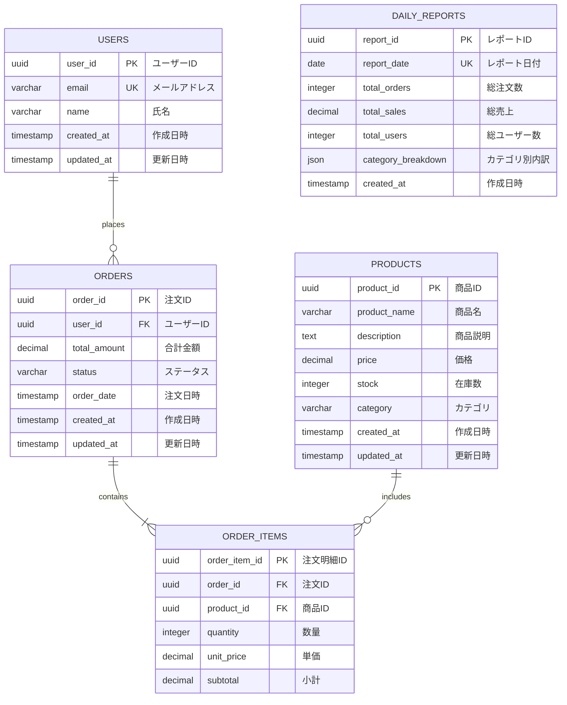

# 04_データベース設計

> AWS Multi-Account Sample Application - データベース設計

**作成日**: 2025-10-24 (Round 3)
**バージョン**: 3.0

---

## 1. データベース概要

### 1.1 データベース仕様

| 項目 | 設定値 | 備考 |
|------|--------|------|
| エンジン | PostgreSQL 15 | 最新安定版 |
| エンジンバージョン | 15.4 | 2023年リリース |
| インスタンスクラス | db.t3.medium | 2 vCPU, 4GB RAM |
| Multi-AZ | 有効 | Primary (1a), Standby (1c) |
| ストレージタイプ | gp3 | 汎用 SSD |
| ストレージサイズ | 50GB | 自動拡張有効 (最大 100GB) |
| IOPS | 3,000 | gp3 ベースライン |
| スループット | 125 MB/s | gp3 ベースライン |
| 暗号化 | 有効 | AES-256 (KMS 管理キー) |
| バックアップ | 自動 | 7日間保持 |
| メンテナンスウィンドウ | 日曜 3:00-4:00 | 影響最小化 |
| マイナーバージョン自動更新 | 無効 | 手動更新 |

### 1.2 接続情報

| 項目 | 値 | 備考 |
|------|-----|------|
| エンドポイント | sample-app-db.xxxxxx.ap-northeast-1.rds.amazonaws.com | CloudFormation Output |
| ポート | 5432 | PostgreSQL デフォルト |
| データベース名 | sampledb | 初期DB |
| マスターユーザー名 | postgres | 管理者 |
| パスワード | Secrets Manager | 自動生成・管理 |

---

## 2. 論理データモデル

### 2.1 ER図



---

## 3. 物理データモデル

### 3.1 テーブル定義

#### 3.1.1 USERS (ユーザー)

**概要**: アプリケーションユーザーマスタ

| カラム名 | データ型 | NULL | デフォルト値 | 制約 | 備考 |
|---------|---------|------|------------|------|------|
| user_id | UUID | NOT NULL | uuid_generate_v4() | PRIMARY KEY | ユーザーID |
| email | VARCHAR(255) | NOT NULL | - | UNIQUE | メールアドレス |
| name | VARCHAR(255) | NOT NULL | - | - | 氏名 |
| created_at | TIMESTAMP | NOT NULL | CURRENT_TIMESTAMP | - | 作成日時 |
| updated_at | TIMESTAMP | NOT NULL | CURRENT_TIMESTAMP | - | 更新日時 |

**インデックス**:
```sql
CREATE UNIQUE INDEX users_email_idx ON users(email);
CREATE INDEX users_created_at_idx ON users(created_at DESC);
```

**DDL**:
```sql
CREATE TABLE users (
    user_id UUID PRIMARY KEY DEFAULT uuid_generate_v4(),
    email VARCHAR(255) NOT NULL UNIQUE,
    name VARCHAR(255) NOT NULL,
    created_at TIMESTAMP NOT NULL DEFAULT CURRENT_TIMESTAMP,
    updated_at TIMESTAMP NOT NULL DEFAULT CURRENT_TIMESTAMP
);

COMMENT ON TABLE users IS 'ユーザーマスタ';
COMMENT ON COLUMN users.user_id IS 'ユーザーID (UUID)';
COMMENT ON COLUMN users.email IS 'メールアドレス (ユニーク制約)';
```

#### 3.1.2 PRODUCTS (商品)

**概要**: 商品マスタ

| カラム名 | データ型 | NULL | デフォルト値 | 制約 | 備考 |
|---------|---------|------|------------|------|------|
| product_id | UUID | NOT NULL | uuid_generate_v4() | PRIMARY KEY | 商品ID |
| product_name | VARCHAR(255) | NOT NULL | - | - | 商品名 |
| description | TEXT | NULL | - | - | 商品説明 |
| price | DECIMAL(10,2) | NOT NULL | 0.00 | CHECK (price >= 0) | 価格 |
| stock | INTEGER | NOT NULL | 0 | CHECK (stock >= 0) | 在庫数 |
| category | VARCHAR(50) | NULL | - | - | カテゴリ |
| created_at | TIMESTAMP | NOT NULL | CURRENT_TIMESTAMP | - | 作成日時 |
| updated_at | TIMESTAMP | NOT NULL | CURRENT_TIMESTAMP | - | 更新日時 |

**インデックス**:
```sql
CREATE INDEX products_category_idx ON products(category);
CREATE INDEX products_price_idx ON products(price);
CREATE INDEX products_created_at_idx ON products(created_at DESC);
```

**DDL**:
```sql
CREATE TABLE products (
    product_id UUID PRIMARY KEY DEFAULT uuid_generate_v4(),
    product_name VARCHAR(255) NOT NULL,
    description TEXT,
    price DECIMAL(10,2) NOT NULL DEFAULT 0.00 CHECK (price >= 0),
    stock INTEGER NOT NULL DEFAULT 0 CHECK (stock >= 0),
    category VARCHAR(50),
    created_at TIMESTAMP NOT NULL DEFAULT CURRENT_TIMESTAMP,
    updated_at TIMESTAMP NOT NULL DEFAULT CURRENT_TIMESTAMP
);

COMMENT ON TABLE products IS '商品マスタ';
```

#### 3.1.3 ORDERS (注文)

**概要**: 注文トランザクション

| カラム名 | データ型 | NULL | デフォルト値 | 制約 | 備考 |
|---------|---------|------|------------|------|------|
| order_id | UUID | NOT NULL | uuid_generate_v4() | PRIMARY KEY | 注文ID |
| user_id | UUID | NOT NULL | - | FOREIGN KEY (users) | ユーザーID |
| total_amount | DECIMAL(10,2) | NOT NULL | 0.00 | CHECK (total_amount >= 0) | 合計金額 |
| status | VARCHAR(50) | NOT NULL | 'pending' | CHECK (status IN (...)) | ステータス |
| order_date | TIMESTAMP | NOT NULL | CURRENT_TIMESTAMP | - | 注文日時 |
| created_at | TIMESTAMP | NOT NULL | CURRENT_TIMESTAMP | - | 作成日時 |
| updated_at | TIMESTAMP | NOT NULL | CURRENT_TIMESTAMP | - | 更新日時 |

**ステータス値**:
- `pending`: 注文確定待ち
- `confirmed`: 注文確定
- `processing`: 処理中
- `shipped`: 発送済み
- `delivered`: 配送完了
- `cancelled`: キャンセル

**インデックス**:
```sql
CREATE INDEX orders_user_id_idx ON orders(user_id);
CREATE INDEX orders_order_date_idx ON orders(order_date DESC);
CREATE INDEX orders_status_idx ON orders(status);
CREATE INDEX orders_composite_idx ON orders(user_id, order_date DESC);
```

**DDL**:
```sql
CREATE TABLE orders (
    order_id UUID PRIMARY KEY DEFAULT uuid_generate_v4(),
    user_id UUID NOT NULL REFERENCES users(user_id),
    total_amount DECIMAL(10,2) NOT NULL DEFAULT 0.00 CHECK (total_amount >= 0),
    status VARCHAR(50) NOT NULL DEFAULT 'pending'
        CHECK (status IN ('pending', 'confirmed', 'processing', 'shipped', 'delivered', 'cancelled')),
    order_date TIMESTAMP NOT NULL DEFAULT CURRENT_TIMESTAMP,
    created_at TIMESTAMP NOT NULL DEFAULT CURRENT_TIMESTAMP,
    updated_at TIMESTAMP NOT NULL DEFAULT CURRENT_TIMESTAMP
);

CREATE INDEX orders_user_id_idx ON orders(user_id);
CREATE INDEX orders_order_date_idx ON orders(order_date DESC);
```

#### 3.1.4 ORDER_ITEMS (注文明細)

**概要**: 注文明細トランザクション

| カラム名 | データ型 | NULL | デフォルト値 | 制約 | 備考 |
|---------|---------|------|------------|------|------|
| order_item_id | UUID | NOT NULL | uuid_generate_v4() | PRIMARY KEY | 注文明細ID |
| order_id | UUID | NOT NULL | - | FOREIGN KEY (orders) | 注文ID |
| product_id | UUID | NOT NULL | - | FOREIGN KEY (products) | 商品ID |
| quantity | INTEGER | NOT NULL | 1 | CHECK (quantity > 0) | 数量 |
| unit_price | DECIMAL(10,2) | NOT NULL | 0.00 | CHECK (unit_price >= 0) | 単価 |
| subtotal | DECIMAL(10,2) | NOT NULL | 0.00 | CHECK (subtotal >= 0) | 小計 |

**インデックス**:
```sql
CREATE INDEX order_items_order_id_idx ON order_items(order_id);
CREATE INDEX order_items_product_id_idx ON order_items(product_id);
```

**DDL**:
```sql
CREATE TABLE order_items (
    order_item_id UUID PRIMARY KEY DEFAULT uuid_generate_v4(),
    order_id UUID NOT NULL REFERENCES orders(order_id) ON DELETE CASCADE,
    product_id UUID NOT NULL REFERENCES products(product_id),
    quantity INTEGER NOT NULL DEFAULT 1 CHECK (quantity > 0),
    unit_price DECIMAL(10,2) NOT NULL DEFAULT 0.00 CHECK (unit_price >= 0),
    subtotal DECIMAL(10,2) NOT NULL DEFAULT 0.00 CHECK (subtotal >= 0)
);
```

#### 3.1.5 DAILY_REPORTS (日次レポート)

**概要**: バッチ処理で生成される日次集計レポート

| カラム名 | データ型 | NULL | デフォルト値 | 制約 | 備考 |
|---------|---------|------|------------|------|------|
| report_id | UUID | NOT NULL | uuid_generate_v4() | PRIMARY KEY | レポートID |
| report_date | DATE | NOT NULL | - | UNIQUE | レポート日付 |
| total_orders | INTEGER | NOT NULL | 0 | - | 総注文数 |
| total_sales | DECIMAL(12,2) | NOT NULL | 0.00 | - | 総売上 |
| total_users | INTEGER | NOT NULL | 0 | - | 総ユーザー数 |
| category_breakdown | JSONB | NULL | - | - | カテゴリ別内訳 |
| created_at | TIMESTAMP | NOT NULL | CURRENT_TIMESTAMP | - | 作成日時 |

**DDL**:
```sql
CREATE TABLE daily_reports (
    report_id UUID PRIMARY KEY DEFAULT uuid_generate_v4(),
    report_date DATE NOT NULL UNIQUE,
    total_orders INTEGER NOT NULL DEFAULT 0,
    total_sales DECIMAL(12,2) NOT NULL DEFAULT 0.00,
    total_users INTEGER NOT NULL DEFAULT 0,
    category_breakdown JSONB,
    created_at TIMESTAMP NOT NULL DEFAULT CURRENT_TIMESTAMP
);

CREATE INDEX daily_reports_report_date_idx ON daily_reports(report_date DESC);
```

---

## 4. インデックス戦略

### 4.1 インデックス一覧

| テーブル | インデックス名 | カラム | タイプ | 用途 |
|---------|--------------|--------|--------|------|
| users | users_pkey | user_id | PRIMARY | 主キー |
| users | users_email_idx | email | UNIQUE | メールアドレス検索 |
| users | users_created_at_idx | created_at DESC | BTREE | 新規ユーザー一覧 |
| products | products_pkey | product_id | PRIMARY | 主キー |
| products | products_category_idx | category | BTREE | カテゴリ別検索 |
| products | products_price_idx | price | BTREE | 価格範囲検索 |
| orders | orders_pkey | order_id | PRIMARY | 主キー |
| orders | orders_user_id_idx | user_id | BTREE | ユーザー別注文検索 |
| orders | orders_order_date_idx | order_date DESC | BTREE | 日時範囲検索 |
| orders | orders_status_idx | status | BTREE | ステータス別検索 |
| orders | orders_composite_idx | user_id, order_date DESC | BTREE | 複合検索 |
| order_items | order_items_pkey | order_item_id | PRIMARY | 主キー |
| order_items | order_items_order_id_idx | order_id | BTREE | 注文別明細検索 |
| daily_reports | daily_reports_pkey | report_id | PRIMARY | 主キー |
| daily_reports | daily_reports_report_date_idx | report_date DESC | UNIQUE BTREE | 日付別検索 |

### 4.2 パフォーマンス考慮事項

**複合インデックス使用例**:
```sql
-- ユーザー別の注文履歴取得 (orders_composite_idx 使用)
SELECT * FROM orders
WHERE user_id = 'xxx'
ORDER BY order_date DESC
LIMIT 10;
```

**カバリングインデックス候補**:
```sql
-- 頻繁に使用されるクエリ用
CREATE INDEX orders_covering_idx ON orders(user_id, order_date DESC)
INCLUDE (order_id, total_amount, status);
```

---

## 5. データ整合性

### 5.1 制約

**外部キー制約**:
```sql
ALTER TABLE orders
ADD CONSTRAINT fk_orders_user_id
FOREIGN KEY (user_id) REFERENCES users(user_id);

ALTER TABLE order_items
ADD CONSTRAINT fk_order_items_order_id
FOREIGN KEY (order_id) REFERENCES orders(order_id) ON DELETE CASCADE;

ALTER TABLE order_items
ADD CONSTRAINT fk_order_items_product_id
FOREIGN KEY (product_id) REFERENCES products(product_id);
```

**チェック制約**:
```sql
-- 価格・金額は0以上
ALTER TABLE products ADD CONSTRAINT check_price_positive CHECK (price >= 0);
ALTER TABLE products ADD CONSTRAINT check_stock_positive CHECK (stock >= 0);
ALTER TABLE orders ADD CONSTRAINT check_total_amount_positive CHECK (total_amount >= 0);
ALTER TABLE order_items ADD CONSTRAINT check_quantity_positive CHECK (quantity > 0);
```

### 5.2 トリガー

**updated_at 自動更新トリガー**:
```sql
CREATE OR REPLACE FUNCTION update_updated_at_column()
RETURNS TRIGGER AS $$
BEGIN
    NEW.updated_at = CURRENT_TIMESTAMP;
    RETURN NEW;
END;
$$ language 'plpgsql';

CREATE TRIGGER update_users_updated_at BEFORE UPDATE ON users
    FOR EACH ROW EXECUTE FUNCTION update_updated_at_column();

CREATE TRIGGER update_products_updated_at BEFORE UPDATE ON products
    FOR EACH ROW EXECUTE FUNCTION update_updated_at_column();

CREATE TRIGGER update_orders_updated_at BEFORE UPDATE ON orders
    FOR EACH ROW EXECUTE FUNCTION update_updated_at_column();
```

**小計自動計算トリガー**:
```sql
CREATE OR REPLACE FUNCTION calculate_subtotal()
RETURNS TRIGGER AS $$
BEGIN
    NEW.subtotal = NEW.quantity * NEW.unit_price;
    RETURN NEW;
END;
$$ language 'plpgsql';

CREATE TRIGGER calculate_order_items_subtotal BEFORE INSERT OR UPDATE ON order_items
    FOR EACH ROW EXECUTE FUNCTION calculate_subtotal();
```

---

## 6. データライフサイクル

### 6.1 保持期間

| テーブル | 保持期間 | アーカイブ方式 | 削除方式 |
|---------|---------|--------------|---------|
| users | 無期限 | - | 論理削除 |
| products | 無期限 | - | 論理削除 |
| orders | 3年 | S3 Export (Parquet) | 物理削除 |
| order_items | 3年 | S3 Export (Parquet) | 物理削除 (CASCADE) |
| daily_reports | 3年 | S3 Export (CSV) | 物理削除 |

### 6.2 論理削除設計

**users, products テーブルに deleted_at カラム追加**:
```sql
ALTER TABLE users ADD COLUMN deleted_at TIMESTAMP NULL;
ALTER TABLE products ADD COLUMN deleted_at TIMESTAMP NULL;

-- 論理削除
UPDATE users SET deleted_at = CURRENT_TIMESTAMP WHERE user_id = 'xxx';

-- 有効なユーザーのみ取得
SELECT * FROM users WHERE deleted_at IS NULL;
```

---

## 7. バックアップ・リカバリ戦略

### 7.1 自動バックアップ

| 項目 | 設定値 |
|------|--------|
| 自動バックアップ | 有効 |
| バックアップ保持期間 | 7日間 |
| バックアップウィンドウ | 02:00-03:00 (JST) |
| コピーターゲット | S3 (暗号化) |

### 7.2 スナップショット戦略

**手動スナップショット**:
- マイルストーン時 (リリース前、大規模データ更新前)
- 保持期間: 30日間
- 命名規則: `manual-snapshot-{YYYY-MM-DD}-{purpose}`

**自動スナップショット**:
- 日次自動取得 (02:00-03:00)
- 7日間保持

### 7.3 リカバリ手順

**RTO (Recovery Time Objective)**: 1時間以内
**RPO (Recovery Point Objective)**: 5分以内 (Multi-AZ 同期レプリケーション)

**リカバリフロー**:
1. スナップショットから新規 RDS インスタンス作成 (30-60分)
2. セキュリティグループ設定
3. アプリケーション接続先変更
4. 動作確認

---

## 8. 性能設計

### 8.1 接続プール

**pgBouncer 設定** (アプリケーション側):
```ini
[databases]
sampledb = host=sample-app-db.xxxxxx.rds.amazonaws.com port=5432 dbname=sampledb

[pgbouncer]
pool_mode = transaction
max_client_conn = 100
default_pool_size = 20
reserve_pool_size = 5
reserve_pool_timeout = 3
```

### 8.2 クエリ性能目標

| クエリタイプ | 目標レスポンスタイム | 備考 |
|------------|------------------|------|
| 商品一覧取得 | 50ms 以内 | LIMIT 100 |
| 商品詳細取得 | 10ms 以内 | PRIMARY KEY 検索 |
| 注文作成 | 100ms 以内 | INSERT + トランザクション |
| ユーザー別注文履歴 | 100ms 以内 | 複合インデックス使用 |

### 8.3 スロークエリ監視

**CloudWatch Logs への出力**:
```sql
-- PostgreSQL パラメータグループ
log_min_duration_statement = 1000  -- 1秒以上のクエリをログ出力
```

---

## 9. セキュリティ

### 9.1 暗号化

| 項目 | 設定 | 暗号化方式 |
|------|------|----------|
| 保存データ暗号化 | 有効 | AES-256 (KMS 管理キー) |
| 通信暗号化 | 有効 | TLS 1.2+ |
| バックアップ暗号化 | 有効 | AES-256 |

### 9.2 認証情報管理

**Secrets Manager 使用**:
```json
{
  "username": "postgres",
  "password": "ランダム生成パスワード",
  "engine": "postgres",
  "host": "sample-app-db.xxxxxx.rds.amazonaws.com",
  "port": 5432,
  "dbname": "sampledb"
}
```

**アプリケーション接続**:
```javascript
// Node.js アプリケーション
const secret = await getSecretValue('rds/sampledb');
const pool = new Pool({
  host: secret.host,
  port: secret.port,
  database: secret.dbname,
  user: secret.username,
  password: secret.password,
  ssl: { rejectUnauthorized: true }
});
```

---

## 10. 初期データ投入

### 10.1 マスターデータ

**products (商品マスタ)**:
```sql
INSERT INTO products (product_name, description, price, stock, category) VALUES
('サンプル商品A', '商品Aの説明', 1000.00, 100, 'カテゴリA'),
('サンプル商品B', '商品Bの説明', 2000.00, 50, 'カテゴリB'),
('サンプル商品C', '商品Cの説明', 3000.00, 30, 'カテゴリC');
```

**users (ユーザーマスタ)**:
```sql
INSERT INTO users (email, name) VALUES
('test1@example.com', 'テストユーザー1'),
('test2@example.com', 'テストユーザー2'),
('test3@example.com', 'テストユーザー3');
```

---

**前章**: [03_システム構成図.md](./03_システム構成図.md)
**次章**: [05_API設計.md](./05_API設計.md)
