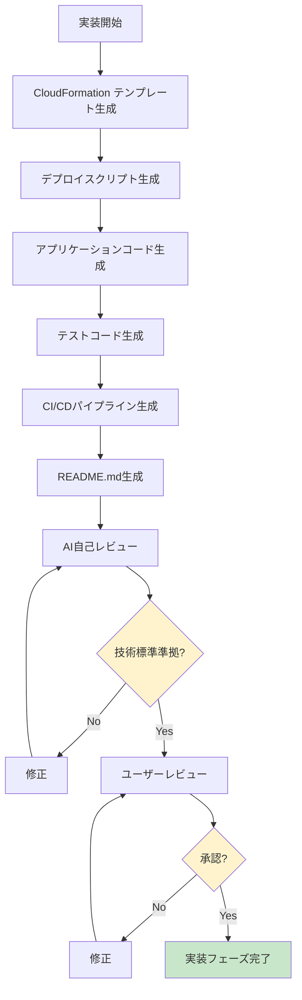

# 2.4.11 実装フェーズ - フェーズ完了基準

## 目的

実装フェーズを完了してよい条件を定義します。

---

## ✅ 必須完了条件

### 1. CloudFormation/Terraform テンプレート ⭐⭐⭐

#### CloudFormationの場合:

- [ ] **Platform Account テンプレート生成済み**
  - [ ] network.yaml（Transit Gateway, VPN Gateway）
  - [ ] parameters/dev.json
  - [ ] parameters/prd.json

- [ ] **Service Account テンプレート生成済み**
  - [ ] network.yaml（VPC, Subnets, Security Groups）
  - [ ] compute.yaml（ECR, ECS, ALB）
  - [ ] database.yaml（RDS, Secrets Manager）
  - [ ] parameters/dev.json
  - [ ] parameters/prd.json

- [ ] **技術標準（`.claude/docs/40_standards/45_cloudformation.md`）準拠確認**
  - [ ] ファイル分割の3原則に準拠
  - [ ] Change Sets必須
  - [ ] Well-Architected Framework準拠

---

### 2. デプロイスクリプト ⭐⭐⭐

- [ ] **責務分離パターンのスクリプト生成済み**
  - [ ] scripts/create-changeset.sh
  - [ ] scripts/describe-changeset.sh
  - [ ] scripts/execute-changeset.sh
  - [ ] scripts/rollback.sh
  - [ ] scripts/validate.sh（推奨）

- [ ] **本番環境承認フローあり**
  - [ ] prd環境で `read -p` 承認プロンプト

---

### 3. アプリケーションコード（該当する場合）

- [ ] **ディレクトリ構成が技術標準に準拠**
  - Python: `.claude/docs/40_standards/41_python.md` 準拠
  - TypeScript: `.claude/docs/40_standards/42_typescript.md` 準拠

- [ ] **型安全性**
  - Python: Type Hints適用
  - TypeScript: strictモード有効

- [ ] **エラーハンドリング**
  - カスタム例外クラス
  - 適切なtry-except/try-catch

---

### 4. テストコード

- [ ] **単体テスト生成済み**
  - Python: pytest
  - TypeScript: Jest

- [ ] **テストカバレッジ測定**
  - Python: pytest-cov（80%以上目標）
  - TypeScript: Jest coverage（80%以上目標）

---

### 5. CI/CDパイプライン（推奨）

- [ ] **GitHub Actions ワークフロー生成済み**
  - [ ] .github/workflows/pr-check.yml（dry-run）
  - [ ] .github/workflows/deploy-dev.yml（自動デプロイ）
  - [ ] .github/workflows/deploy-prd.yml（手動承認）

---

### 6. ドキュメント

- [ ] **README.md 生成済み**
  - [ ] infra/cloudformation/README.md（デプロイ手順）
  - [ ] src/README.md（アプリケーション概要）

- [ ] **運用手順書 生成済み**（該当する場合）

---

### 7. セキュリティ ⭐⭐⭐

- [ ] **シークレット管理適切**
  - [ ] ハードコード禁止（コード内に平文なし）
  - [ ] Secrets Manager / Parameter Store 使用
  - [ ] .env ファイルを .gitignore に追加

- [ ] **技術標準（`.claude/docs/40_standards/49_security.md`）準拠確認**

---

### 8. コードレビュー

- [ ] **AI自己レビュー完了**
  - [ ] 技術標準（`.claude/docs/40_standards/`）準拠確認
  - [ ] ベストプラクティス準拠確認

- [ ] **ユーザーレビュー完了**

---

## 🔄 フェーズ完了フロー

---

## 📚 次フェーズへの引継ぎ

### テストフェーズへ渡す情報

- [ ] 実装済みコード
- [ ] テストコード
- [ ] デプロイスクリプト
- [ ] テスト環境セットアップ手順
- [ ] 既知の制限事項

---

**作成日**: 2025-10-24
**対象フェーズ**: 実装
**重要度**: ⭐⭐⭐ 必須
