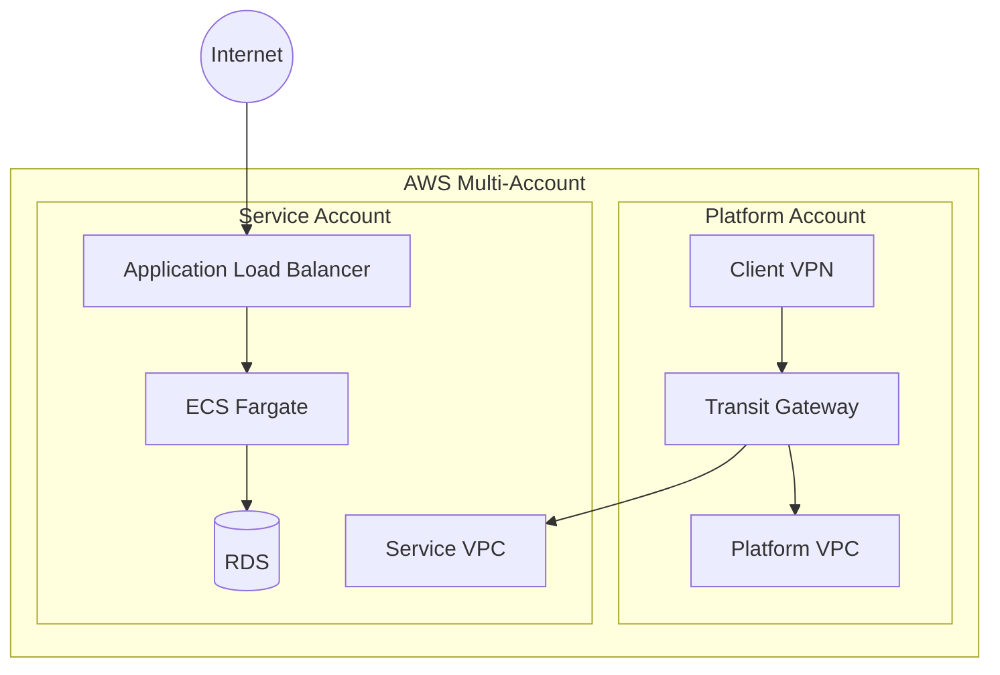
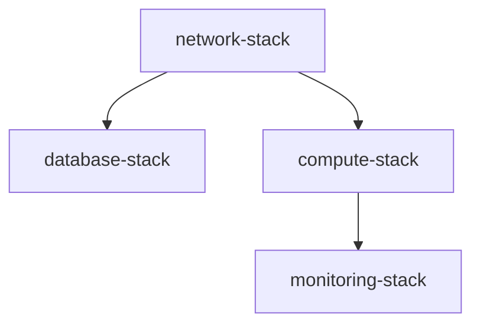
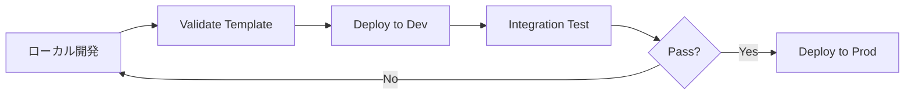

# インフラ設計書テンプレート

> このテンプレートは、**インフラ特化プロジェクト**で使用する設計書の標準構成です。
> AWS/GCP/Azure等のクラウドインフラ構築プロジェクトに適用してください。
> アプリケーション開発を含むプロジェクトは [template.md](template.md) を使用してください。

---

## 1. ドキュメント情報

| 項目 | 内容 |
|------|------|
| プロジェクト名 | {プロジェクト名} |
| 文書バージョン | {バージョン} |
| 作成日 | {作成日} |
| 最終更新日 | {更新日} |
| 承認状態 | 承認待ち/承認済み |

---

## 2. 概要

### 2.1 目的
{このインフラ構築の目的を記載}

例:
- AWS Multi-Account構成のPoC環境構築
- Transit Gateway経由の拠点間閉域接続の検証
- コンテナベースのマイクロサービス基盤構築

### 2.2 対象範囲
{構築対象のスコープを明確化}

例:
- **Phase 1**: PoC環境（Single-AZ、最小構成）
- **Phase 2**: 本番環境（Multi-AZ、高可用性構成）

**含むもの:**
- {含む項目をリスト}

**含まないもの:**
- {除外項目をリスト}

### 2.3 参照ドキュメント
- {関連ドキュメントへのリンク}

---

## 3. アーキテクチャ設計

### 3.1 全体構成図



**または、ASCIIアート形式:**

```
┌─────────────────────────────────────────────────────┐
│                  {プロジェクト名}                     │
│                                                       │
│  ┌────────────────────┐     ┌──────────────────┐   │
│  │ Platform Account   │     │ Service Account  │   │
│  │                    │     │                  │   │
│  │  - VPC             │────▶│  - VPC           │   │
│  │  - Transit Gateway │     │  - ECS           │   │
│  │  - Client VPN      │     │  - RDS           │   │
│  └────────────────────┘     └──────────────────┘   │
└─────────────────────────────────────────────────────┘
```

### 3.2 採用アーキテクチャパターン

- **パターン**: {Multi-Account、Hub-and-Spoke、3層アーキテクチャ等}
- **選定理由**: {なぜこのパターンを選んだか}

### 3.3 主要コンポーネント

| コンポーネント | 役割 | 備考 |
|---------------|------|------|
| {コンポーネント名} | {役割} | {備考} |

---

## 4. ネットワーク設計

### 4.1 VPC設計

#### {VPC名} (例: Platform VPC)

| 項目 | 値 |
|-----|---|
| **CIDR** | {10.0.0.0/16} |
| **用途** | {Transit Gateway、Client VPN等} |
| **リージョン** | {ap-northeast-1} |
| **AZ** | {ap-northeast-1a, 1c} |

**サブネット構成:**

| サブネット名 | CIDR | AZ | 用途 | インターネット接続 |
|------------|------|----|----|------------------|
| {Public Subnet} | {10.0.1.0/24} | {1a} | {用途} | あり（IGW経由） |
| {Private Subnet} | {10.0.10.0/24} | {1a} | {用途} | NAT Gateway経由 |

### 4.2 ルーティング設計

#### {Route Table名}

| 宛先 | ターゲット | 用途 |
|-----|----------|------|
| {0.0.0.0/0} | {IGW} | インターネット向け |
| {10.1.0.0/16} | {TGW} | Service VPC向け |

### 4.3 Transit Gateway / VPN 設計

{必要に応じて記載}

**Transit Gateway:**
- Attachment: {VPC名をリスト}
- Route Table: {ルーティング戦略}

**Client VPN / Site-to-Site VPN:**
- 認証方式: {証明書ベース、Active Directory等}
- 接続元CIDR: {192.168.0.0/16}

---

## 5. コンピュート設計

### 5.1 ECS / EC2 / Lambda

#### ECS Fargate（例）

| 項目 | 値 |
|-----|---|
| **クラスター名** | {cluster-name} |
| **サービス数** | {3（Public/Admin/Batch）} |
| **タスク定義** | {後述} |

**タスク定義:**

| サービス名 | CPU | メモリ | コンテナイメージ | 備考 |
|-----------|-----|--------|----------------|------|
| {public} | {256} | {512MB} | {ECR URI} | {一般ユーザー向け} |
| {admin} | {256} | {512MB} | {ECR URI} | {管理者向け} |
| {batch} | {512} | {1024MB} | {ECR URI} | {バッチ処理} |

### 5.2 Auto Scaling設定

{必要に応じて記載}

---

## 6. データベース設計

### 6.1 RDS構成

| 項目 | 値 |
|-----|---|
| **エンジン** | {PostgreSQL 15.x} |
| **インスタンスクラス** | {db.t3.micro（PoC） / db.r5.large（本番）} |
| **Multi-AZ** | {無効（PoC） / 有効（本番）} |
| **ストレージ** | {20GB（PoC） / 100GB（本番）} |
| **バックアップ保持期間** | {7日} |

### 6.2 データベース名・スキーマ

{必要に応じて簡易ER図やテーブル一覧を記載}

---

## 7. ストレージ設計

### 7.1 S3バケット

| バケット名 | 用途 | バージョニング | ライフサイクル |
|-----------|------|--------------|--------------|
| {bucket-name} | {用途} | {有効/無効} | {ルール} |

### 7.2 ECR（コンテナイメージ）

| リポジトリ名 | イメージタグ戦略 | スキャン |
|------------|----------------|---------|
| {repo-name} | {latest, v1.0.0} | {有効} |

---

## 8. セキュリティ設計

### 8.1 セキュリティグループ

#### {sg-alb} (例: ALB用)

| タイプ | プロトコル | ポート | ソース | 説明 |
|--------|----------|--------|--------|------|
| Inbound | HTTPS | 443 | 0.0.0.0/0 | インターネットからHTTPS |
| Outbound | ALL | ALL | 0.0.0.0/0 | すべて許可 |

#### {sg-app} (例: ECS用)

| タイプ | プロトコル | ポート | ソース | 説明 |
|--------|----------|--------|--------|------|
| Inbound | TCP | 3000 | sg-alb | ALBからのトラフィック |
| Outbound | HTTPS | 443 | 0.0.0.0/0 | 外部API通信 |
| Outbound | TCP | 5432 | sg-db | RDS通信 |

#### {sg-db} (例: RDS用)

| タイプ | プロトコル | ポート | ソース | 説明 |
|--------|----------|--------|--------|------|
| Inbound | TCP | 5432 | sg-app | アプリからのDB接続 |

### 8.2 IAMロール・ポリシー

#### {ECS Task Execution Role}

**信頼ポリシー:**
```json
{
  "Version": "2012-10-17",
  "Statement": [
    {
      "Effect": "Allow",
      "Principal": {
        "Service": "ecs-tasks.amazonaws.com"
      },
      "Action": "sts:AssumeRole"
    }
  ]
}
```

**アタッチポリシー:**
- AmazonECSTaskExecutionRolePolicy（AWS管理）
- カスタムポリシー（ECR、Secrets Manager アクセス）

#### {ECS Task Role}

{必要なポリシーを記載}

### 8.3 暗号化・機密情報管理

- **通信暗号化**: TLS 1.2以上
- **保存時暗号化**:
  - RDS: AES-256（AWS KMS）
  - S3: SSE-S3
- **機密情報管理**:
  - Secrets Manager: {DB接続情報、APIキー等}
  - Systems Manager Parameter Store: {環境変数}

---

## 9. 監視・ログ設計

### 9.1 CloudWatch Alarms

| アラーム名 | メトリクス | 閾値 | 通知先 |
|-----------|----------|------|--------|
| {ECSCPUHigh} | CPUUtilization | >80% (5分) | SNS Topic |
| {RDSConnections} | DatabaseConnections | >80% max | SNS Topic |
| {ALB5xxErrors} | HTTPCode_Target_5XX_Count | >10 (1分) | SNS Topic |

### 9.2 CloudWatch Logs

| ロググループ | 保持期間 | 用途 |
|------------|---------|------|
| /ecs/{service-name} | 7日 | ECSタスクログ |
| /aws/rds/instance/{db-instance} | 7日 | RDSログ |

### 9.3 CloudWatch Dashboard

{ダッシュボードに表示する主要メトリクスをリスト}

---

## 10. IaC（Infrastructure as Code）設計

### 10.1 採用ツール

- **ツール**: {CloudFormation / Terraform / CDK}
- **選定理由**: {理由}

### 10.2 ディレクトリ構成

```
infra/
├── platform/                  # Platform Account
│   ├── network.yaml
│   ├── parameters-poc.json
│   └── deploy.ps1
│
└── service/                   # Service Account
    ├── 01-network.yaml
    ├── 02-database.yaml
    ├── 03-compute.yaml
    ├── 04-monitoring.yaml
    ├── parameters-poc.json
    └── deploy.ps1
```

### 10.3 スタック構成

{CloudFormation/Terraformのスタック/モジュール分割方針}

**スタック分割:**
- {network-stack}: VPC、Subnet、IGW、NAT Gateway
- {database-stack}: RDS、Subnet Group、Security Group
- {compute-stack}: ECS Cluster、Service、Task Definition、ALB
- {monitoring-stack}: CloudWatch Alarms、Dashboard、SNS

**依存関係:**


### 10.4 パラメータ管理

**環境別パラメータファイル:**
- `parameters-poc.json`: PoC環境
- `parameters-prod.json`: 本番環境

**パラメータ例:**
```json
[
  {
    "ParameterKey": "Environment",
    "ParameterValue": "poc"
  },
  {
    "ParameterKey": "InstanceType",
    "ParameterValue": "t3.micro"
  }
]
```

---

## 11. デプロイ戦略

### 11.1 デプロイフロー



### 11.2 デプロイ手順

{デプロイスクリプトの使い方、手動手順等}

### 11.3 ロールバック戦略

{デプロイ失敗時のロールバック手順}

---

## 12. コスト設計

### 12.1 月額コスト見積もり（PoC環境）

| リソース | スペック | 台数 | 月額概算（USD） |
|---------|---------|------|---------------|
| {ECS Fargate} | {0.25vCPU, 0.5GB} | {3タスク} | {$10} |
| {RDS} | {db.t3.micro} | {1} | {$15} |
| {NAT Gateway} | {-} | {1} | {$32} |
| {ALB} | {-} | {1} | {$20} |
| **合計** | | | **{$77}** |

### 12.2 コスト最適化施策

- PoC環境: Single-AZ、小さいインスタンスサイズ
- 本番環境: Reserved Instance、Savings Plans検討

---

## 13. 運用設計

### 13.1 バックアップ・リストア

**RDS:**
- 自動バックアップ: 毎日 04:00 JST、保持7日
- 手動スナップショット: リリース前に取得

**リストア手順:**
{手順を記載}

### 13.2 障害対応

**障害検知:**
- CloudWatch Alarms → SNS → Slack/Email通知

**対応フロー:**
{障害対応手順を記載}

---

## 14. 技術標準準拠

### 14.1 準拠する標準

- `.claude/docs/40_standards/41_common.md` - 共通技術標準
- `.claude/docs/40_standards/42_infrastructure.md` - インフラ/IaC標準

### 14.2 標準からの逸脱事項

{標準から逸脱している箇所と、その理由を記載}

---

## 15. 承認

| 役割 | 氏名 | 承認日 | 署名 |
|------|------|--------|------|
| プロジェクトマネージャー | | | |
| インフラエンジニア | | | |
| セキュリティ担当 | | | |

---

## 付録

### A. 設計判断記録（ADR）

{重要な設計判断の記録}

### B. 変更履歴

| 日付 | 版数 | 変更内容 | 承認者 |
|------|------|----------|--------|
| {日付} | 1.0 | 初版作成 | - |
