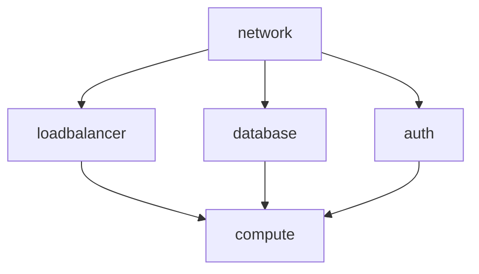

# デプロイ順序

## 環境構築の順序

1. ネットワーク (network)
   ```bash
   cd iac/cloudformation/scripts
   ENV=dev ./deploy.sh network
   ```
   - VPC
   - サブネット
   - セキュリティグループ
   - VPCエンドポイント

2. ロードバランサー (loadbalancer)
   ```bash
   ENV=dev ./deploy.sh loadbalancer
   ```
   - ALB
   - ターゲットグループ
   - SSL証明書
   - リスナー設定

3. データベース (database)
   ```bash
   ENV=dev ./deploy.sh database
   ```
   - RDS
   - シークレット

4. 認証 (auth)
   ```bash
   ENV=dev ./deploy.sh auth
   ```
   - Cognito User Pool
   - アプリクライアント

5. コンピュート (compute)
   ```bash
   ENV=dev ./deploy.sh compute
   ```
   - ECSクラスター
   - タスク定義
   - サービス

## 依存関係



## 注意点

1. SSL証明書のDNS検証
   - loadbalancerスタック作成後、DNS検証が必要
   - Route53でレコードを作成

2. シークレットの作成
   - database: DB認証情報
   - auth: Cognito設定
   - compute: 環境変数

3. デプロイ時の確認事項
   - セキュリティグループの設定
   - サブネットの指定
   - ヘルスチェックの設定

4. ロールバック時の対応
   - 依存関係の逆順で削除
   - リソースの手動クリーンアップが必要な場合あり
