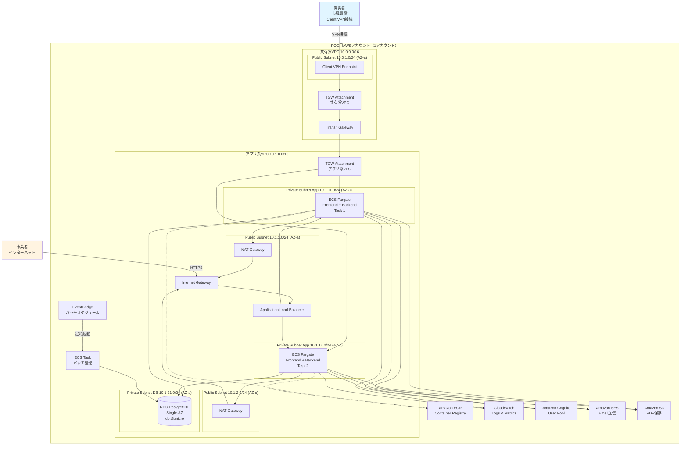
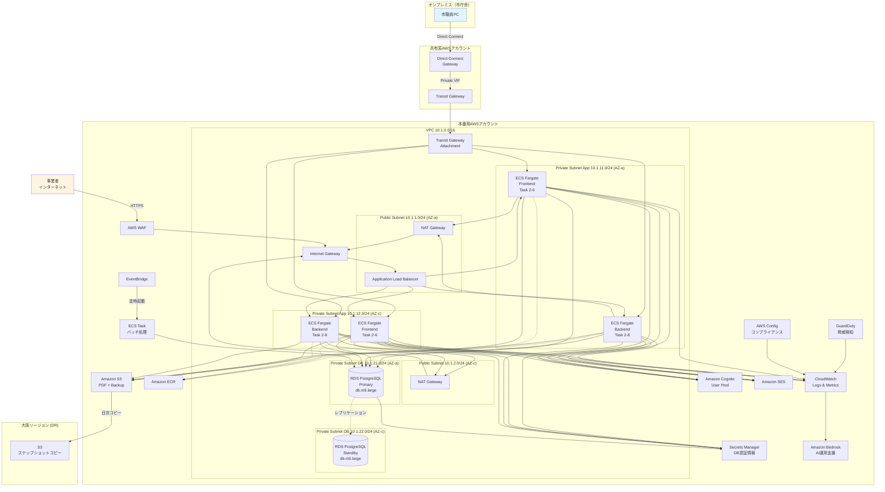
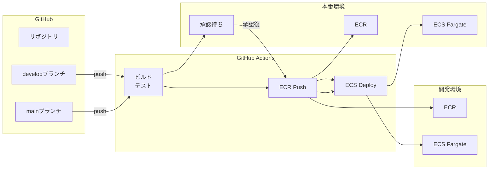
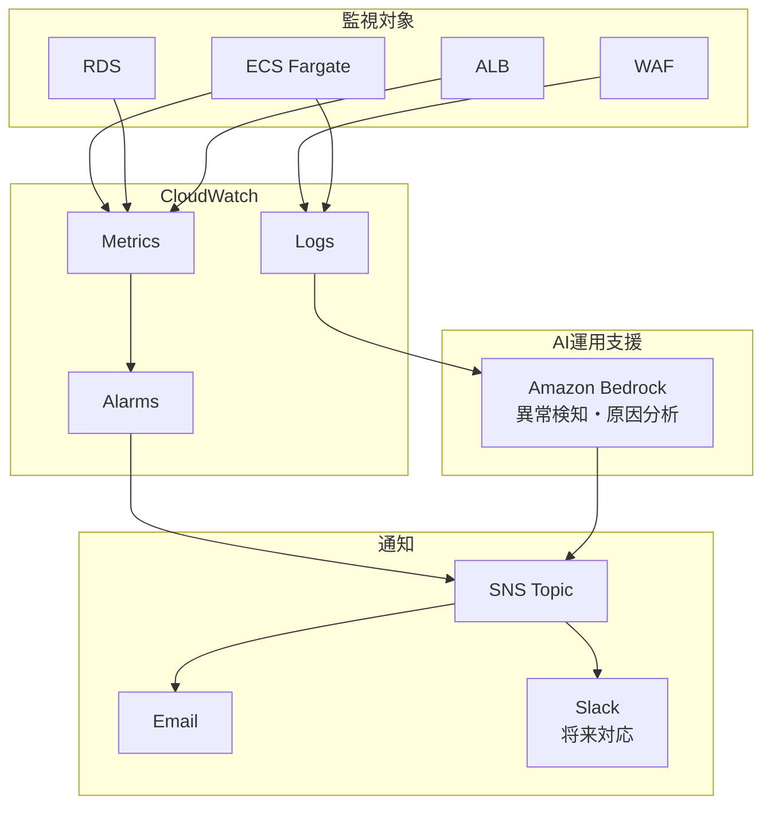
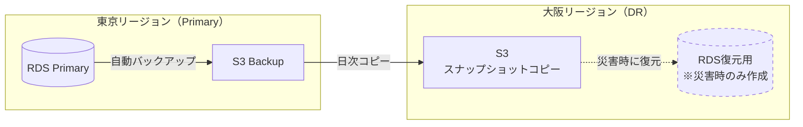

# AWS構成図

## 1. POC環境構成図

### 1.1 全体構成（POC）

### 1.2 POC環境の特徴

- **1アカウント、2VPC構成**: 共有系VPCとアプリ系VPCを分離
- **Transit Gateway検証**: 本番と同じTGW経由のルーティングを確認
- **2つのアクセス経路**:
  - 事業者: インターネット → ALB（本番と同じ経路）
  - 市職員役（開発者）: Client VPN → TGW → アプリVPC（本番はDirect Connectに置き換え）
- **Single-AZ構成**: コスト削減のためRDSは単一AZ
- **最小リソース**: db.t3.micro、ECS最小タスク数

---

## 2. 本番環境構成図

### 2.1 全体構成（本番）

### 2.2 本番環境の特徴

- **Multi-AZ構成**: RDS、ECSタスクが複数AZに分散
- **Direct Connect + Transit Gateway**: 市庁舎からセキュアに接続
- **WAF**: インターネットからの攻撃を防御
- **Auto Scaling**: ECSタスクが負荷に応じて自動スケール
- **DR対応**: 大阪リージョンにスナップショットコピー

---

## 3. ネットワーク詳細

### 3.1 POC環境のネットワーク構成

#### 共有系VPC (10.0.0.0/16)

| サブネット種別 | CIDR | AZ | 用途 |
|--------------|------|----|----|
| Public Subnet 1 | 10.0.1.0/24 | ap-northeast-1a | Client VPN Endpoint |

#### アプリ系VPC (10.1.0.0/16)

| サブネット種別 | CIDR | AZ | 用途 |
|--------------|------|----|----|
| Public Subnet 1 | 10.1.1.0/24 | ap-northeast-1a | ALB, NAT Gateway |
| Public Subnet 2 | 10.1.2.0/24 | ap-northeast-1c | NAT Gateway |
| Private Subnet App 1 | 10.1.11.0/24 | ap-northeast-1a | ECS Fargate |
| Private Subnet App 2 | 10.1.12.0/24 | ap-northeast-1c | ECS Fargate |
| Private Subnet DB 1 | 10.1.21.0/24 | ap-northeast-1a | RDS |

### 3.2 本番環境のネットワーク構成

| サブネット種別 | CIDR | AZ | 用途 |
|--------------|------|----|----|
| Public Subnet 1 | 10.1.1.0/24 | ap-northeast-1a | ALB, NAT Gateway |
| Public Subnet 2 | 10.1.2.0/24 | ap-northeast-1c | ALB, NAT Gateway |
| Private Subnet App 1 | 10.1.11.0/24 | ap-northeast-1a | ECS Fargate |
| Private Subnet App 2 | 10.1.12.0/24 | ap-northeast-1c | ECS Fargate |
| Private Subnet DB 1 | 10.1.21.0/24 | ap-northeast-1a | RDS Primary |
| Private Subnet DB 2 | 10.1.22.0/24 | ap-northeast-1c | RDS Standby |

---

## 4. セキュリティグループ構成

### 4.1 ALB Security Group

| 方向 | プロトコル | ポート | ソース | 用途 |
|-----|----------|-------|--------|-----|
| Inbound | TCP | 443 | 0.0.0.0/0 | HTTPS（事業者） |
| Inbound | TCP | 443 | VPC CIDR | HTTPS（市職員） |
| Outbound | TCP | 3000 | ECS SG | Frontend |
| Outbound | TCP | 5000 | ECS SG | Backend API |

### 4.2 ECS Security Group

| 方向 | プロトコル | ポート | ソース | 用途 |
|-----|----------|-------|--------|-----|
| Inbound | TCP | 3000 | ALB SG | Frontend |
| Inbound | TCP | 5000 | ALB SG | Backend API |
| Inbound | TCP | 3000 | VPN CIDR | Frontend（POC開発者） |
| Inbound | TCP | 5000 | VPN CIDR | Backend API（POC開発者） |
| Outbound | TCP | 5432 | RDS SG | PostgreSQL |
| Outbound | TCP | 443 | 0.0.0.0/0 | AWS API, SES, S3 |

### 4.3 RDS Security Group

| 方向 | プロトコル | ポート | ソース | 用途 |
|-----|----------|-------|--------|-----|
| Inbound | TCP | 5432 | ECS SG | PostgreSQL |
| Outbound | - | - | - | なし |

---

## 5. コンポーネント詳細

### 5.1 ECS Fargate

#### POC環境
- **Frontend**:
  - CPU: 256 (.25 vCPU)
  - Memory: 512 MB
  - タスク数: 1-2
  - コンテナポート: 3000
- **Backend**:
  - CPU: 256 (.25 vCPU)
  - Memory: 512 MB
  - タスク数: 1-2
  - コンテナポート: 5000

#### 本番環境
- **Frontend**:
  - CPU: 512 (.5 vCPU)
  - Memory: 1024 MB
  - タスク数: 2-6（Auto Scaling）
  - コンテナポート: 3000
- **Backend**:
  - CPU: 1024 (1 vCPU)
  - Memory: 2048 MB
  - タスク数: 2-8（Auto Scaling）
  - コンテナポート: 5000

### 5.2 RDS PostgreSQL

#### POC環境
- **エンジン**: PostgreSQL 15
- **インスタンスクラス**: db.t3.micro
- **ストレージ**: 20 GB GP3
- **構成**: Single-AZ
- **バックアップ**: 7日間
- **暗号化**: 無効（コスト削減）

####本番環境
- **エンジン**: PostgreSQL 15
- **インスタンスクラス**: db.m5.large
- **ストレージ**: 100 GB GP3（Auto Scaling有効）
- **構成**: Multi-AZ
- **バックアップ**: 30日間
- **暗号化**: 有効（KMS）
- **Performance Insights**: 有効

### 5.3 Amazon Cognito

- **User Pool**: 1つ
- **User Groups**:
  - Administrators（市職員）
  - BusinessUsers（事業者）
- **MFA**: オプション
- **パスワードポリシー**:
  - 最小長: 8文字
  - 大文字・小文字・数字・記号必須
- **Lambda Triggers**:
  - Pre Sign-up（自己登録防止）
  - Post Authentication（ログイン記録）

### 5.4 Application Load Balancer

#### POC環境
- **スキーム**: Internet-facing
- **リスナー**:
  - HTTP:80 → HTTPS:443リダイレクト
  - HTTPS:443 → Target Group
- **ターゲットグループ**:
  - Frontend: /
  - Backend: /api/*
- **ヘルスチェック**:
  - パス: /health
  - 間隔: 30秒
  - タイムアウト: 5秒

####本番環境（POCと同じ + WAF）
- **WAF Rules**:
  - SQLインジェクション防止
  - XSS防止
  - レート制限（100 req/5min/IP）
  - 地域制限（日本のみ許可）

### 5.5 EventBridge + Batch処理

- **スケジュール**:
  - 日次集計: cron(0 2 * * ? *) 毎日2:00
  - 月次締め: cron(0 3 1 * ? *) 毎月1日3:00
- **ECS Task**:
  - CPU: 512
  - Memory: 1024 MB
  - タイムアウト: 6時間

---

## 6. CI/CDパイプライン構成

---

## 7. 監視・アラート構成

---

## 8. DR（災害復旧）構成

---

## 9. POC → 本番移行時の変更点

| 項目 | POC | 本番 |
|-----|-----|-----|
| AWSアカウント | 1アカウント（2VPC） | 共有系 + 本番用（2アカウント） |
| 共有系VPC | 10.0.0.0/16 | 共有系アカウントに移行 |
| アプリ系VPC | 10.1.0.0/16 | 本番アカウントに移行 |
| ネットワーク接続（市職員） | Client VPN | Direct Connect + TGW |
| Transit Gateway | POCで検証済み | アカウント分離 |
| RDS構成 | Single-AZ | Multi-AZ |
| RDSインスタンス | db.t3.micro | db.m5.large |
| ECS Auto Scaling | 無効 | 有効 |
| WAF | なし | あり |
| GuardDuty | なし | あり |
| Config | なし | あり |
| DR対応 | なし | 大阪リージョンコピー |
| 暗号化 | 無効 | 有効 |

---

**作成日**: 2025-09-30
**承認者**: （承認後に記入）
**承認日**: （承認後に記入）