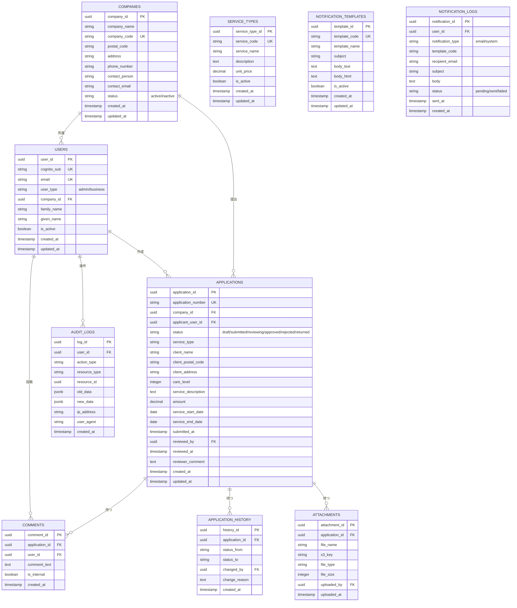
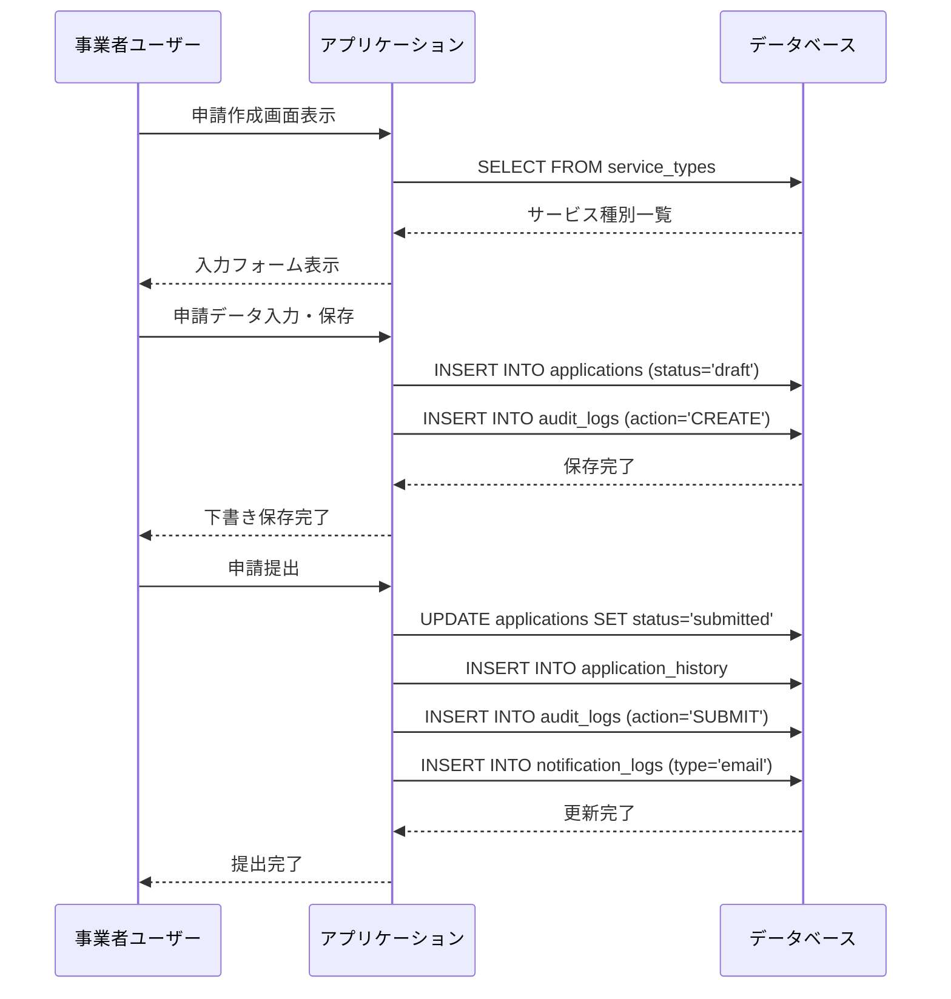
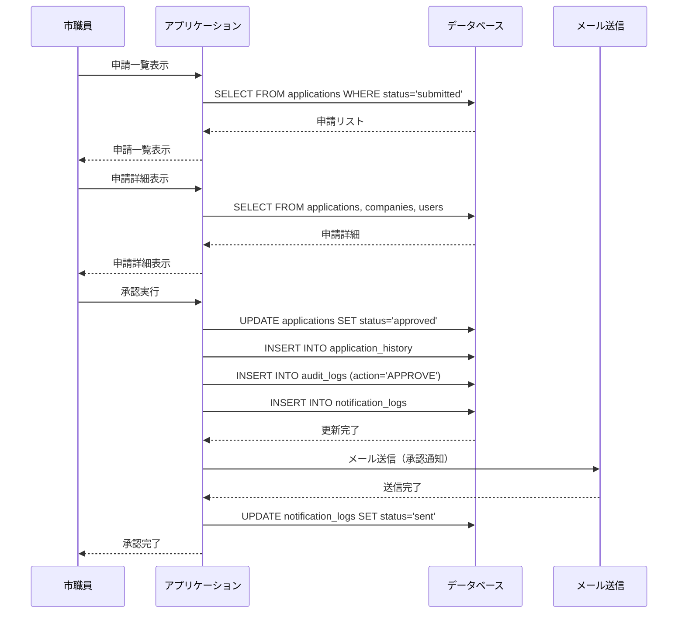

# データモデル設計

## 1. ER図



---

## 2. テーブル詳細定義

### 2.1 USERS（ユーザー）

ユーザー情報を管理するテーブル。Cognitoと連携。

| カラム名 | 型 | NULL | デフォルト | 説明 |
|---------|-----|------|----------|------|
| user_id | UUID | NOT NULL | gen_random_uuid() | ユーザーID（主キー） |
| cognito_sub | VARCHAR(255) | NOT NULL | - | Cognito User Pool Sub（一意） |
| email | VARCHAR(255) | NOT NULL | - | メールアドレス（一意） |
| user_type | VARCHAR(20) | NOT NULL | - | ユーザー種別（admin/business） |
| company_id | UUID | NULL | - | 所属事業者ID（事業者ユーザーのみ） |
| family_name | VARCHAR(100) | NOT NULL | - | 姓 |
| given_name | VARCHAR(100) | NOT NULL | - | 名 |
| is_active | BOOLEAN | NOT NULL | TRUE | 有効フラグ |
| created_at | TIMESTAMP | NOT NULL | CURRENT_TIMESTAMP | 作成日時 |
| updated_at | TIMESTAMP | NOT NULL | CURRENT_TIMESTAMP | 更新日時 |

**インデックス**:
- PRIMARY KEY (user_id)
- UNIQUE INDEX (cognito_sub)
- UNIQUE INDEX (email)
- INDEX (company_id)
- INDEX (user_type, is_active)

**制約**:
- user_type IN ('admin', 'business')
- user_type='business' の場合、company_id は NOT NULL

---

### 2.2 COMPANIES（事業者）

介護事業者情報を管理するテーブル。

| カラム名 | 型 | NULL | デフォルト | 説明 |
|---------|-----|------|----------|------|
| company_id | UUID | NOT NULL | gen_random_uuid() | 事業者ID（主キー） |
| company_name | VARCHAR(255) | NOT NULL | - | 事業者名 |
| company_code | VARCHAR(50) | NOT NULL | - | 事業者コード（一意） |
| postal_code | VARCHAR(10) | NOT NULL | - | 郵便番号 |
| address | VARCHAR(500) | NOT NULL | - | 住所 |
| phone_number | VARCHAR(20) | NOT NULL | - | 電話番号 |
| contact_person | VARCHAR(100) | NOT NULL | - | 担当者名 |
| contact_email | VARCHAR(255) | NOT NULL | - | 担当者メールアドレス |
| status | VARCHAR(20) | NOT NULL | 'active' | ステータス（active/inactive） |
| created_at | TIMESTAMP | NOT NULL | CURRENT_TIMESTAMP | 作成日時 |
| updated_at | TIMESTAMP | NOT NULL | CURRENT_TIMESTAMP | 更新日時 |

**インデックス**:
- PRIMARY KEY (company_id)
- UNIQUE INDEX (company_code)
- INDEX (status)

**制約**:
- status IN ('active', 'inactive')

---

### 2.3 APPLICATIONS（申請）

介護保険申請を管理するメインテーブル。

| カラム名 | 型 | NULL | デフォルト | 説明 |
|---------|-----|------|----------|------|
| application_id | UUID | NOT NULL | gen_random_uuid() | 申請ID（主キー） |
| application_number | VARCHAR(50) | NOT NULL | - | 申請番号（一意、自動採番） |
| company_id | UUID | NOT NULL | - | 事業者ID |
| applicant_user_id | UUID | NOT NULL | - | 申請者ユーザーID |
| status | VARCHAR(20) | NOT NULL | 'draft' | ステータス |
| service_type | VARCHAR(100) | NOT NULL | - | サービス種別 |
| client_name | VARCHAR(100) | NOT NULL | - | 利用者名 |
| client_postal_code | VARCHAR(10) | NOT NULL | - | 利用者郵便番号 |
| client_address | VARCHAR(500) | NOT NULL | - | 利用者住所 |
| care_level | INTEGER | NOT NULL | - | 要介護度（1-5） |
| service_description | TEXT | NOT NULL | - | サービス内容 |
| amount | DECIMAL(10,2) | NOT NULL | - | 金額 |
| service_start_date | DATE | NOT NULL | - | サービス開始日 |
| service_end_date | DATE | NOT NULL | - | サービス終了日 |
| submitted_at | TIMESTAMP | NULL | - | 提出日時 |
| reviewed_by | UUID | NULL | - | 審査者ユーザーID |
| reviewed_at | TIMESTAMP | NULL | - | 審査日時 |
| reviewer_comment | TEXT | NULL | - | 審査コメント |
| created_at | TIMESTAMP | NOT NULL | CURRENT_TIMESTAMP | 作成日時 |
| updated_at | TIMESTAMP | NOT NULL | CURRENT_TIMESTAMP | 更新日時 |

**インデックス**:
- PRIMARY KEY (application_id)
- UNIQUE INDEX (application_number)
- INDEX (company_id, status)
- INDEX (applicant_user_id)
- INDEX (reviewed_by)
- INDEX (status, submitted_at)
- INDEX (created_at)

**制約**:
- status IN ('draft', 'submitted', 'reviewing', 'approved', 'rejected', 'returned')
- care_level BETWEEN 1 AND 5
- service_end_date >= service_start_date

**申請番号フォーマット**: `APP-YYYYMMDD-XXXXX`
- 例: APP-20250930-00001

---

### 2.4 COMMENTS（コメント）

申請に対するコメントを管理するテーブル。

| カラム名 | 型 | NULL | デフォルト | 説明 |
|---------|-----|------|----------|------|
| comment_id | UUID | NOT NULL | gen_random_uuid() | コメントID（主キー） |
| application_id | UUID | NOT NULL | - | 申請ID |
| user_id | UUID | NOT NULL | - | コメント投稿者ユーザーID |
| comment_text | TEXT | NOT NULL | - | コメント本文 |
| is_internal | BOOLEAN | NOT NULL | FALSE | 内部コメントフラグ（市職員のみ閲覧可） |
| created_at | TIMESTAMP | NOT NULL | CURRENT_TIMESTAMP | 作成日時 |

**インデックス**:
- PRIMARY KEY (comment_id)
- INDEX (application_id, created_at)
- INDEX (user_id)

---

### 2.5 APPLICATION_HISTORY（申請履歴）

申請のステータス変更履歴を記録するテーブル。

| カラム名 | 型 | NULL | デフォルト | 説明 |
|---------|-----|------|----------|------|
| history_id | UUID | NOT NULL | gen_random_uuid() | 履歴ID（主キー） |
| application_id | UUID | NOT NULL | - | 申請ID |
| status_from | VARCHAR(20) | NOT NULL | - | 変更前ステータス |
| status_to | VARCHAR(20) | NOT NULL | - | 変更後ステータス |
| changed_by | UUID | NOT NULL | - | 変更者ユーザーID |
| change_reason | TEXT | NULL | - | 変更理由 |
| created_at | TIMESTAMP | NOT NULL | CURRENT_TIMESTAMP | 作成日時 |

**インデックス**:
- PRIMARY KEY (history_id)
- INDEX (application_id, created_at)
- INDEX (changed_by)

---

### 2.6 ATTACHMENTS（添付ファイル）

申請に添付されたファイルを管理するテーブル。

| カラム名 | 型 | NULL | デフォルト | 説明 |
|---------|-----|------|----------|------|
| attachment_id | UUID | NOT NULL | gen_random_uuid() | 添付ファイルID（主キー） |
| application_id | UUID | NOT NULL | - | 申請ID |
| file_name | VARCHAR(255) | NOT NULL | - | ファイル名 |
| s3_key | VARCHAR(500) | NOT NULL | - | S3オブジェクトキー |
| file_type | VARCHAR(50) | NOT NULL | - | ファイルタイプ（MIME Type） |
| file_size | INTEGER | NOT NULL | - | ファイルサイズ（バイト） |
| uploaded_by | UUID | NOT NULL | - | アップロード者ユーザーID |
| uploaded_at | TIMESTAMP | NOT NULL | CURRENT_TIMESTAMP | アップロード日時 |

**インデックス**:
- PRIMARY KEY (attachment_id)
- INDEX (application_id)
- UNIQUE INDEX (s3_key)

**制約**:
- file_size <= 10485760 (10MB)

---

### 2.7 AUDIT_LOGS（監査ログ）

全ての重要操作を記録する監査ログテーブル。

| カラム名 | 型 | NULL | デフォルト | 説明 |
|---------|-----|------|----------|------|
| log_id | UUID | NOT NULL | gen_random_uuid() | ログID（主キー） |
| user_id | UUID | NULL | - | ユーザーID |
| action_type | VARCHAR(50) | NOT NULL | - | アクション種別 |
| resource_type | VARCHAR(50) | NOT NULL | - | リソース種別 |
| resource_id | UUID | NULL | - | リソースID |
| old_data | JSONB | NULL | - | 変更前データ |
| new_data | JSONB | NULL | - | 変更後データ |
| ip_address | VARCHAR(45) | NOT NULL | - | IPアドレス |
| user_agent | VARCHAR(500) | NOT NULL | - | User Agent |
| created_at | TIMESTAMP | NOT NULL | CURRENT_TIMESTAMP | 作成日時 |

**インデックス**:
- PRIMARY KEY (log_id)
- INDEX (user_id, created_at)
- INDEX (action_type, created_at)
- INDEX (resource_type, resource_id)
- INDEX (created_at)

**アクション種別**:
- LOGIN, LOGOUT
- CREATE, UPDATE, DELETE
- APPROVE, REJECT, RETURN
- EXPORT

---

### 2.8 SERVICE_TYPES（サービス種別マスタ）

介護サービス種別を管理するマスタテーブル。

| カラム名 | 型 | NULL | デフォルト | 説明 |
|---------|-----|------|----------|------|
| service_type_id | UUID | NOT NULL | gen_random_uuid() | サービス種別ID（主キー） |
| service_code | VARCHAR(50) | NOT NULL | - | サービスコード（一意） |
| service_name | VARCHAR(255) | NOT NULL | - | サービス名 |
| description | TEXT | NULL | - | 説明 |
| unit_price | DECIMAL(10,2) | NOT NULL | - | 単価 |
| is_active | BOOLEAN | NOT NULL | TRUE | 有効フラグ |
| created_at | TIMESTAMP | NOT NULL | CURRENT_TIMESTAMP | 作成日時 |
| updated_at | TIMESTAMP | NOT NULL | CURRENT_TIMESTAMP | 更新日時 |

**インデックス**:
- PRIMARY KEY (service_type_id)
- UNIQUE INDEX (service_code)
- INDEX (is_active)

**初期データ例**:
- 訪問介護
- 訪問入浴介護
- 訪問看護
- 通所介護
- 短期入所生活介護

---

### 2.9 NOTIFICATION_TEMPLATES（通知テンプレート）

メール通知のテンプレートを管理するテーブル。

| カラム名 | 型 | NULL | デフォルト | 説明 |
|---------|-----|------|----------|------|
| template_id | UUID | NOT NULL | gen_random_uuid() | テンプレートID（主キー） |
| template_code | VARCHAR(50) | NOT NULL | - | テンプレートコード（一意） |
| template_name | VARCHAR(255) | NOT NULL | - | テンプレート名 |
| subject | VARCHAR(255) | NOT NULL | - | 件名（変数埋め込み可） |
| body_text | TEXT | NOT NULL | - | 本文（テキスト版） |
| body_html | TEXT | NULL | - | 本文（HTML版） |
| is_active | BOOLEAN | NOT NULL | TRUE | 有効フラグ |
| created_at | TIMESTAMP | NOT NULL | CURRENT_TIMESTAMP | 作成日時 |
| updated_at | TIMESTAMP | NOT NULL | CURRENT_TIMESTAMP | 更新日時 |

**インデックス**:
- PRIMARY KEY (template_id)
- UNIQUE INDEX (template_code)

**テンプレートコード例**:
- APPLICATION_SUBMITTED: 申請提出時（市職員宛）
- APPLICATION_APPROVED: 申請承認時（事業者宛）
- APPLICATION_REJECTED: 申請却下時（事業者宛）
- APPLICATION_RETURNED: 差し戻し時（事業者宛）

**変数埋め込みフォーマット**: `{{変数名}}`
- 例: `{{company_name}}様、申請番号{{application_number}}が承認されました。`

---

### 2.10 NOTIFICATION_LOGS（通知ログ）

送信した通知の履歴を記録するテーブル。

| カラム名 | 型 | NULL | デフォルト | 説明 |
|---------|-----|------|----------|------|
| notification_id | UUID | NOT NULL | gen_random_uuid() | 通知ID（主キー） |
| user_id | UUID | NULL | - | 宛先ユーザーID |
| notification_type | VARCHAR(20) | NOT NULL | - | 通知種別（email/system） |
| template_code | VARCHAR(50) | NULL | - | 使用テンプレートコード |
| recipient_email | VARCHAR(255) | NOT NULL | - | 宛先メールアドレス |
| subject | VARCHAR(255) | NOT NULL | - | 件名 |
| body | TEXT | NOT NULL | - | 本文 |
| status | VARCHAR(20) | NOT NULL | 'pending' | ステータス（pending/sent/failed） |
| sent_at | TIMESTAMP | NULL | - | 送信日時 |
| created_at | TIMESTAMP | NOT NULL | CURRENT_TIMESTAMP | 作成日時 |

**インデックス**:
- PRIMARY KEY (notification_id)
- INDEX (user_id, created_at)
- INDEX (status, created_at)

---

## 3. データフロー

### 3.1 申請作成フロー



### 3.2 申請承認フロー



---

## 4. インデックス戦略

### 4.1 検索パフォーマンス最適化

**事業者の申請一覧表示**:
```sql
SELECT * FROM applications
WHERE company_id = ? AND status = ?
ORDER BY created_at DESC;
```
→ INDEX (company_id, status, created_at)

**市職員の申請一覧表示**:
```sql
SELECT * FROM applications
WHERE status IN ('submitted', 'reviewing')
ORDER BY submitted_at ASC;
```
→ INDEX (status, submitted_at)

**全文検索（将来対応）**:
```sql
SELECT * FROM applications
WHERE client_name LIKE '%山田%';
```
→ GIN INDEX on client_name（PostgreSQL Full-Text Search）

---

## 5. データ保持ポリシー

| テーブル | 保持期間 | アーカイブ方法 |
|---------|---------|--------------|
| applications | 7年 | パーティショニング（年単位） |
| application_history | 7年 | パーティショニング（年単位） |
| audit_logs | 7年 | S3エクスポート（年次） |
| notification_logs | 1年 | 削除 |
| attachments | 7年 | S3 Glacier移行（1年後） |

---

## 6. バックアップ・リカバリ戦略

### 6.1 バックアップ対象

- **RDS自動バックアップ**: 全テーブル（日次）
- **S3バックアップ**: attachments の実ファイル（週次）
- **エクスポート**: audit_logs（年次、CSV形式）

### 6.2 リカバリシナリオ

**誤削除からの復旧**:
- RDSスナップショットから復元（過去30日分）

**データ破損からの復旧**:
- Point-in-Time Recovery（PITRで任意時点に復元）

---

## 7. セキュリティ・権限

### 7.1 Row Level Security（RLS）

**事業者ユーザー**:
- 自社の申請のみ閲覧・編集可能
```sql
CREATE POLICY company_isolation ON applications
FOR ALL TO business_user
USING (company_id = current_setting('app.current_company_id')::uuid);
```

**市職員**:
- 全申請の閲覧・編集可能（制限なし）

### 7.2 列レベル暗号化（将来対応）

個人情報カラムを暗号化:
- client_name
- client_address
- client_postal_code

---

**作成日**: 2025-09-30
**承認者**: （承認後に記入）
**承認日**: （承認後に記入）