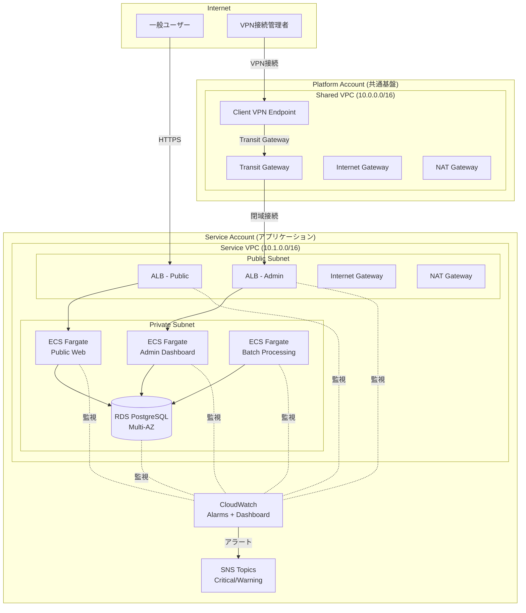
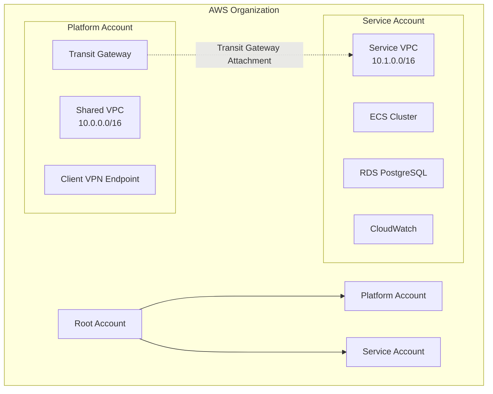
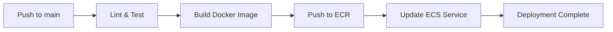
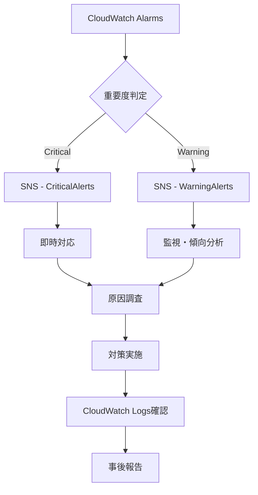

# 基本設計書

> AWS Multi-Account Sample Application
> Transit Gateway による拠点間閉域接続を実現する技術検証・社内デモ用サンプル

---

## 1. ドキュメント情報

| 項目 | 内容 |
|------|------|
| プロジェクト名 | AWS Multi-Account Sample Application |
| 文書バージョン | 2.0 |
| 作成日 | 2025-10-20 |
| 最終更新日 | 2025-10-20 |
| 承認状態 | 承認待ち |

---

## 2. システム概要

### 2.1 システム構成図



### 2.2 技術スタック

| レイヤー | 技術 | バージョン | 選定理由 |
|---------|------|-----------|---------|
| インフラ | AWS Multi-Account | - | Platform/Service分離による責務分離 |
| IaC | CloudFormation | - | AWSネイティブ、ネストスタック活用 |
| ネットワーク | Transit Gateway | - | VPC間閉域接続、拡張性 |
| VPN | Client VPN | - | オンプレミス拠点想定アクセス |
| コンピュート | ECS Fargate | - | サーバーレス、運用負荷削減 |
| データベース | RDS PostgreSQL | 14.x | リレーショナルDB、Multi-AZ対応 |
| バックエンド | Node.js | 20.x LTS | 軽量、非同期処理、エコシステム豊富 |
| フロントエンド | React | 18.x | コンポーネントベース、エコシステム豊富 |
| 監視 | CloudWatch | - | AWS統合監視、Alarms/Dashboard |
| 通知 | SNS | - | アラート通知 |
| CI/CD | GitHub Actions | - | GitHub統合、無料枠あり |
| コンテナレジストリ | ECR | - | AWS統合 |

---

## 3. アーキテクチャ設計

### 3.1 アーキテクチャパターン

**採用パターン:** Multi-Account + Transit Gateway Hub-and-Spoke

**選定理由:**
- Platform AccountとService Accountを分離することで責務を明確化
- Transit Gatewayをハブとして、将来的な拠点追加に柔軟に対応
- 共通基盤とアプリケーション基盤を独立管理

### 3.2 設計原則

- ✅ 疎結合：アカウント間、サービス間を疎結合に設計
- ✅ 高凝集：各サービスは独立した責務を持つ
- ✅ 単一責任の原則：各コンポーネントは1つの責務のみ
- ✅ スケーラビリティ：ECS Auto Scalingで水平スケール
- ✅ 可用性：Multi-AZ構成で高可用性を確保
- ✅ セキュリティ：管理系はVPN経由のみアクセス可能

### 3.3 アカウント構成



**Platform Account:**
- 役割：共通ネットワーク基盤の管理
- リソース：Shared VPC、Transit Gateway、Client VPN

**Service Account:**
- 役割：アプリケーション基盤の管理
- リソース：Service VPC、ECS、RDS、CloudWatch

---

## 4. ネットワーク設計

### 4.1 全体ネットワーク構成

```mermaid
graph TB
    subgraph "Internet"
        Internet[Internet]
    end

    subgraph "Platform Account: Shared VPC (10.0.0.0/16)"
        subgraph "AZ-1a"
            P_Pub1[Public Subnet<br/>10.0.1.0/24]
            P_Priv1[Private Subnet<br/>10.0.11.0/24]
        end

        subgraph "AZ-1c"
            P_Pub2[Public Subnet<br/>10.0.2.0/24]
            P_Priv2[Private Subnet<br/>10.0.12.0/24]
        end

        P_IGW[Internet Gateway]
        P_NAT1[NAT Gateway - 1a]
        P_NAT2[NAT Gateway - 1c]
        TGW[Transit Gateway]
        CVE[Client VPN Endpoint]
    end

    subgraph "Service Account: Service VPC (10.1.0.0/16)"
        subgraph "AZ-1a"
            S_Pub1[Public Subnet<br/>10.1.1.0/24<br/>ALB配置]
            S_Priv1[Private Subnet<br/>10.1.11.0/24<br/>ECS, RDS配置]
        end

        subgraph "AZ-1c"
            S_Pub2[Public Subnet<br/>10.1.2.0/24<br/>ALB配置]
            S_Priv2[Private Subnet<br/>10.1.12.0/24<br/>ECS, RDS配置]
        end

        S_IGW[Internet Gateway]
        S_NAT1[NAT Gateway - 1a]
        S_NAT2[NAT Gateway - 1c]
        TGW_ATT[TGW Attachment]
    end

    Internet --> P_IGW
    Internet --> S_IGW
    P_IGW --> P_Pub1
    P_IGW --> P_Pub2
    S_IGW --> S_Pub1
    S_IGW --> S_Pub2

    P_Pub1 --> P_NAT1
    P_Pub2 --> P_NAT2
    S_Pub1 --> S_NAT1
    S_Pub2 --> S_NAT2

    P_NAT1 --> P_Priv1
    P_NAT2 --> P_Priv2
    S_NAT1 --> S_Priv1
    S_NAT2 --> S_Priv2

    TGW -.Transit Gateway.-> TGW_ATT
    CVE -.VPN接続.-> P_Priv1
```

### 4.2 CIDR設計

#### Platform Account: Shared VPC

| 項目 | CIDR | 用途 |
|------|------|------|
| VPC | 10.0.0.0/16 | Platform Account全体 |
| Public Subnet 1a | 10.0.1.0/24 | NAT Gateway配置 |
| Public Subnet 1c | 10.0.2.0/24 | NAT Gateway配置 |
| Private Subnet 1a | 10.0.11.0/24 | Client VPN接続先 |
| Private Subnet 1c | 10.0.12.0/24 | Client VPN接続先 |

**使用可能IP数:**
- VPC全体：65,536 IP
- Public Subnet（各）：256 IP
- Private Subnet（各）：256 IP

#### Service Account: Service VPC

| 項目 | CIDR | 用途 |
|------|------|------|
| VPC | 10.1.0.0/16 | Service Account全体 |
| Public Subnet 1a | 10.1.1.0/24 | ALB配置 |
| Public Subnet 1c | 10.1.2.0/24 | ALB配置 |
| Private Subnet 1a | 10.1.11.0/24 | ECS Fargate、RDS Primary配置 |
| Private Subnet 1c | 10.1.12.0/24 | ECS Fargate、RDS Standby配置 |

**使用可能IP数:**
- VPC全体：65,536 IP
- Public Subnet（各）：256 IP
- Private Subnet（各）：256 IP

### 4.3 ルートテーブル設計

#### Platform Account: Public Subnet Route Table

| Destination | Target | 説明 |
|------------|--------|------|
| 10.0.0.0/16 | local | VPC内通信 |
| 0.0.0.0/0 | Internet Gateway | インターネット向け |
| 10.1.0.0/16 | Transit Gateway | Service VPC向け |

#### Platform Account: Private Subnet Route Table

| Destination | Target | 説明 |
|------------|--------|------|
| 10.0.0.0/16 | local | VPC内通信 |
| 0.0.0.0/0 | NAT Gateway | インターネット向け（NAT経由） |
| 10.1.0.0/16 | Transit Gateway | Service VPC向け |

#### Service Account: Public Subnet Route Table

| Destination | Target | 説明 |
|------------|--------|------|
| 10.1.0.0/16 | local | VPC内通信 |
| 0.0.0.0/0 | Internet Gateway | インターネット向け |
| 10.0.0.0/16 | Transit Gateway | Shared VPC向け |

#### Service Account: Private Subnet Route Table

| Destination | Target | 説明 |
|------------|--------|------|
| 10.1.0.0/16 | local | VPC内通信 |
| 0.0.0.0/0 | NAT Gateway | インターネット向け（NAT経由） |
| 10.0.0.0/16 | Transit Gateway | Shared VPC向け |

### 4.4 Transit Gateway設計

**Transit Gateway構成:**
- リージョン：ap-northeast-1
- Default Route Table Association：無効（明示的な関連付け）
- Default Route Table Propagation：無効（明示的な伝播）
- Auto Accept Shared Attachments：有効

**Attachment構成:**

| Attachment | VPC | アカウント | Route Table |
|-----------|-----|-----------|-------------|
| tgw-attach-platform | Shared VPC | Platform Account | tgw-rt-platform |
| tgw-attach-service | Service VPC | Service Account | tgw-rt-service |

**Route Table構成:**

**tgw-rt-platform（Platform Account用）:**
| Destination | Target | 説明 |
|------------|--------|------|
| 10.0.0.0/16 | tgw-attach-platform | Shared VPC |
| 10.1.0.0/16 | tgw-attach-service | Service VPC |

**tgw-rt-service（Service Account用）:**
| Destination | Target | 説明 |
|------------|--------|------|
| 10.1.0.0/16 | tgw-attach-service | Service VPC |
| 10.0.0.0/16 | tgw-attach-platform | Shared VPC |

### 4.5 Client VPN設計

**Client VPN Endpoint構成:**
- VPC：Shared VPC
- Subnet：Private Subnet 1a, 1c
- Client CIDR：172.16.0.0/22（VPNクライアントに割り当て）
- 認証方式：相互認証（証明書ベース）
- Split Tunnel：有効（AWSリソースのみVPN経由）

**認証設定:**
- サーバー証明書：ACM管理
- クライアント証明書：ACM管理
- ルート証明書：ACM管理

**Authorization Rules:**
| Destination | Access Group | 説明 |
|------------|-------------|------|
| 10.0.0.0/16 | All | Shared VPCへのアクセス |
| 10.1.0.0/16 | All | Service VPCへのアクセス（Transit Gateway経由） |

---

## 5. セキュリティグループ設計

### 5.1 Service Account セキュリティグループ

#### sg-alb-public（Public ALB用）

**Inbound:**
| タイプ | プロトコル | ポート | ソース | 説明 |
|--------|----------|--------|--------|------|
| HTTPS | TCP | 443 | 0.0.0.0/0 | インターネットからHTTPS |
| HTTP | TCP | 80 | 0.0.0.0/0 | HTTP→HTTPS リダイレクト |

**Outbound:**
| タイプ | プロトコル | ポート | 送信先 | 説明 |
|--------|----------|--------|--------|------|
| ALL | ALL | ALL | sg-ecs-public | ECS Publicへの転送 |

---

#### sg-alb-admin（Admin ALB用）

**Inbound:**
| タイプ | プロトコル | ポート | ソース | 説明 |
|--------|----------|--------|--------|------|
| HTTPS | TCP | 443 | 10.0.0.0/16 | Shared VPC（VPN経由）からのみ |

**Outbound:**
| タイプ | プロトコル | ポート | 送信先 | 説明 |
|--------|----------|--------|--------|------|
| ALL | ALL | ALL | sg-ecs-admin | ECS Adminへの転送 |

---

#### sg-ecs-public（ECS Public Service用）

**Inbound:**
| タイプ | プロトコル | ポート | ソース | 説明 |
|--------|----------|--------|--------|------|
| HTTP | TCP | 8080 | sg-alb-public | ALB Publicからのトラフィック |

**Outbound:**
| タイプ | プロトコル | ポート | 送信先 | 説明 |
|--------|----------|--------|--------|------|
| HTTPS | TCP | 443 | 0.0.0.0/0 | 外部API通信、ECR pull |
| TCP | TCP | 5432 | sg-rds | RDS接続 |

---

#### sg-ecs-admin（ECS Admin Service用）

**Inbound:**
| タイプ | プロトコル | ポート | ソース | 説明 |
|--------|----------|--------|--------|------|
| HTTP | TCP | 8080 | sg-alb-admin | ALB Adminからのトラフィック |

**Outbound:**
| タイプ | プロトコル | ポート | 送信先 | 説明 |
|--------|----------|--------|--------|------|
| HTTPS | TCP | 443 | 0.0.0.0/0 | 外部API通信、ECR pull |
| TCP | TCP | 5432 | sg-rds | RDS接続 |

---

#### sg-ecs-batch（ECS Batch Service用）

**Inbound:**
| タイプ | プロトコル | ポート | ソース | 説明 |
|--------|----------|--------|--------|------|
| なし | - | - | - | 外部からのアクセス不要 |

**Outbound:**
| タイプ | プロトコル | ポート | 送信先 | 説明 |
|--------|----------|--------|--------|------|
| HTTPS | TCP | 443 | 0.0.0.0/0 | 外部API通信、ECR pull |
| TCP | TCP | 5432 | sg-rds | RDS接続 |

---

#### sg-rds（RDS PostgreSQL用）

**Inbound:**
| タイプ | プロトコル | ポート | ソース | 説明 |
|--------|----------|--------|--------|------|
| PostgreSQL | TCP | 5432 | sg-ecs-public | ECS Publicから |
| PostgreSQL | TCP | 5432 | sg-ecs-admin | ECS Adminから |
| PostgreSQL | TCP | 5432 | sg-ecs-batch | ECS Batchから |

**Outbound:**
| タイプ | プロトコル | ポート | 送信先 | 説明 |
|--------|----------|--------|--------|------|
| なし | - | - | - | 外部への通信不要 |

---

## 6. コンピュート設計（ECS Fargate）

### 6.1 ECS Cluster構成

**Cluster名:** `myapp-service-cluster`

**容量プロバイダー:** FARGATE, FARGATE_SPOT

**Container Insights:** 有効

### 6.2 ECS Service構成

#### Public Web Service

| 項目 | 値 | 備考 |
|------|-----|------|
| Service名 | public-web-service | - |
| Task Definition | public-web-task | - |
| Desired Count | 2 | Multi-AZ配置 |
| Launch Type | FARGATE | サーバーレス |
| Platform Version | LATEST | - |
| Subnets | Private Subnet 1a, 1c | - |
| Security Groups | sg-ecs-public | - |
| Load Balancer | ALB Public | - |
| Target Group | tg-public-web | - |
| Health Check | /health | HTTP 200 |
| Deployment Type | Rolling Update | - |
| Auto Scaling | CPU 70%でスケール | Min: 2, Max: 10 |

**Task Definition（public-web-task）:**
- CPU：0.5 vCPU（512）
- Memory：1 GB（1024）
- Container Port：8080
- Environment Variables：
  - `NODE_ENV=production`
  - `DB_HOST`（Parameter Store参照）
  - `DB_PORT=5432`
  - `DB_NAME`（Parameter Store参照）
- Secrets：
  - `DB_PASSWORD`（Secrets Manager参照）

---

#### Admin Dashboard Service

| 項目 | 値 | 備考 |
|------|-----|------|
| Service名 | admin-dashboard-service | - |
| Task Definition | admin-dashboard-task | - |
| Desired Count | 2 | Multi-AZ配置 |
| Launch Type | FARGATE | サーバーレス |
| Platform Version | LATEST | - |
| Subnets | Private Subnet 1a, 1c | - |
| Security Groups | sg-ecs-admin | - |
| Load Balancer | ALB Admin | - |
| Target Group | tg-admin-dashboard | - |
| Health Check | /health | HTTP 200 |
| Deployment Type | Rolling Update | - |
| Auto Scaling | 無効 | 管理系のため固定 |

**Task Definition（admin-dashboard-task）:**
- CPU：0.25 vCPU（256）
- Memory：0.5 GB（512）
- Container Port：8080
- Environment Variables：同上
- Secrets：同上

---

#### Batch Processing Service

| 項目 | 値 | 備考 |
|------|-----|------|
| Service名 | batch-processing-service | - |
| Task Definition | batch-processing-task | - |
| Desired Count | 0 | Scheduled Task実行時のみ起動 |
| Launch Type | FARGATE | サーバーレス |
| Platform Version | LATEST | - |
| Subnets | Private Subnet 1a, 1c | - |
| Security Groups | sg-ecs-batch | - |
| Load Balancer | なし | - |

**Scheduled Task（EventBridge）:**
- Schedule：cron(0 17 * * ? *)（毎日深夜2時 JST）
- Task Count：1
- Task Definition：batch-processing-task

**Task Definition（batch-processing-task）:**
- CPU：0.5 vCPU（512）
- Memory：1 GB（1024）
- Environment Variables：同上
- Secrets：同上

---

### 6.3 Auto Scaling設定

#### Public Web Service Auto Scaling

**Target Tracking Scaling Policy:**
```yaml
MetricType: ECSServiceAverageCPUUtilization
TargetValue: 70.0
ScaleInCooldown: 300
ScaleOutCooldown: 60
```

**Capacity:**
- Minimum：2
- Desired：2
- Maximum：10

**スケールアウトシナリオ:**
- CPU使用率が70%を超えた場合、60秒後にタスク追加
- 最大10タスクまで増加

**スケールインシナリオ:**
- CPU使用率が70%を下回った場合、300秒後にタスク削除
- 最小2タスクを維持

---

## 7. データベース設計（RDS PostgreSQL）

### 7.1 RDS構成

| 項目 | 値 | 備考 |
|------|-----|------|
| Engine | PostgreSQL | - |
| Version | 14.10 | LTS |
| Instance Class | db.t3.medium | 2vCPU, 4GB RAM |
| Storage Type | gp3 | 汎用SSD |
| Allocated Storage | 100 GB | 初期容量 |
| Storage Autoscaling | 有効 | 最大200GB |
| Multi-AZ | 有効 | 高可用性 |
| Subnet Group | Private Subnet 1a, 1c | - |
| Security Group | sg-rds | - |
| Backup Retention | 7日間 | 自動バックアップ |
| Backup Window | 04:00-05:00 JST | メンテナンス時間 |
| Maintenance Window | Sun 05:00-06:00 JST | - |
| Encryption | 有効（AES-256） | AWS KMS管理 |
| Enhanced Monitoring | 有効（60秒間隔） | - |
| Performance Insights | 有効 | 7日間保持 |

### 7.2 接続情報管理

**Parameter Store:**
- `/myapp/db/host`：RDSエンドポイント
- `/myapp/db/port`：5432
- `/myapp/db/name`：myapp_db

**Secrets Manager:**
- `myapp/db/credentials`：
  ```json
  {
    "username": "postgres",
    "password": "<auto-generated>"
  }
  ```

### 7.3 データベース初期化

**初期DDL:**
```sql
-- UUID拡張有効化
CREATE EXTENSION IF NOT EXISTS "uuid-ossp";

-- ユーザーテーブル
CREATE TABLE users (
    user_id UUID PRIMARY KEY DEFAULT uuid_generate_v4(),
    email VARCHAR(255) UNIQUE NOT NULL,
    name VARCHAR(255) NOT NULL,
    created_at TIMESTAMP NOT NULL DEFAULT CURRENT_TIMESTAMP,
    updated_at TIMESTAMP NOT NULL DEFAULT CURRENT_TIMESTAMP
);

CREATE INDEX idx_users_email ON users(email);
CREATE INDEX idx_users_created_at ON users(created_at);

-- 注文テーブル
CREATE TABLE orders (
    order_id UUID PRIMARY KEY DEFAULT uuid_generate_v4(),
    user_id UUID NOT NULL REFERENCES users(user_id),
    total_amount DECIMAL(10,2) NOT NULL DEFAULT 0,
    status VARCHAR(50) NOT NULL DEFAULT 'pending',
    order_date TIMESTAMP NOT NULL DEFAULT CURRENT_TIMESTAMP,
    created_at TIMESTAMP NOT NULL DEFAULT CURRENT_TIMESTAMP,
    updated_at TIMESTAMP NOT NULL DEFAULT CURRENT_TIMESTAMP
);

CREATE INDEX idx_orders_user_id ON orders(user_id);
CREATE INDEX idx_orders_order_date ON orders(order_date);
CREATE INDEX idx_orders_status ON orders(status);

-- 商品テーブル
CREATE TABLE products (
    product_id UUID PRIMARY KEY DEFAULT uuid_generate_v4(),
    product_name VARCHAR(255) NOT NULL,
    price DECIMAL(10,2) NOT NULL DEFAULT 0,
    stock INTEGER NOT NULL DEFAULT 0,
    created_at TIMESTAMP NOT NULL DEFAULT CURRENT_TIMESTAMP,
    updated_at TIMESTAMP NOT NULL DEFAULT CURRENT_TIMESTAMP
);

-- 注文明細テーブル
CREATE TABLE order_items (
    order_item_id UUID PRIMARY KEY DEFAULT uuid_generate_v4(),
    order_id UUID NOT NULL REFERENCES orders(order_id),
    product_id UUID NOT NULL REFERENCES products(product_id),
    quantity INTEGER NOT NULL,
    unit_price DECIMAL(10,2) NOT NULL
);

CREATE INDEX idx_order_items_order_id ON order_items(order_id);
CREATE INDEX idx_order_items_product_id ON order_items(product_id);
```

---

## 8. ロードバランサー設計（ALB）

### 8.1 Public ALB構成

| 項目 | 値 | 備考 |
|------|-----|------|
| Name | myapp-public-alb | - |
| Scheme | internet-facing | インターネット公開 |
| IP Address Type | ipv4 | - |
| Subnets | Public Subnet 1a, 1c | Multi-AZ |
| Security Groups | sg-alb-public | - |
| Listeners | 443（HTTPS）、80（HTTP） | - |
| Target Group | tg-public-web | ECS Public Service |

**Listener Rules（HTTPS:443）:**
| 優先度 | 条件 | アクション |
|-------|------|----------|
| 1 | Path: /health | Return fixed response 200 |
| 2 | デフォルト | Forward to tg-public-web |

**Listener Rules（HTTP:80）:**
| 優先度 | 条件 | アクション |
|-------|------|----------|
| 1 | デフォルト | Redirect to HTTPS:443 |

**Target Group（tg-public-web）:**
- Protocol：HTTP
- Port：8080
- Target Type：ip（Fargate）
- Health Check Path：/health
- Health Check Interval：30秒
- Healthy Threshold：2
- Unhealthy Threshold：5
- Timeout：5秒
- Deregistration Delay：30秒

### 8.2 Admin ALB構成

| 項目 | 値 | 備考 |
|------|-----|------|
| Name | myapp-admin-alb | - |
| Scheme | internal | VPN経由のみ |
| IP Address Type | ipv4 | - |
| Subnets | Private Subnet 1a, 1c | Multi-AZ |
| Security Groups | sg-alb-admin | - |
| Listeners | 443（HTTPS） | - |
| Target Group | tg-admin-dashboard | ECS Admin Service |

**Listener Rules（HTTPS:443）:**
| 優先度 | 条件 | アクション |
|-------|------|----------|
| 1 | Path: /health | Return fixed response 200 |
| 2 | デフォルト | Forward to tg-admin-dashboard |

**Target Group（tg-admin-dashboard）:**
- 設定はtg-public-webと同様

---

## 9. 監視設計（CloudWatch）

### 9.1 CloudWatch Alarms構成

#### ECS関連アラーム

**ECS Public - CPU High:**
- Metric：ECSServiceAverageCPUUtilization
- Threshold：>= 80%
- Period：5分間
- Evaluation Periods：2
- Datapoints to Alarm：2 out of 2
- Action：SNS Topic（WarningAlerts）

**ECS Public - Memory High:**
- Metric：ECSServiceAverageMemoryUtilization
- Threshold：>= 80%
- Period：5分間
- Evaluation Periods：2
- Datapoints to Alarm：2 out of 2
- Action：SNS Topic（WarningAlerts）

**ECS Public - Task Count Zero:**
- Metric：RunningTaskCount
- Threshold：< 1
- Period：1分間
- Evaluation Periods：1
- Datapoints to Alarm：1 out of 1
- Action：SNS Topic（CriticalAlerts）

（ECS Admin、ECS Batchも同様のアラームを設定）

#### RDS関連アラーム

**RDS - CPU High:**
- Metric：CPUUtilization
- Threshold：>= 80%
- Period：5分間
- Evaluation Periods：2
- Datapoints to Alarm：2 out of 2
- Action：SNS Topic（WarningAlerts）

**RDS - Connections High:**
- Metric：DatabaseConnections
- Threshold：>= 80（最大接続数の80%）
- Period：5分間
- Evaluation Periods：2
- Datapoints to Alarm：2 out of 2
- Action：SNS Topic（WarningAlerts）

**RDS - Storage Low:**
- Metric：FreeStorageSpace
- Threshold：< 20 GB
- Period：5分間
- Evaluation Periods：1
- Datapoints to Alarm：1 out of 1
- Action：SNS Topic（WarningAlerts）

**RDS - Replication Lag High:**
- Metric：ReplicaLag
- Threshold：>= 60秒
- Period：1分間
- Evaluation Periods：2
- Datapoints to Alarm：2 out of 2
- Action：SNS Topic（CriticalAlerts）

#### ALB関連アラーム

**ALB Public - Unhealthy Target:**
- Metric：UnHealthyHostCount
- Threshold：>= 1
- Period：1分間
- Evaluation Periods：2
- Datapoints to Alarm：2 out of 2
- Action：SNS Topic（CriticalAlerts）

**ALB Public - 5xx Error Rate:**
- Metric：HTTPCode_Target_5XX_Count
- Threshold：>= 10（10リクエスト/分）
- Period：1分間
- Evaluation Periods：2
- Datapoints to Alarm：2 out of 2
- Action：SNS Topic（WarningAlerts）

**ALB Public - Response Time High:**
- Metric：TargetResponseTime
- Statistic：p95
- Threshold：>= 1秒
- Period：5分間
- Evaluation Periods：2
- Datapoints to Alarm：2 out of 2
- Action：SNS Topic（WarningAlerts）

### 9.2 CloudWatch Dashboard構成

**Dashboard名:** `myapp-service-dashboard`

**ウィジェット構成:**

```
+------------------------+------------------------+
| ECS Public CPU/Memory  | ECS Admin CPU/Memory   |
| - CPU使用率（%）       | - CPU使用率（%）       |
| - メモリ使用率（%）    | - メモリ使用率（%）    |
| - タスク数             | - タスク数             |
+------------------------+------------------------+
| RDS Metrics            | ALB Public Metrics     |
| - CPU使用率（%）       | - リクエスト数         |
| - 接続数               | - 5xxエラー率          |
| - ストレージ使用量     | - レスポンスタイム     |
| - レプリケーションラグ | - ターゲット健全性     |
+------------------------+------------------------+
| ECS Batch Metrics      | Network Metrics        |
| - 最終実行時刻         | - Transit Gateway      |
| - 実行ステータス       |   バイト数（In/Out）   |
| - エラーログ数         | - VPN接続数            |
+------------------------+------------------------+
```

### 9.3 SNS Topics構成

#### CriticalAlerts Topic

- Topic名：`myapp-critical-alerts`
- Protocol：Email
- Endpoint：（運用担当者メールアドレス）
- 用途：即時対応が必要なアラート
  - ECS Task全停止
  - RDSレプリケーションラグ
  - ALBターゲット異常

#### WarningAlerts Topic

- Topic名：`myapp-warning-alerts`
- Protocol：Email
- Endpoint：（運用担当者メールアドレス）
- 用途：監視・傾向分析が必要なアラート
  - CPU/メモリ高使用率
  - レスポンスタイム遅延
  - 5xxエラー率上昇

---

## 10. IAMロール設計

### 10.1 ECS Task Execution Role

**Role名:** `ecsTaskExecutionRole`

**Trust Policy:**
```json
{
  "Version": "2012-10-17",
  "Statement": [
    {
      "Effect": "Allow",
      "Principal": {
        "Service": "ecs-tasks.amazonaws.com"
      },
      "Action": "sts:AssumeRole"
    }
  ]
}
```

**Managed Policies:**
- `arn:aws:iam::aws:policy/service-role/AmazonECSTaskExecutionRolePolicy`

**Inline Policy:**
```json
{
  "Version": "2012-10-17",
  "Statement": [
    {
      "Effect": "Allow",
      "Action": [
        "secretsmanager:GetSecretValue"
      ],
      "Resource": [
        "arn:aws:secretsmanager:ap-northeast-1:*:secret:myapp/db/credentials*"
      ]
    },
    {
      "Effect": "Allow",
      "Action": [
        "ssm:GetParameters"
      ],
      "Resource": [
        "arn:aws:ssm:ap-northeast-1:*:parameter/myapp/db/*"
      ]
    }
  ]
}
```

### 10.2 ECS Task Role

**Role名:** `ecsTaskRole`

**Trust Policy:**（同上）

**Inline Policy:**
```json
{
  "Version": "2012-10-17",
  "Statement": [
    {
      "Effect": "Allow",
      "Action": [
        "logs:CreateLogStream",
        "logs:PutLogEvents"
      ],
      "Resource": "arn:aws:logs:ap-northeast-1:*:log-group:/ecs/myapp/*"
    }
  ]
}
```

### 10.3 GitHub Actions Deployment Role

**Role名:** `githubActionsDeploymentRole`

**Trust Policy（OIDC）:**
```json
{
  "Version": "2012-10-17",
  "Statement": [
    {
      "Effect": "Allow",
      "Principal": {
        "Federated": "arn:aws:iam::ACCOUNT_ID:oidc-provider/token.actions.githubusercontent.com"
      },
      "Action": "sts:AssumeRoleWithWebIdentity",
      "Condition": {
        "StringEquals": {
          "token.actions.githubusercontent.com:sub": "repo:YOUR_ORG/YOUR_REPO:ref:refs/heads/main"
        }
      }
    }
  ]
}
```

**Inline Policy:**
```json
{
  "Version": "2012-10-17",
  "Statement": [
    {
      "Effect": "Allow",
      "Action": [
        "ecr:GetAuthorizationToken",
        "ecr:BatchCheckLayerAvailability",
        "ecr:GetDownloadUrlForLayer",
        "ecr:BatchGetImage",
        "ecr:PutImage",
        "ecr:InitiateLayerUpload",
        "ecr:UploadLayerPart",
        "ecr:CompleteLayerUpload"
      ],
      "Resource": "*"
    },
    {
      "Effect": "Allow",
      "Action": [
        "ecs:UpdateService",
        "ecs:DescribeServices"
      ],
      "Resource": "arn:aws:ecs:ap-northeast-1:*:service/myapp-service-cluster/*"
    }
  ]
}
```

---

## 11. CloudFormationスタック構成

### 11.1 Platform Accountスタック構成

```
infra/platform/
├── stack.yaml                      # 親スタック
├── parameters-dev.json             # 開発環境パラメータ
├── parameters-prod.json            # 本番環境パラメータ
├── nested/
│   ├── network.yaml                # Shared VPC、サブネット、IGW、NAT
│   └── connectivity.yaml           # Transit Gateway、Client VPN
└── deploy.sh                       # デプロイスクリプト
```

**スタック依存関係:**
```
stack.yaml (親)
  ├── network.yaml (ネストスタック)
  └── connectivity.yaml (ネストスタック、networkに依存)
```

### 11.2 Service Accountスタック構成

```
infra/service/
├── 01-network.yaml                 # Service VPC、TGW Attachment
├── 02-database.yaml                # RDS PostgreSQL
├── 03-compute.yaml                 # ECS Cluster、Service、ALB
├── 04-monitoring.yaml              # CloudWatch Alarms、Dashboard（親）
├── parameters-dev.json             # 開発環境パラメータ
├── parameters-prod.json            # 本番環境パラメータ
├── nested/
│   └── monitoring/
│       ├── ecs-alarms.yaml         # ECS関連アラーム
│       ├── rds-alarms.yaml         # RDS関連アラーム
│       ├── alb-alarms.yaml         # ALB関連アラーム
│       └── dashboard.yaml          # CloudWatch Dashboard
└── deploy.sh                       # デプロイスクリプト
```

**スタック依存関係:**
```
01-network.yaml (独立)
  ↓
02-database.yaml (01に依存)
  ↓
03-compute.yaml (01、02に依存)
  ↓
04-monitoring.yaml (01、02、03に依存)
  ├── nested/monitoring/ecs-alarms.yaml
  ├── nested/monitoring/rds-alarms.yaml
  ├── nested/monitoring/alb-alarms.yaml
  └── nested/monitoring/dashboard.yaml
```

### 11.3 デプロイ順序

**Platform Account:**
1. `stack.yaml`（Change Set作成 → dry-run確認 → 実行）
   - `nested/network.yaml`が先に作成される
   - `nested/connectivity.yaml`が後に作成される

**Service Account:**
1. `01-network.yaml`（Change Set作成 → dry-run確認 → 実行）
2. `02-database.yaml`（Change Set作成 → dry-run確認 → 実行）
3. `03-compute.yaml`（Change Set作成 → dry-run確認 → 実行）
4. `04-monitoring.yaml`（Change Set作成 → dry-run確認 → 実行）

**重要:** すべてのスタックはChange Setsで差分確認後に実行すること

---

## 12. CI/CD設計

### 12.1 GitHub Actionsワークフロー概要



### 12.2 ワークフロー詳細

**トリガー:**
- `main`ブランチへのpush
- Pull Requestの作成・更新（テストのみ）

**ジョブ:**
1. **lint-and-test**: ESLint、Prettier、Jest実行
2. **build**: Dockerイメージビルド
3. **deploy**: ECRへpush、ECS Service更新

**環境変数:**
- `AWS_REGION`: ap-northeast-1
- `ECR_REPOSITORY`: myapp-public-web（サービスごと）
- `ECS_CLUSTER`: myapp-service-cluster
- `ECS_SERVICE`: public-web-service（サービスごと）

**Secrets（GitHub Secrets）:**
- `AWS_ACCOUNT_ID`: AWSアカウントID
- GitHub Actions OIDC連携使用（IAMロール）

### 12.3 デプロイフロー

**Public Web Service:**
```yaml
- name: Build, tag, and push image to Amazon ECR
  run: |
    docker build -t $ECR_REGISTRY/$ECR_REPOSITORY:$IMAGE_TAG ./app/public
    docker push $ECR_REGISTRY/$ECR_REPOSITORY:$IMAGE_TAG

- name: Update ECS service
  run: |
    aws ecs update-service \
      --cluster $ECS_CLUSTER \
      --service $ECS_SERVICE \
      --force-new-deployment
```

**デプロイ戦略:**
- Rolling Update（デフォルト）
- Minimum Healthy Percent：100%
- Maximum Percent：200%

**ロールバック:**
- 手動ロールバック（前バージョンのイメージタグを指定してデプロイ）

---

## 13. アプリケーション設計

### 13.1 モノレポ構成

```
app/
├── package.json                    # ルートpackage.json（workspaces設定）
├── node_modules/                   # 共通依存関係
├── public/                         # Public Web Service
│   ├── package.json
│   ├── Dockerfile
│   ├── src/
│   │   ├── index.js
│   │   ├── routes/
│   │   ├── controllers/
│   │   ├── services/
│   │   └── utils/
│   └── tests/
├── admin/                          # Admin Dashboard Service
│   ├── package.json
│   ├── Dockerfile
│   ├── src/
│   └── tests/
├── batch/                          # Batch Processing Service
│   ├── package.json
│   ├── Dockerfile
│   ├── src/
│   └── tests/
└── shared/                         # 共通ライブラリ
    ├── package.json
    ├── db/                         # DB接続、マイグレーション
    │   ├── connection.js
    │   └── migrations/
    └── utils/                      # 共通ユーティリティ
```

### 13.2 技術スタック（アプリケーション）

| 項目 | 技術 | バージョン |
|------|------|-----------|
| Runtime | Node.js | 20.x LTS |
| フレームワーク | Express | 4.x |
| ORM | Knex.js | 3.x |
| テスト | Jest | 29.x |
| Lint | ESLint | 8.x |
| Format | Prettier | 3.x |

### 13.3 環境変数管理

**ローカル開発:**
- `.env`ファイル（`.gitignore`で除外）
- `.env.example`（Gitにコミット）

**ECS Fargate:**
- Parameter Store：非機密情報
- Secrets Manager：機密情報（DBパスワード等）

---

## 14. 運用設計

### 14.1 ログ設計

**CloudWatch Logs構成:**
- Log Group：`/ecs/myapp/public-web`（サービスごと）
- Retention：30日間
- Stream：Task IDごと

**ログフォーマット（JSON）:**
```json
{
  "timestamp": "2025-10-20T12:34:56.789Z",
  "level": "INFO",
  "service": "public-web",
  "request_id": "req_abc123",
  "method": "POST",
  "path": "/api/v1/orders",
  "status": 201,
  "duration_ms": 123,
  "message": "Order created successfully"
}
```

### 14.2 バックアップ戦略

**RDS自動バックアップ:**
- 頻度：毎日 04:00 JST
- 保持期間：7日間
- 手動スナップショット：デプロイ前に取得

**スナップショット命名規則:**
- `myapp-db-manual-YYYYMMDD-HHMM`

### 14.3 障害対応フロー



---

## 15. コスト見積もり

### 15.1 月額コスト概算（検証環境想定）

| サービス | スペック | 台数 | 月額（USD） |
|---------|---------|------|------------|
| Transit Gateway | - | 1 | $36（接続料）+ データ転送量 |
| Client VPN | - | 1 | $73（接続料）+ 接続時間 |
| NAT Gateway | - | 4（2 Account × 2 AZ） | $180 |
| ECS Fargate | 0.5vCPU, 1GB | ~6タスク | $50 |
| RDS PostgreSQL | db.t3.medium, Multi-AZ | 1 | $130 |
| ALB | - | 2 | $40 |
| CloudWatch | Alarms, Logs, Dashboard | - | $20 |
| **合計** | | | **約$530/月** |

**注意:**
- データ転送量によって変動
- 検証用のため最小構成
- 本番環境ではスペック増強が必要

---

## 16. 次のステップ

### 16.1 詳細設計フェーズで決定すること
- [ ] CloudFormationテンプレートの詳細実装
- [ ] ECS Task Definitionの詳細パラメータ
- [ ] アプリケーションコードの詳細設計
- [ ] テストケース詳細設計

### 16.2 承認事項
- [ ] ネットワーク設計承認
- [ ] セキュリティグループ設計承認
- [ ] コンピュート設計承認
- [ ] 監視設計承認
- [ ] 詳細設計フェーズへの移行承認

---

## 付録

### A. 設計判断記録（ADR）

**ADR-001: Transit Gateway採用**
- 決定日：2025-09-30
- 決定：Transit GatewayでVPC間接続
- 理由：VPC Peeringより柔軟、将来の拠点追加に対応
- 代替案：VPC Peering
- 影響：コスト増（月額$36〜）、運用負荷減

**ADR-002: ECS Fargate採用**
- 決定日：2025-09-30
- 決定：ECS FargateでサーバーレスにContainer実行
- 理由：サーバー管理不要、Auto Scaling容易
- 代替案：EC2 + Docker
- 影響：コスト微増、運用負荷大幅減

**ADR-003: CloudFormation採用**
- 決定日：2025-09-30
- 決定：CloudFormationでIaC管理
- 理由：AWSネイティブ、ネストスタック活用
- 代替案：Terraform
- 影響：AWS専用、学習コスト低

### B. 変更履歴

| 日付 | 版数 | 変更内容 | 承認者 |
|------|------|----------|--------|
| 2025-10-20 | 1.0 | 初版作成 | - |
| 2025-10-20 | 2.0 | プロジェクト再起動に伴う詳細化 | - |
