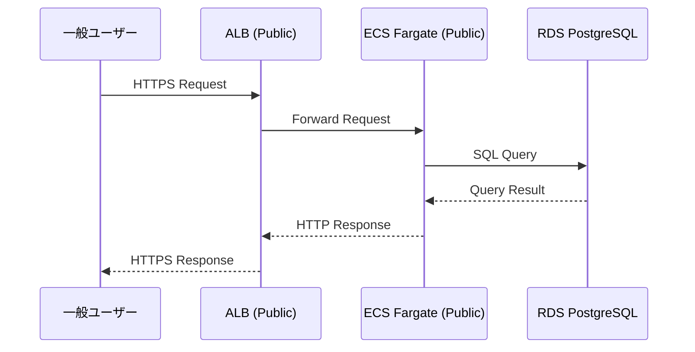
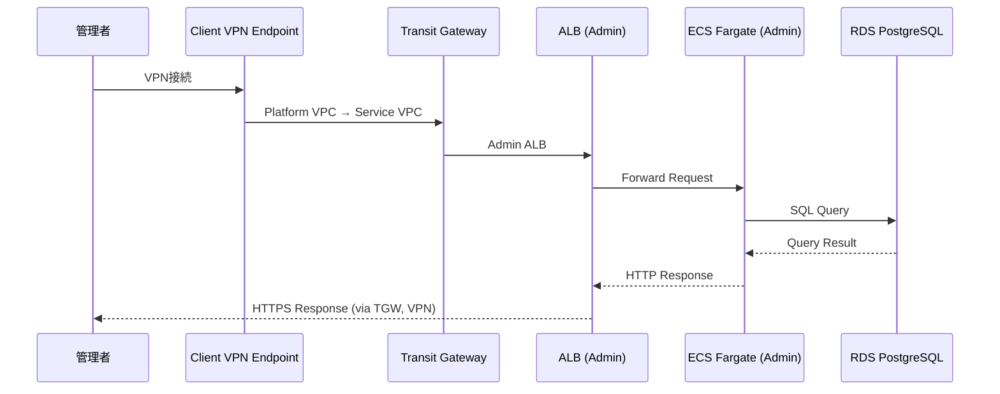

# 02. アーキテクチャ設計

> AWS Multi-Account Sample Application - 基本設計書

[← 前へ: システム概要](01_システム概要.md) | [目次に戻る](00_目次.md) | [次へ: インフラ設計 →](03_インフラ設計.md)

---

## 1. アーキテクチャパターン

### 1.1 採用パターン

**Multi-Account構成 + Transit Gateway Hub-and-Spoke**

### 1.2 選定理由

| 観点 | 理由 |
|------|------|
| アカウント分離 | 共通基盤（Platform）とアプリ基盤（Service）の責務を明確に分離 |
| ネットワーク接続 | Transit Gatewayで拠点間閉域接続を実現 |
| セキュリティ | 管理系サービスはVPN経由のみアクセス可能 |
| スケーラビリティ | 将来的に他のService Account追加が容易 |

---

## 2. 技術スタック選定

### 2.1 選定結果と理由

| 技術領域 | 選定技術 | 選定理由 |
|---------|---------|---------|
| **IaC** | CloudFormation | 要件定義で指定（Terraform不可） |
| **Compute** | ECS Fargate | サーバーレス、Auto Scaling容易 |
| **Database** | RDS PostgreSQL | 要件定義で指定、Multi-AZ対応 |
| **Network** | Transit Gateway | VPC間閉域接続の検証が目的 |
| **VPN** | Client VPN | オンプレミス拠点想定のアクセス方法 |
| **監視** | CloudWatch | AWS標準、Alarms + Dashboard統合 |
| **Application** | Node.js 20 | 要件定義で指定、モダンなLTS版 |

---

## 3. 参照した技術標準

以下の技術標準を参照し、設計に反映しています：

### 3.1 `.claude/docs/40_standards/41_common.md` - 共通技術標準

- **モジュール分割**: 単一責任の原則、適切な粒度
- **環境差分管理**: dev/prod パラメータファイル分離
- **シークレット管理**: Secrets Manager使用、ハードコード禁止
- **命名規則**: `${ProjectName}-${Environment}-${ResourceType}`

### 3.2 `.claude/docs/40_standards/45_cloudformation.md` - CloudFormation規約

- **Change Sets必須**: dry-run必須（本番環境保護）
- **スタック分割**: レイヤー別分割（Network/Database/Compute/Monitoring）
- **ファイル分割**: 1ファイル300行以内推奨（超過時は理由明記）
- **Well-Architected Framework**: 6つの柱への対応

### 3.3 `.claude/docs/40_standards/45_secrets-management.md` - シークレット管理

- **ローカル開発**: `.env` ファイル（Git管理外）
- **本番環境**: AWS Secrets Manager
- **Dynamic Reference**: CloudFormationで `{{resolve:secretsmanager:...}}`
- **暗号化**: KMS暗号化必須

---

## 4. レイヤー構成

### 4.1 3層アーキテクチャ

```
┌───────────────────────────────────────┐
│  Presentation Layer                   │
│  - ALB (HTTPS Termination)            │
│  - ECS Fargate (Web/Admin/Batch)      │
└───────────────┬───────────────────────┘
                │
┌───────────────┴───────────────────────┐
│  Application Layer                    │
│  - Business Logic (Node.js)           │
│  - API Endpoints (REST)               │
└───────────────┬───────────────────────┘
                │
┌───────────────┴───────────────────────┐
│  Data Layer                           │
│  - RDS PostgreSQL (Multi-AZ)          │
│  - Secrets Manager (Credentials)      │
└───────────────────────────────────────┘
```

---

## 5. データフロー

### 5.1 Public Webアプリのデータフロー



### 5.2 Admin Dashboardのデータフロー



---

## 6. Well-Architected Frameworkへの準拠

本設計は、AWS Well-Architected Framework の6つの柱に準拠しています：

| 柱 | 対応内容 |
|----|---------|
| **セキュリティ** | VPN経由アクセス、Secrets Manager、KMS暗号化、SecurityGroup最小権限 |
| **信頼性** | Multi-AZ構成、Auto Scaling、RDS自動バックアップ |
| **パフォーマンス効率** | ECS Fargate、ALB、RDS最適化 |
| **コスト最適化** | 最小構成（0.5 vCPU）、検証用設定 |
| **運用上の優秀性** | CloudWatch監視、IaC（CloudFormation） |
| **持続可能性** | サーバーレス（Fargate）、リソース効率化 |

---

## 7. 次のステップ

アーキテクチャ設計を理解したら、次は具体的なインフラ構成を確認します。

**次のドキュメント**: [03_インフラ設計.md](03_インフラ設計.md)

---

**ドキュメントナビゲーション**:
- [← 前へ: システム概要](01_システム概要.md)
- [目次に戻る](00_目次.md)
- [次へ: インフラ設計 →](03_インフラ設計.md)
