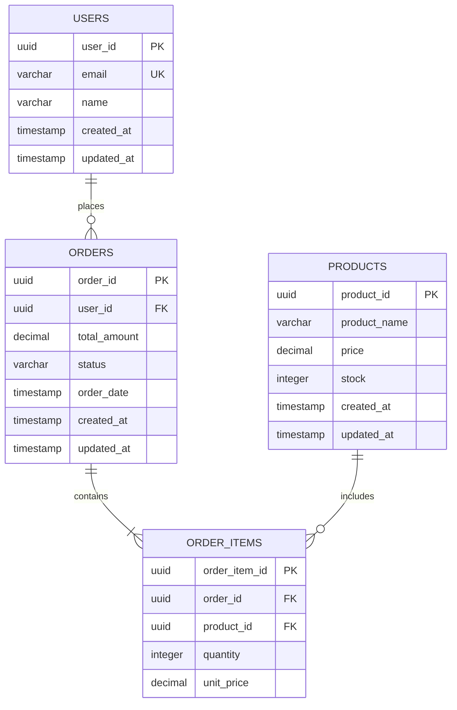

# 04. アプリケーション設計

> AWS Multi-Account Sample Application - 基本設計書

[← 前へ: インフラ設計](03_インフラ設計.md) | [目次に戻る](00_目次.md) | [次へ: セキュリティ設計 →](05_セキュリティ設計.md)

---

## 1. データベース設計

### 1.1 ER図（詳細版）



### 1.2 テーブル一覧

| テーブル名 | 論理名 | 主キー | 外部キー | 推定レコード数 |
|-----------|-------|--------|---------|--------------|
| USERS | ユーザー | user_id | - | 1,000件（検証用） |
| PRODUCTS | 商品 | product_id | - | 100件（検証用） |
| ORDERS | 注文 | order_id | user_id | 10,000件（検証用） |
| ORDER_ITEMS | 注文明細 | order_item_id | order_id, product_id | 50,000件（検証用） |

### 1.3 インデックス戦略

| テーブル | インデックス名 | カラム | 種別 | 理由 |
|---------|--------------|--------|------|------|
| USERS | users_email_idx | email | UNIQUE | メールアドレス検索・一意性保証 |
| USERS | users_created_at_idx | created_at | INDEX | 日時範囲検索 |
| ORDERS | orders_user_id_idx | user_id | INDEX | ユーザー別注文検索 |
| ORDERS | orders_order_date_idx | order_date | INDEX | 日時範囲検索 |
| ORDERS | orders_status_idx | status | INDEX | ステータス別検索 |

---

## 2. API設計

### 2.1 API設計方針

**採用パターン**: RESTful API

| 項目 | 内容 |
|------|------|
| プロトコル | HTTPS（TLS 1.2以上） |
| フォーマット | JSON |
| 認証 | なし（検証・デモ用のため） |
| バージョニング | `/api/v1/` |
| エラーレスポンス | RFC 7807準拠 |

### 2.2 認証・認可方式

**検証・デモ用のため簡易実装**

| サービス | 認証方式 | 備考 |
|---------|---------|------|
| Public Web | なし | 一般公開のため認証不要 |
| Admin Dashboard | Basic認証（検討中） | 本番化時はJWT等に変更 |
| Batch Processing | なし | スケジュール実行のみ |

**将来的な本番化対応案:**
- Public Web: JWT認証 + OAuth 2.0
- Admin Dashboard: AWS Cognito + MFA
- API: API Gateway + Lambda Authorizer

### 2.3 エラーハンドリング方針

**HTTPステータスコード:**

| ステータスコード | 意味 | 使用場面 |
|----------------|------|---------|
| 200 OK | 成功 | 正常レスポンス |
| 400 Bad Request | リクエスト不正 | バリデーションエラー |
| 404 Not Found | リソース不在 | 該当データなし |
| 500 Internal Server Error | サーバーエラー | 予期しないエラー |
| 503 Service Unavailable | サービス停止 | DB接続失敗等 |

**エラーレスポンスフォーマット（RFC 7807準拠）:**

```json
{
  "type": "https://example.com/errors/validation-error",
  "title": "Validation Error",
  "status": 400,
  "detail": "商品IDが不正です",
  "instance": "/api/v1/orders",
  "errors": [
    {
      "field": "product_id",
      "message": "UUIDフォーマットである必要があります"
    }
  ]
}
```

---

## 3. アプリケーションアーキテクチャ

### 3.1 Monorepo構成

```
app/
├── public/              # Public Webアプリ
│   └── src/
│       ├── index.js
│       └── app.js
├── admin/               # Admin Dashboard
│   └── src/
│       ├── index.js
│       └── app.js
├── batch/               # Batch Processing
│   └── src/
│       └── index.js
└── shared/              # 共通ライブラリ
    ├── db/
    │   └── connection.js
    └── index.js
```

### 3.2 アプリケーション間の依存関係

```
shared (共通ライブラリ)
  ↑
  ├── public
  ├── admin
  └── batch
```

---

## 4. 次のステップ

アプリケーション設計を理解したら、次はセキュリティ設計を確認します。

**次のドキュメント**: [05_セキュリティ設計.md](05_セキュリティ設計.md)

---

**ドキュメントナビゲーション**:
- [← 前へ: インフラ設計](03_インフラ設計.md)
- [目次に戻る](00_目次.md)
- [次へ: セキュリティ設計 →](05_セキュリティ設計.md)
