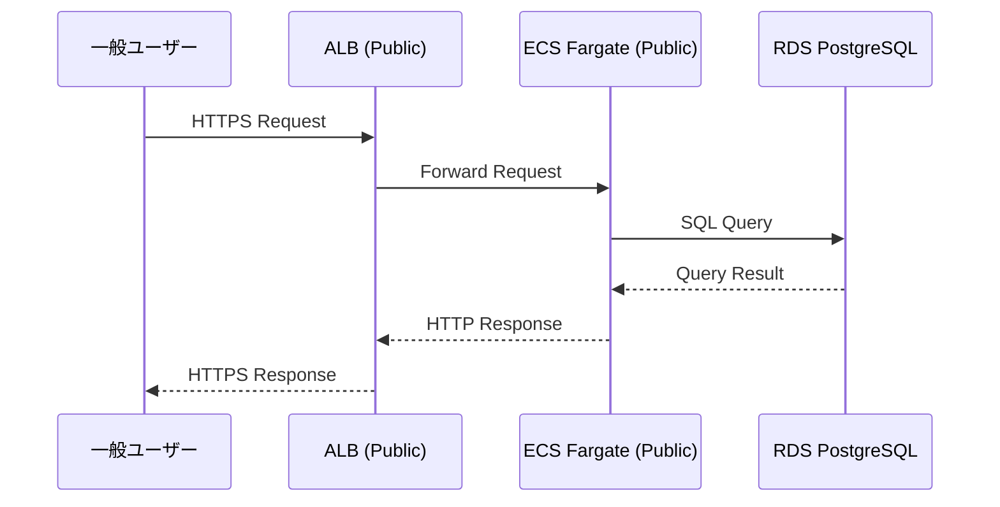
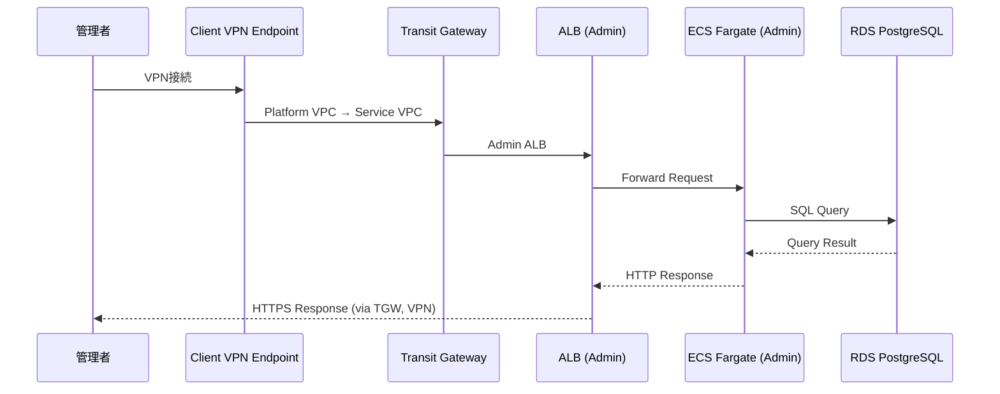
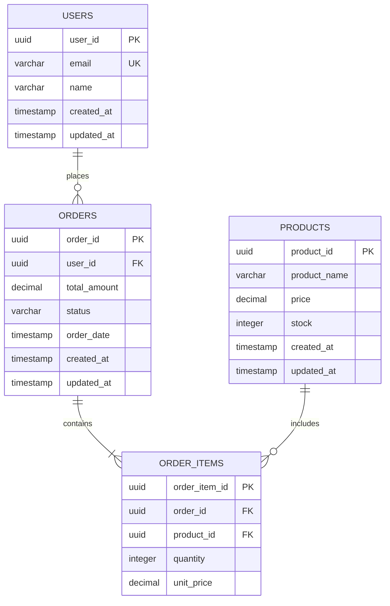

# 基本設計書

> AWS Multi-Account Sample Application
> Transit Gateway による拠点間閉域接続を実現する技術検証・社内デモ用サンプル

---

## 1. はじめに

### 1.1 ドキュメント概要

本書は、AWS Multi-Account Sample Applicationの基本設計書です。
要件定義書で定義された機能要件・非機能要件を実現するための技術的なアプローチ、アーキテクチャ、システム構成を定義します。

| 項目 | 内容 |
|------|------|
| プロジェクト名 | AWS Multi-Account Sample Application |
| 文書バージョン | 1.0 |
| 作成日 | 2025-10-21 |
| 最終更新日 | 2025-10-21 |
| 承認状態 | 承認待ち |

### 1.2 対象読者

- システムアーキテクト
- インフラエンジニア
- アプリケーションエンジニア
- プロジェクトマネージャー

### 1.3 関連ドキュメント

| ドキュメント | ファイルパス | 備考 |
|------------|------------|------|
| 企画書 | `docs/01_企画書.md` | プロジェクト背景・目的 |
| 要件定義書 | `docs/02_要件定義書.md` | 機能要件・非機能要件 |
| 詳細設計書 | `docs/04_詳細設計書/` | 本設計書を詳細化したもの（次フェーズで作成） |

---

## 2. システム概要

### 2.1 システム目的

**目的:**
AWS Multi-Account構成とTransit Gatewayによる拠点間閉域接続の技術検証・社内デモ用リファレンスアーキテクチャを構築する。

**目標:**
- Transit Gateway活用パターンの確立
- Multi-Account構成のベストプラクティス検証
- CloudFormationによるIaCベストプラクティス確立
- 3サービス構成（Public/Admin/Batch）の実装パターン確立

### 2.2 システム機能概要

| 機能ID | 機能名 | 概要 |
|--------|--------|------|
| F-001 | Platform Account基盤 | Shared VPC、Transit Gateway、Client VPN |
| F-002 | Service Account基盤 | Service VPC、RDS、ECS、ALB |
| F-003 | Public Webアプリ | 一般ユーザー向けWebアプリケーション |
| F-004 | Admin Dashboard | 管理者向けダッシュボード（VPN経由のみ） |
| F-005 | Batch Processing | データ処理・集計バッチ |
| F-006 | CloudWatch統合監視 | Alarms + Dashboard |

### 2.3 対象ユーザー

| ユーザー種別 | 説明 | アクセス方法 |
|------------|------|------------|
| 一般ユーザー | Public Webアプリを利用 | インターネット経由（HTTPS） |
| 管理者 | Admin Dashboardで管理操作 | Client VPN経由 |
| システム | Batch Processing自動実行 | ECS Scheduled Task |

---

## 3. アーキテクチャ設計

### 3.1 アーキテクチャパターン

**採用パターン**: Multi-Account構成 + Transit Gateway Hub-and-Spoke

```
┌─────────────────────────────────────────────────────────────┐
│                      Platform Account                        │
│  ┌────────────────────────────────────────────────────────┐ │
│  │ Shared VPC (10.0.0.0/16)                               │ │
│  │  - Client VPN Endpoint                                 │ │
│  │  - Transit Gateway (Hub)                               │ │
│  └────────────────────────────────────────────────────────┘ │
└───────────────────────────┬─────────────────────────────────┘
                            │ Transit Gateway
┌───────────────────────────┴─────────────────────────────────┐
│                      Service Account                         │
│  ┌────────────────────────────────────────────────────────┐ │
│  │ Service VPC (10.1.0.0/16)                              │ │
│  │  - Public Web App (ECS Fargate + ALB)                  │ │
│  │  - Admin Dashboard (ECS Fargate + ALB, VPN経由のみ)    │ │
│  │  - Batch Processing (ECS Fargate Scheduled Task)       │ │
│  │  - RDS PostgreSQL (Multi-AZ)                           │ │
│  └────────────────────────────────────────────────────────┘ │
└─────────────────────────────────────────────────────────────┘
```

**選定理由:**

| 観点 | 理由 |
|------|------|
| アカウント分離 | 共通基盤（Platform）とアプリ基盤（Service）の責務を明確に分離 |
| ネットワーク接続 | Transit Gatewayで拠点間閉域接続を実現 |
| セキュリティ | 管理系サービスはVPN経由のみアクセス可能 |
| スケーラビリティ | 将来的に他のService Account追加が容易 |

### 3.2 技術スタック選定理由

| 技術領域 | 選定技術 | 選定理由 |
|---------|---------|---------|
| **IaC** | CloudFormation | 要件定義で指定（Terraform不可） |
| **Compute** | ECS Fargate | サーバーレス、Auto Scaling容易 |
| **Database** | RDS PostgreSQL | 要件定義で指定、Multi-AZ対応 |
| **Network** | Transit Gateway | VPC間閉域接続の検証が目的 |
| **VPN** | Client VPN | オンプレミス拠点想定のアクセス方法 |
| **監視** | CloudWatch | AWS標準、Alarms + Dashboard統合 |
| **Application** | Node.js 20 | 要件定義で指定、モダンなLTS版 |

### 3.3 参照した技術標準

以下の技術標準を参照し、設計に反映しています：

#### `.claude/docs/40_standards/41_common.md` - 共通技術標準

- **モジュール分割**: 単一責任の原則、適切な粒度
- **環境差分管理**: dev/prod パラメータファイル分離
- **シークレット管理**: Secrets Manager使用、ハードコード禁止
- **命名規則**: `${ProjectName}-${Environment}-${ResourceType}`

#### `.claude/docs/40_standards/45_cloudformation.md` - CloudFormation規約

- **Change Sets必須**: dry-run必須（本番環境保護）
- **スタック分割**: レイヤー別分割（Network/Database/Compute/Monitoring）
- **ファイル分割**: 1ファイル300行以内推奨（超過時は理由明記）
- **Well-Architected Framework**: 6つの柱への対応

#### `.claude/docs/40_standards/45_secrets-management.md` - シークレット管理

- **ローカル開発**: `.env` ファイル（Git管理外）
- **本番環境**: AWS Secrets Manager
- **Dynamic Reference**: CloudFormationで `{{resolve:secretsmanager:...}}`
- **暗号化**: KMS暗号化必須

### 3.4 レイヤー構成

**3層アーキテクチャ:**

```
┌───────────────────────────────────────┐
│  Presentation Layer                   │
│  - ALB (HTTPS Termination)            │
│  - ECS Fargate (Web/Admin/Batch)      │
└───────────────┬───────────────────────┘
                │
┌───────────────┴───────────────────────┐
│  Application Layer                    │
│  - Business Logic (Node.js)           │
│  - API Endpoints (REST)               │
└───────────────┬───────────────────────┘
                │
┌───────────────┴───────────────────────┐
│  Data Layer                           │
│  - RDS PostgreSQL (Multi-AZ)          │
│  - Secrets Manager (Credentials)      │
└───────────────────────────────────────┘
```

### 3.5 データフロー

#### Public Webアプリのデータフロー



#### Admin Dashboardのデータフロー



---

## 4. システム構成図

### 4.1 全体構成図

```
┌──────────────────────────────────────────────────────────────────┐
│                         AWS Cloud                                │
├──────────────────────────────────────────────────────────────────┤
│                                                                  │
│  ┌───────────────────────────── Platform Account ─────────────┐ │
│  │                                                              │ │
│  │  Shared VPC (10.0.0.0/16)                                   │ │
│  │  ┌──────────────────────────────────────────────────────┐  │ │
│  │  │ Public Subnet (AZ-1a, 1c)                            │  │ │
│  │  │  - NAT Gateway x2                                    │  │ │
│  │  └──────────────────────────────────────────────────────┘  │ │
│  │  ┌──────────────────────────────────────────────────────┐  │ │
│  │  │ Private Subnet (AZ-1a, 1c)                           │  │ │
│  │  │  - Client VPN Endpoint                               │  │ │
│  │  │  - Transit Gateway Attachment                        │  │ │
│  │  └──────────────────────────────────────────────────────┘  │ │
│  │                                                              │ │
│  │  Transit Gateway (Hub)                                      │ │
│  │  - RAM共有でService Accountに共有                           │ │
│  └──────────────────┬───────────────────────────────────────────┘ │
│                     │                                             │
│  ┌─────────────────┴────────────── Service Account ──────────┐  │
│  │                                                             │  │
│  │  Service VPC (10.1.0.0/16)                                 │  │
│  │  ┌─────────────────────────────────────────────────────┐  │  │
│  │  │ Public Subnet (AZ-1a, 1c)                           │  │  │
│  │  │  - ALB (Public Web)                                 │  │  │
│  │  │  - ALB (Admin)                                      │  │  │
│  │  │  - NAT Gateway x2                                   │  │  │
│  │  └─────────────────────────────────────────────────────┘  │  │
│  │  ┌─────────────────────────────────────────────────────┐  │  │
│  │  │ Private Subnet (AZ-1a, 1c)                          │  │  │
│  │  │  - ECS Fargate (Public/Admin/Batch)                 │  │  │
│  │  │  - RDS PostgreSQL (Multi-AZ)                        │  │  │
│  │  │  - Transit Gateway Attachment                       │  │  │
│  │  └─────────────────────────────────────────────────────┘  │  │
│  │                                                             │  │
│  │  CloudWatch (統合監視)                                      │  │
│  │  - Alarms (CPU, Memory, RDS, ALB)                          │  │
│  │  - Dashboard (全リソース可視化)                             │  │
│  │  - SNS Topics (Critical/Warning)                           │  │
│  └─────────────────────────────────────────────────────────────┘  │
│                                                                  │
└──────────────────────────────────────────────────────────────────┘

External:
- Internet → Public Web (ALB Public)
- VPN Client → Client VPN → Transit Gateway → Service VPC → Admin ALB
```

### 4.2 ネットワーク構成図

**VPC CIDR割り当て:**

| VPC | CIDR | Account | 用途 |
|-----|------|---------|------|
| Shared VPC | 10.0.0.0/16 | Platform | 共通ネットワーク基盤 |
| Service VPC | 10.1.0.0/16 | Service | アプリケーション基盤 |
| Client VPN | 172.16.0.0/22 | Platform | VPNクライアント用 |

**Subnet構成 (Platform Account - Shared VPC):**

| Subnet | CIDR | AZ | 種別 | 用途 |
|--------|------|----|----|------|
| Public Subnet 1a | 10.0.1.0/24 | ap-northeast-1a | Public | NAT Gateway |
| Public Subnet 1c | 10.0.2.0/24 | ap-northeast-1c | Public | NAT Gateway |
| Private Subnet 1a | 10.0.11.0/24 | ap-northeast-1a | Private | Transit Gateway, Client VPN |
| Private Subnet 1c | 10.0.12.0/24 | ap-northeast-1c | Private | Transit Gateway, Client VPN |

**Subnet構成 (Service Account - Service VPC):**

| Subnet | CIDR | AZ | 種別 | 用途 |
|--------|------|----|----|------|
| Public Subnet 1a | 10.1.1.0/24 | ap-northeast-1a | Public | ALB, NAT Gateway |
| Public Subnet 1c | 10.1.2.0/24 | ap-northeast-1c | Public | ALB, NAT Gateway |
| Private Subnet 1a | 10.1.11.0/24 | ap-northeast-1a | Private | ECS, RDS, Transit Gateway |
| Private Subnet 1c | 10.1.12.0/24 | ap-northeast-1c | Private | ECS, RDS, Transit Gateway |

**ルーティング設計:**

| Source | Destination | Next Hop |
|--------|-------------|----------|
| Platform VPC Private Subnet | 10.1.0.0/16 | Transit Gateway |
| Platform VPC Private Subnet | 0.0.0.0/0 | NAT Gateway |
| Service VPC Private Subnet | 10.0.0.0/16 | Transit Gateway |
| Service VPC Private Subnet | 0.0.0.0/0 | NAT Gateway |
| Client VPN | 10.0.0.0/16 | Local (Shared VPC) |
| Client VPN | 10.1.0.0/16 | Transit Gateway |

### 4.3 コンポーネント配置図

**Platform Account:**

```
Shared VPC (10.0.0.0/16)
├── Public Subnet (AZ-1a)
│   └── NAT Gateway 1a
├── Public Subnet (AZ-1c)
│   └── NAT Gateway 1c
├── Private Subnet (AZ-1a)
│   ├── Client VPN Endpoint (Target Network Association)
│   └── Transit Gateway Attachment
└── Private Subnet (AZ-1c)
    ├── Client VPN Endpoint (Target Network Association)
    └── Transit Gateway Attachment

Transit Gateway
├── Route Table (Platform)
│   └── Route: 10.1.0.0/16 → Service VPC Attachment
└── Route Table (Service)
    └── Route: 10.0.0.0/16 → Platform VPC Attachment

Client VPN Endpoint
├── Authorization Rule: 10.0.0.0/16 (Shared VPC)
├── Authorization Rule: 10.1.0.0/16 (Service VPC via TGW)
└── Route: 10.1.0.0/16 → Transit Gateway
```

**Service Account:**

```
Service VPC (10.1.0.0/16)
├── Public Subnet (AZ-1a)
│   ├── ALB (Public Web)
│   ├── ALB (Admin)
│   └── NAT Gateway 1a
├── Public Subnet (AZ-1c)
│   ├── ALB (Public Web) - Multi-AZ
│   ├── ALB (Admin) - Multi-AZ
│   └── NAT Gateway 1c
├── Private Subnet (AZ-1a)
│   ├── ECS Fargate (Public Web) x N
│   ├── ECS Fargate (Admin) x N
│   ├── ECS Fargate (Batch) - Scheduled
│   ├── RDS PostgreSQL (Primary)
│   └── Transit Gateway Attachment
└── Private Subnet (AZ-1c)
    ├── ECS Fargate (Public Web) x N
    ├── ECS Fargate (Admin) x N
    ├── RDS PostgreSQL (Standby - Multi-AZ)
    └── Transit Gateway Attachment

CloudWatch
├── Alarms
│   ├── ECS CPU/Memory (Public/Admin/Batch)
│   ├── RDS CPU/Connections/Storage
│   └── ALB TargetHealth/5xxErrors/ResponseTime
├── Dashboard
│   └── Integrated View (ECS/RDS/ALB)
└── SNS Topics
    ├── CriticalAlerts
    └── WarningAlerts
```

---

## 5. データベース設計

### 5.1 ER図（詳細版）



### 5.2 テーブル一覧

| テーブル名 | 論理名 | 主キー | 外部キー | 推定レコード数 |
|-----------|-------|--------|---------|--------------|
| USERS | ユーザー | user_id | - | 1,000件（検証用） |
| PRODUCTS | 商品 | product_id | - | 100件（検証用） |
| ORDERS | 注文 | order_id | user_id | 10,000件（検証用） |
| ORDER_ITEMS | 注文明細 | order_item_id | order_id, product_id | 50,000件（検証用） |

### 5.3 インデックス戦略

| テーブル | インデックス名 | カラム | 種別 | 理由 |
|---------|--------------|--------|------|------|
| USERS | users_email_idx | email | UNIQUE | メールアドレス検索・一意性保証 |
| USERS | users_created_at_idx | created_at | INDEX | 日時範囲検索 |
| ORDERS | orders_user_id_idx | user_id | INDEX | ユーザー別注文検索 |
| ORDERS | orders_order_date_idx | order_date | INDEX | 日時範囲検索 |
| ORDERS | orders_status_idx | status | INDEX | ステータス別検索 |

---

## 6. API設計

### 6.1 API設計方針

**採用パターン**: RESTful API

| 項目 | 内容 |
|------|------|
| プロトコル | HTTPS（TLS 1.2以上） |
| フォーマット | JSON |
| 認証 | なし（検証・デモ用のため） |
| バージョニング | `/api/v1/` |
| エラーレスポンス | RFC 7807準拠 |

### 6.2 認証・認可方式

**検証・デモ用のため簡易実装**

| サービス | 認証方式 | 備考 |
|---------|---------|------|
| Public Web | なし | 一般公開のため認証不要 |
| Admin Dashboard | Basic認証（検討中） | 本番化時はJWT等に変更 |
| Batch Processing | なし | スケジュール実行のみ |

**将来的な本番化対応案:**
- Public Web: JWT認証 + OAuth 2.0
- Admin Dashboard: AWS Cognito + MFA
- API: API Gateway + Lambda Authorizer

### 6.3 エラーハンドリング方針

**HTTPステータスコード:**

| ステータスコード | 意味 | 使用場面 |
|----------------|------|---------|
| 200 OK | 成功 | 正常レスポンス |
| 400 Bad Request | リクエスト不正 | バリデーションエラー |
| 404 Not Found | リソース不在 | 該当データなし |
| 500 Internal Server Error | サーバーエラー | 予期しないエラー |
| 503 Service Unavailable | サービス停止 | DB接続失敗等 |

**エラーレスポンスフォーマット（RFC 7807準拠）:**

```json
{
  "type": "https://example.com/errors/validation-error",
  "title": "Validation Error",
  "status": 400,
  "detail": "商品IDが不正です",
  "instance": "/api/v1/orders",
  "errors": [
    {
      "field": "product_id",
      "message": "UUIDフォーマットである必要があります"
    }
  ]
}
```

---

## 7. セキュリティ設計

### 7.1 認証設計

**現フェーズ（検証・デモ用）:**
- Public Web: 認証なし
- Admin Dashboard: Basic認証（検討中）

**将来的な本番化対応:**
- AWS Cognito User Pools
- MFA（多要素認証）
- SAML 2.0（企業SSO連携）

### 7.2 認可設計

**現フェーズ:**
- RBAC（Role-Based Access Control）は未実装
- Admin Dashboardは全機能アクセス可能

**将来的な本番化対応:**
- RBAC実装（Admin/Operator/Viewer）
- AWS IAM Identity Center統合

### 7.3 データ暗号化

| 項目 | 暗号化方式 | 適用箇所 |
|------|-----------|---------|
| **通信暗号化** | TLS 1.2以上 | ALB HTTPS Listener |
| **保存データ暗号化** | AES-256 | RDS PostgreSQL（KMS暗号化） |
| **EBS暗号化** | AES-256 | ECS Fargateは暗号化済み |
| **S3暗号化** | AES-256（SSE-S3） | ALBログ、VPCフローログ |

### 7.4 シークレット管理

**参照標準**: `.claude/docs/40_standards/45_secrets-management.md`

| シークレット種別 | 管理方法 | 備考 |
|---------------|---------|------|
| DBパスワード | AWS Secrets Manager | 自動生成、32文字 |
| APIキー | AWS Secrets Manager | - |
| TLS証明書 | AWS Certificate Manager | Client VPN用 |

**CloudFormationでの参照:**
```yaml
# Dynamic Reference使用
MasterUserPassword: !Sub '{{resolve:secretsmanager:${DBSecret}:SecretString:password}}'
```

**ECS Task Definitionでの参照:**
```yaml
Secrets:
  - Name: DB_PASSWORD
    ValueFrom: !Sub '{{resolve:secretsmanager:${DBSecret}:SecretString:password}}'
```

### 7.5 監査ログ

| ログ種別 | 出力先 | 保持期間 | 用途 |
|---------|--------|---------|------|
| アプリケーションログ | CloudWatch Logs | 30日 | エラー追跡、デバッグ |
| ALBアクセスログ | S3 | 90日 | アクセス分析 |
| VPCフローログ | CloudWatch Logs | 30日 | ネットワーク監視 |
| CloudTrail | S3 | 1年 | API監査（将来実装） |

### 7.6 `.claude/docs/40_standards/49_security.md` 準拠確認

**チェックリスト:**

- [x] シークレット情報をハードコードしない → Secrets Manager使用
- [x] 通信はTLS 1.2以上 → ALB HTTPS Listener
- [x] データ保存時暗号化 → RDS KMS暗号化
- [x] 最小権限の原則 → SecurityGroup、IAM Role
- [ ] CloudTrail有効化 → 将来実装（検証用のため未実装）
- [x] VPCフローログ有効化 → CloudWatch Logs出力

---

## 8. 運用設計

### 8.1 監視設計

**監視ツール**: AWS CloudWatch

**監視対象とアラーム閾値:**

| リソース | メトリクス | 閾値 | アクション | 重要度 |
|---------|-----------|------|-----------|--------|
| ECS Fargate | CPU使用率 | 80%以上 | SNS通知（Warning） | Warning |
| ECS Fargate | メモリ使用率 | 80%以上 | SNS通知（Warning） | Warning |
| ECS Fargate | タスク数 | 0（全停止） | SNS通知（Critical） | Critical |
| RDS PostgreSQL | CPU使用率 | 80%以上 | SNS通知（Warning） | Warning |
| RDS PostgreSQL | 接続数 | 80%以上 | SNS通知（Warning） | Warning |
| RDS PostgreSQL | ストレージ容量 | 80%以上 | SNS通知（Warning） | Warning |
| RDS PostgreSQL | レプリケーションラグ | 60秒以上 | SNS通知（Critical） | Critical |
| ALB | ターゲット異常数 | 1以上 | SNS通知（Critical） | Critical |
| ALB | 5xxエラー率 | 5%以上 | SNS通知（Warning） | Warning |
| ALB | レスポンスタイム | 1秒以上 | SNS通知（Warning） | Warning |

**SNS Topics:**

| Topic名 | 用途 | サブスクリプション |
|--------|------|------------------|
| CriticalAlerts | 即時対応が必要 | Email、Slack（将来） |
| WarningAlerts | 監視・傾向分析 | Email |

**Dashboard構成:**
- ECSサービス別CPU/メモリ使用率
- RDS CPU/接続数/ストレージ容量
- ALBリクエスト数/エラー率/レスポンスタイム

### 8.2 ログ設計

**ログレベル:**

| レベル | 使用場面 | 出力先 |
|-------|---------|--------|
| ERROR | エラー発生 | CloudWatch Logs |
| WARN | 警告（処理継続） | CloudWatch Logs |
| INFO | 重要な情報 | CloudWatch Logs |
| DEBUG | デバッグ情報 | CloudWatch Logs（開発環境のみ） |

**ログフォーマット（JSON）:**

```json
{
  "timestamp": "2025-10-21T10:00:00.000Z",
  "level": "ERROR",
  "service": "public-web",
  "message": "Failed to connect to database",
  "error": {
    "code": "CONNECTION_TIMEOUT",
    "details": "..."
  },
  "request_id": "uuid-xxxx-xxxx",
  "user_id": "uuid-yyyy-yyyy"
}
```

### 8.3 バックアップ設計

| 対象 | バックアップ方式 | 頻度 | 保持期間 |
|-----|---------------|------|---------|
| RDS PostgreSQL | 自動バックアップ | 日次 | 7日間 |
| RDS PostgreSQL | 手動スナップショット | 随時 | 無期限（手動削除） |
| CloudWatch Logs | - | - | 30日（自動削除） |

**バックアップウィンドウ:**
- **Preferred Backup Window**: 19:00-20:00 UTC (04:00-05:00 JST)
- **理由**: 日本時間深夜、トラフィック最小時

### 8.4 障害復旧設計（RTO/RPO）

**検証・デモ用のため緩い目標:**

| 項目 | 目標値 | 実現方法 |
|------|--------|---------|
| **RTO** (Recovery Time Objective) | 30分以内 | ECS Auto Scaling、RDS Multi-AZ自動フェイルオーバー |
| **RPO** (Recovery Point Objective) | 24時間以内 | RDS自動バックアップ（日次） |

**障害復旧手順:**

1. **ECS Task障害**: Auto Scalingで自動復旧
2. **RDS Primary障害**: Multi-AZ自動フェイルオーバー（数分）
3. **AZ障害**: Multi-AZ構成で継続稼働
4. **リージョン障害**: 未対応（検証用のため）

---

## 9. インフラ設計

### 9.1 クラウドベンダー選定理由

**選定**: AWS（Amazon Web Services）

| 理由 | 詳細 |
|------|------|
| 要件定義で指定 | Transit Gateway技術検証が目的 |
| Multi-Account構成 | AWS Organizationsで容易に実現 |
| 豊富なマネージドサービス | ECS Fargate、RDS、Secrets Manager等 |
| CloudFormation | IaCツールとして標準提供 |

### 9.2 ネットワーク設計

**設計方針:**

| 項目 | 設計内容 |
|------|---------|
| **Multi-AZ構成** | ap-northeast-1a、1cで冗長化 |
| **NAT Gateway** | 各AZに配置（単一障害対策） |
| **Transit Gateway** | Hub-and-Spoke構成、将来的な拡張容易 |
| **Client VPN** | Split Tunnel有効（AWSリソースのみVPN経由） |

**セキュリティグループ設計:**

| SecurityGroup | Ingress | Egress | 用途 |
|--------------|---------|--------|------|
| ALB Public | 0.0.0.0/0:443 | All | Public Web用 |
| ALB Admin | 10.0.0.0/16:443 | All | Admin用（VPN経由のみ） |
| ECS Public | ALB Public SG:8080 | All | Public Web ECS |
| ECS Admin | ALB Admin SG:8080 | All | Admin ECS |
| RDS | ECS SG:5432 | - | PostgreSQL |
| Client VPN | 172.16.0.0/22:All | All | VPN Endpoint |

### 9.3 コンピューティング設計

**ECS Fargate設計:**

| サービス | CPU | Memory | Desired Count | Auto Scaling |
|---------|-----|--------|--------------|-------------|
| Public Web | 512 (0.5 vCPU) | 1024 MB | 2 | CPU 70%でスケール（Max 10） |
| Admin | 512 (0.5 vCPU) | 1024 MB | 2 | CPU 70%でスケール（Max 5） |
| Batch | 512 (0.5 vCPU) | 1024 MB | 0（Scheduled） | - |

**選定理由:**
- サーバーレス（EC2管理不要）
- Auto Scaling容易
- 検証用のため最小構成（0.5 vCPU）

### 9.4 ストレージ設計

**RDS PostgreSQL:**

| 項目 | 設定値 | 理由 |
|------|--------|------|
| Instance Class | db.t3.medium | 検証用、コスト重視 |
| Allocated Storage | 100 GB | 検証用データ量（10万レコード想定） |
| Max Allocated Storage | 200 GB | Auto Scaling対応 |
| Storage Type | gp3 | 最新、コスト効率良 |
| Multi-AZ | 有効 | 高可用性確保 |
| Backup Retention | 7日間 | 標準的な設定 |

**S3:**

| 用途 | バケット名 | ストレージクラス | ライフサイクル |
|------|-----------|----------------|--------------|
| ALBログ | `${ProjectName}-${Environment}-alb-logs` | Standard | 90日後削除 |
| CloudFormationテンプレート | `${ProjectName}-cfn-templates` | Standard | 無期限 |

### 9.5 `.claude/docs/40_standards/45_cloudformation.md` 準拠確認

**チェックリスト:**

- [x] Change Sets必須 → デプロイスクリプトで実装
- [x] スタック分割 → Platform/Service、Network/Database/Compute/Monitoring
- [x] パラメータ駆動 → Environment、ProjectName、VpcCidr等
- [x] Outputs/Export → VPC ID、Subnet IDs等
- [x] ファイル分割方針 → 詳細設計書で明記予定
- [x] Well-Architected Framework → セキュリティ、信頼性、パフォーマンス対応

---

## 10. 非機能要件への対応

### 10.1 性能要件への対応

| 非機能要件 | 目標値 | 実現方法 |
|-----------|--------|---------|
| レスポンスタイム | 2秒以内 | ECS Fargate + RDS最適化、ALBキャッシュ |
| ネットワークレイテンシ | 50ms以内 | Transit Gateway（AWS内通信） |
| 同時接続数 | 100接続 | ECS Auto Scaling（CPU 70%） |

### 10.2 可用性要件への対応

| 非機能要件 | 目標値 | 実現方法 |
|-----------|--------|---------|
| Multi-AZ構成 | 必須 | VPC、RDS、ALBすべてMulti-AZ |
| 稼働時間 | 99%以上 | Multi-AZ + Auto Scaling |
| MTTR | 30分以内 | CloudWatch Alarms即時通知 |

### 10.3 セキュリティ要件への対応

| 非機能要件 | 実現方法 |
|-----------|---------|
| 通信暗号化 | ALB TLS 1.2以上 |
| 保存データ暗号化 | RDS KMS暗号化、EBS暗号化 |
| シークレット管理 | AWS Secrets Manager |
| ネットワークセキュリティ | SecurityGroup最小権限、Admin VPN経由のみ |
| 監査ログ | CloudWatch Logs、VPCフローログ |

### 10.4 運用要件への対応

| 非機能要件 | 実現方法 |
|-----------|---------|
| 監視 | CloudWatch Alarms + Dashboard |
| ログ | CloudWatch Logs（JSON形式、30日保持） |
| バックアップ | RDS自動バックアップ（7日保持） |
| デプロイ | CloudFormation Change Sets（dry-run必須） |

---

## 付録

### A. 変更履歴

| 日付 | 版数 | 変更内容 | 承認者 |
|------|------|----------|--------|
| 2025-10-21 | 1.0 | 初版作成（設計標準に準拠して再作成） | - |

### B. 次のステップ

1. **詳細設計フェーズ**
   - 詳細設計書を分割構成で作成
   - **必須**: 「10. 実装方針」セクション（ファイル分割、推定行数、技術標準適用）
   - 参照: `.claude/docs/10_facilitation/2.3_設計フェーズ/2.3.7_実装方針設計.md`

2. **実装フェーズ**
   - 詳細設計書の「実装方針」に従ってCloudFormationコード生成
   - 設計 ↔ 実装の一貫性チェック

3. **検証フェーズ**
   - Transit Gateway通信検証
   - CloudWatch監視動作確認
