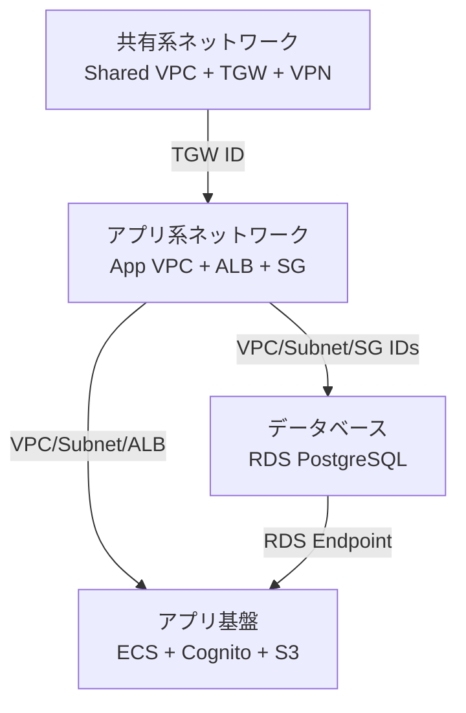

# インフラストラクチャ - CloudFormation

## 概要

このディレクトリには、介護保険申請管理システム（CareApp）のAWSインフラをデプロイするためのCloudFormationテンプレートが含まれています。

## アーキテクチャ概要

4つの独立したスタックで構成：

1. **CareApp-{Env}-SharedNetwork**: 共有系VPC、Transit Gateway、Client VPN
2. **CareApp-{Env}-AppNetwork**: アプリ系VPC、ALB、セキュリティグループ
3. **CareApp-{Env}-Database**: RDS PostgreSQL、Secrets Manager
4. **CareApp-{Env}-AppPlatform**: ECS Cluster、ECR、Cognito、S3、IAMロール



## 技術方針

### スタック分割方針

**Cross-Stack References** を採用し、以下の理由で4スタック分割：

- **独立した管理**: スタックごとに更新・ロールバック可能
- **責任分離**: ネットワーク、DB、アプリ基盤を分離
- **段階的構築**: 順次デプロイ可能
- **再利用性**: 共有VPCは他プロジェクトでも利用可能

### 命名規則

```
スタック名: CareApp-{Environment}-{Component}
  例: CareApp-POC-SharedNetwork
      CareApp-Production-AppNetwork

Export名: {StackName}-{ResourceName}
  例: CareApp-POC-SharedNetwork-TransitGatewayID
      CareApp-POC-AppNetwork-ALBArn

リソース名: CareApp-{Environment}-{ResourceType}-{Name}
  例: CareApp-POC-VPC-Shared
      CareApp-POC-ECSCluster-Main
```

### パラメータ管理

- **環境依存**: `parameters-{env}.json` で管理
- **シークレット**: AWS Secrets Manager（DB認証情報）
- **証明書**: ACMでHTTPS証明書を事前発行
- **VPN証明書**: Client VPN用サーバー/クライアント証明書

## ディレクトリ構成

```
infra/
├── README.md                          # このファイル
├── shared/
│   ├── network.yaml                   # 共有系VPC、TGW、Client VPN
│   └── parameters-poc.json            # POC環境用パラメータ
├── app/
│   ├── network.yaml                   # アプリ系VPC、サブネット、ALB
│   ├── database.yaml                  # RDS PostgreSQL
│   ├── platform.yaml                  # ECS、Cognito、S3、ECR
│   └── parameters-poc.json            # POC環境用パラメータ
└── scripts/
    ├── deploy-all.sh                  # 全スタック一括デプロイ
    ├── delete-all.sh                  # 全スタック削除
    └── validate.sh                    # テンプレート検証
```

## クイックスタート

### 前提条件

1. **AWS CLI設定**: 管理者権限を持つプロファイル
2. **ACM証明書**: ALB用HTTPS証明書を `ap-northeast-1` に発行
3. **VPN証明書**: Client VPN用サーバー/クライアント証明書をACMにインポート
4. **パラメータ設定**: `infra/shared/parameters-poc.json` と `infra/app/parameters-poc.json` を編集

### デプロイ手順

#### 方法1: 一括デプロイスクリプト（推奨）

```bash
cd infra/scripts

# dry-run: 変更セットのみ作成
./deploy-all.sh --dry-run

# 本番実行
./deploy-all.sh
```

#### 方法2: 手動デプロイ（スタックごと）

```bash
cd infra

# 1. 共有系ネットワークスタック
aws cloudformation create-stack \
  --stack-name CareApp-POC-SharedNetwork \
  --template-body file://shared/network.yaml \
  --parameters file://shared/parameters-poc.json \
  --capabilities CAPABILITY_NAMED_IAM \
  --region ap-northeast-1

# 作成完了を待機
aws cloudformation wait stack-create-complete \
  --stack-name CareApp-POC-SharedNetwork \
  --region ap-northeast-1

# 2. アプリ系ネットワークスタック
aws cloudformation create-stack \
  --stack-name CareApp-POC-AppNetwork \
  --template-body file://app/network.yaml \
  --parameters file://app/parameters-poc.json \
  --capabilities CAPABILITY_NAMED_IAM \
  --region ap-northeast-1

aws cloudformation wait stack-create-complete \
  --stack-name CareApp-POC-AppNetwork \
  --region ap-northeast-1

# 3. データベーススタック
aws cloudformation create-stack \
  --stack-name CareApp-POC-Database \
  --template-body file://app/database.yaml \
  --parameters file://app/parameters-poc.json \
  --capabilities CAPABILITY_NAMED_IAM \
  --region ap-northeast-1

aws cloudformation wait stack-create-complete \
  --stack-name CareApp-POC-Database \
  --region ap-northeast-1

# 4. アプリ基盤スタック
aws cloudformation create-stack \
  --stack-name CareApp-POC-AppPlatform \
  --template-body file://app/platform.yaml \
  --parameters file://app/parameters-poc.json \
  --capabilities CAPABILITY_NAMED_IAM \
  --region ap-northeast-1

aws cloudformation wait stack-create-complete \
  --stack-name CareApp-POC-AppPlatform \
  --region ap-northeast-1
```

### デプロイ後の確認

```bash
# ALB DNS名
aws cloudformation describe-stacks \
  --stack-name CareApp-POC-AppNetwork \
  --query 'Stacks[0].Outputs[?OutputKey==`ALBDNSName`].OutputValue' \
  --output text \
  --region ap-northeast-1

# RDS Endpoint
aws cloudformation describe-stacks \
  --stack-name CareApp-POC-Database \
  --query 'Stacks[0].Outputs[?OutputKey==`DBEndpoint`].OutputValue' \
  --output text \
  --region ap-northeast-1

# Cognito User Pool ID
aws cloudformation describe-stacks \
  --stack-name CareApp-POC-AppPlatform \
  --query 'Stacks[0].Outputs[?OutputKey==`CognitoUserPoolId`].OutputValue' \
  --output text \
  --region ap-northeast-1
```

## スタック間依存関係

## Exports一覧

各スタックが出力する主なExports：

### 共有系ネットワークスタック
- `CareApp-POC-SharedNetwork-VPCID`
- `CareApp-POC-SharedNetwork-TransitGatewayID`
- `CareApp-POC-SharedNetwork-ClientVPNEndpointID`

### アプリ系ネットワークスタック
- `CareApp-POC-AppNetwork-VPCID`
- `CareApp-POC-AppNetwork-PublicSubnet1ID`
- `CareApp-POC-AppNetwork-PublicSubnet2ID`
- `CareApp-POC-AppNetwork-PrivateSubnetApp1ID`
- `CareApp-POC-AppNetwork-PrivateSubnetApp2ID`
- `CareApp-POC-AppNetwork-PrivateSubnetDB1ID`
- `CareApp-POC-AppNetwork-ALBArn`
- `CareApp-POC-AppNetwork-ALBDNSName`
- `CareApp-POC-AppNetwork-FrontendTargetGroupArn`
- `CareApp-POC-AppNetwork-BackendTargetGroupArn`
- `CareApp-POC-AppNetwork-ECSSecurityGroupID`
- `CareApp-POC-AppNetwork-RDSSecurityGroupID`

### データベーススタック
- `CareApp-POC-Database-RDSEndpoint`
- `CareApp-POC-Database-RDSPort`
- `CareApp-POC-Database-DBName`
- `CareApp-POC-Database-SecretArn`

### アプリ基盤スタック
- `CareApp-POC-AppPlatform-ECSClusterName`
- `CareApp-POC-AppPlatform-ECSClusterArn`
- `CareApp-POC-AppPlatform-ECRRepositoryFrontendUri`
- `CareApp-POC-AppPlatform-ECRRepositoryBackendUri`
- `CareApp-POC-AppPlatform-TaskExecutionRoleArn`
- `CareApp-POC-AppPlatform-TaskRoleArn`
- `CareApp-POC-AppPlatform-CognitoUserPoolId`
- `CareApp-POC-AppPlatform-CognitoUserPoolClientId`
- `CareApp-POC-AppPlatform-S3BucketName`

## 環境の違い（POC vs 本番）

| 項目 | POC | 本番 |
|-----|-----|-----|
| AWSアカウント | 1アカウント | 2アカウント（共有系+本番） |
| VPC構成 | 2VPC（10.0.0.0/16, 10.1.0.0/16） | 2VPC（別アカウント） |
| 接続方式 | Client VPN | Direct Connect |
| RDS構成 | Single-AZ | Multi-AZ |
| RDSインスタンス | db.t3.micro | db.m5.large |
| 暗号化 | 無効 | 有効 |
| WAF | なし | あり |
| バックアップ | 7日 | 30日 |
| DR | なし | 大阪リージョンコピー |

## 管理・運用

### テンプレート検証

```bash
cd infra/scripts
./validate.sh
```

### スタック削除（全削除）

```bash
cd infra/scripts
./delete-all.sh  # 確認プロンプトあり
```

### 個別スタック削除（依存関係の逆順）

```bash
# 4. アプリ基盤
aws cloudformation delete-stack --stack-name CareApp-POC-AppPlatform --region ap-northeast-1
aws cloudformation wait stack-delete-complete --stack-name CareApp-POC-AppPlatform --region ap-northeast-1

# 3. データベース
aws cloudformation delete-stack --stack-name CareApp-POC-Database --region ap-northeast-1
aws cloudformation wait stack-delete-complete --stack-name CareApp-POC-Database --region ap-northeast-1

# 2. アプリ系ネットワーク
aws cloudformation delete-stack --stack-name CareApp-POC-AppNetwork --region ap-northeast-1
aws cloudformation wait stack-delete-complete --stack-name CareApp-POC-AppNetwork --region ap-northeast-1

# 1. 共有系ネットワーク
aws cloudformation delete-stack --stack-name CareApp-POC-SharedNetwork --region ap-northeast-1
aws cloudformation wait stack-delete-complete --stack-name CareApp-POC-SharedNetwork --region ap-northeast-1
```

### 変更セット作成（本番環境推奨）

```bash
aws cloudformation create-change-set \
  --stack-name CareApp-POC-AppNetwork \
  --change-set-name update-$(date +%Y%m%d-%H%M%S) \
  --template-body file://app/network.yaml \
  --parameters file://app/parameters-poc.json \
  --capabilities CAPABILITY_NAMED_IAM \
  --region ap-northeast-1

# 変更セット確認
aws cloudformation describe-change-set \
  --stack-name CareApp-POC-AppNetwork \
  --change-set-name update-YYYYMMDD-HHMMSS \
  --region ap-northeast-1

# 変更セット実行
aws cloudformation execute-change-set \
  --stack-name CareApp-POC-AppNetwork \
  --change-set-name update-YYYYMMDD-HHMMSS \
  --region ap-northeast-1
```

## トラブルシューティング

### スタック作成失敗

```bash
# エラー詳細確認
aws cloudformation describe-stack-events \
  --stack-name CareApp-POC-AppNetwork \
  --max-items 20 \
  --region ap-northeast-1

# 失敗時は自動ロールバック（DELETE_FAILED状態の場合は手動削除）
aws cloudformation delete-stack \
  --stack-name CareApp-POC-AppNetwork \
  --region ap-northeast-1
```

### よくあるエラー

| エラー | 原因 | 対処 |
|--------|------|------|
| `Export ... already exists` | 同名Exportが存在 | 既存スタック削除 or Export名変更 |
| `No export named ...` | 依存スタック未作成 | 依存スタックを先にデプロイ |
| `Certificate not found` | ACM証明書未発行 | パラメータファイルのARN確認 |
| `Insufficient permissions` | IAM権限不足 | AdministratorAccess権限確認 |
| `VPN endpoint limit exceeded` | VPNエンドポイント上限 | 既存VPNを削除 |

### スタック更新失敗（UPDATE_ROLLBACK_COMPLETE）

```bash
# 現在の状態確認
aws cloudformation describe-stacks \
  --stack-name CareApp-POC-AppNetwork \
  --region ap-northeast-1

# 再度更新を試みる（変更セット推奨）
aws cloudformation create-change-set \
  --stack-name CareApp-POC-AppNetwork \
  --change-set-name fix-$(date +%Y%m%d-%H%M%S) \
  --template-body file://app/network.yaml \
  --parameters file://app/parameters-poc.json \
  --capabilities CAPABILITY_NAMED_IAM \
  --region ap-northeast-1
```

### ドリフト検出（手動変更の確認）

```bash
# ドリフト検出開始
aws cloudformation detect-stack-drift \
  --stack-name CareApp-POC-AppNetwork \
  --region ap-northeast-1

# 結果確認
aws cloudformation describe-stack-resource-drifts \
  --stack-name CareApp-POC-AppNetwork \
  --region ap-northeast-1
```

## コスト試算

### POC環境（月額概算）

| リソース | スペック | 月額（JPY） |
|----------|----------|-------------|
| RDS PostgreSQL | db.t3.micro, Single-AZ | ¥2,500 |
| Client VPN | 1エンドポイント, 5接続 | ¥5,000 |
| Transit Gateway | 1TGW, 少量通信 | ¥4,000 |
| ALB | 少量通信 | ¥2,500 |
| NAT Gateway | 1台 | ¥4,000 |
| その他（S3, ECR等） | - | ¥1,000 |
| **合計** | - | **約¥19,000** |

### 本番環境（月額概算）

| リソース | スペック | 月額（JPY） |
|----------|----------|-------------|
| RDS PostgreSQL | db.m5.large, Multi-AZ | ¥45,000 |
| Direct Connect | 1Gbps専用線 | ¥30,000 |
| Transit Gateway | 1TGW, 中量通信 | ¥8,000 |
| ALB | 中量通信 | ¥5,000 |
| NAT Gateway | 2台（Multi-AZ） | ¥8,000 |
| WAF | ALB用 | ¥10,000 |
| その他（S3, ECR, CloudWatch等） | - | ¥5,000 |
| **合計** | - | **約¥111,000** |

## セキュリティベストプラクティス

- ✅ DB認証情報はSecrets Managerで管理（自動生成32文字）
- ✅ ALBはHTTPS必須（HTTP→HTTPSリダイレクト）
- ✅ セキュリティグループは最小権限の原則
- ✅ RDSはプライベートサブネットに配置
- ✅ VPC Flow Logsで通信監視
- ✅ IAMロールは最小権限（ECS Task用）
- ⚠️ POC環境ではRDS暗号化無効（本番では有効化）

## 参考リンク

- [AWS CloudFormation ベストプラクティス](https://docs.aws.amazon.com/ja_jp/AWSCloudFormation/latest/UserGuide/best-practices.html)
- [クロススタック参照](https://docs.aws.amazon.com/ja_jp/AWSCloudFormation/latest/UserGuide/walkthrough-crossstackref.html)
- [プロジェクト設計書](../docs/03_CareApp設計書.md)
- [インフラ設計規約](../docs/standards/インフラ/)

---

**最終更新**: 2025-10-03
**管理者**: インフラチーム
**バージョン**: 1.0.0