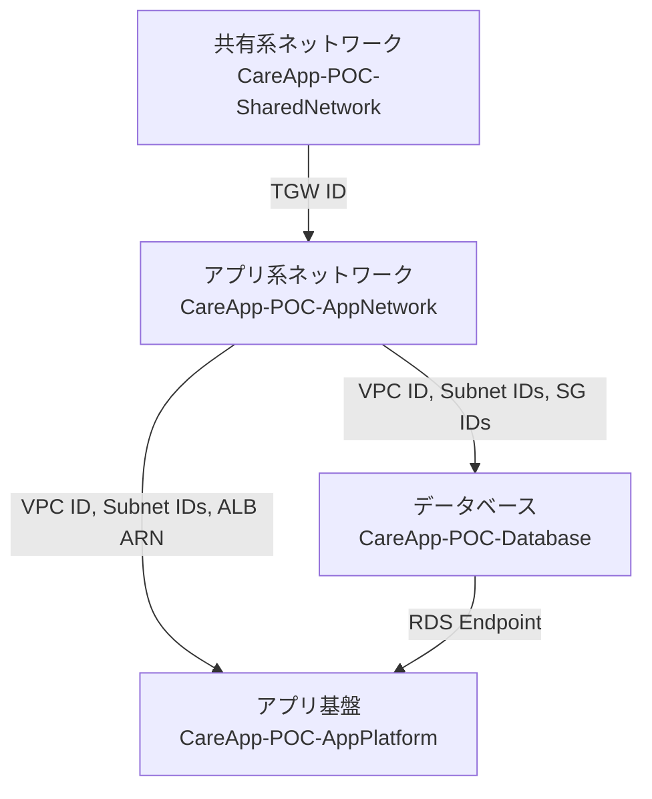

# インフラストラクチャ - CloudFormation

## 概要

このディレクトリには、介護保険申請管理システムのAWSインフラをデプロイするためのCloudFormationテンプレートが含まれています。

## 技術方針

### スタック分割方針

**Cross-Stack References** を採用し、以下の4つの独立したスタックに分割：

1. **共有系ネットワークスタック**: 共有系VPC、Transit Gateway、Client VPN
2. **アプリ系ネットワークスタック**: アプリ系VPC、サブネット、ALB、セキュリティグループ
3. **データベーススタック**: RDS PostgreSQL
4. **アプリ基盤スタック**: ECS Cluster、ECR、Cognito、S3、IAMロール

### 命名規則

```
スタック名: CareApp-{Environment}-{Component}
  例: CareApp-POC-SharedNetwork
      CareApp-POC-AppNetwork
      CareApp-POC-Database
      CareApp-POC-AppPlatform

Export名: CareApp-{Environment}-{Component}-{Resource}
  例: CareApp-POC-AppNetwork-ECSClusterName
      CareApp-POC-AppNetwork-ALBTargetGroupArn

リソース名: CareApp-{Environment}-{ResourceType}-{Name}
  例: CareApp-POC-VPC-Shared
      CareApp-POC-ECSCluster-Main
```

### 責任分解

**インフラチーム（CloudFormation）の責任**:
- ネットワーク構成（VPC、サブネット、ルーティング）
- Transit Gateway、Client VPN
- ECS Cluster（空のクラスター）
- ALB、Target Group
- RDS PostgreSQL
- Cognito User Pool
- S3バケット、ECRリポジトリ
- IAMロール、セキュリティグループ

**アプリチーム（GitHub Actions）の責任**:
- Dockerイメージのビルド、ECRへのpush
- ECS Task Definition
- ECS Service（CloudFormationが作成したTarget Groupに紐付け）

### パラメータ管理

- 環境依存パラメータは `parameters-{environment}.json` で管理
- シークレット情報（DBパスワード等）はAWS Secrets Managerで管理
- VPCのCIDR等、環境ごとに異なる値はパラメータ化

## ディレクトリ構成

```
infra/
├── README.md                          # このファイル
├── shared/
│   ├── network.yaml                   # 共有系VPC、TGW、Client VPN
│   └── parameters-poc.json            # POC環境用パラメータ
├── app/
│   ├── network.yaml                   # アプリ系VPC、サブネット、ALB
│   ├── database.yaml                  # RDS PostgreSQL
│   ├── platform.yaml                  # ECS、Cognito、S3、ECR
│   └── parameters-poc.json            # POC環境用パラメータ
└── docs/
    └── deploy-guide.md                # デプロイ手順書
```

## デプロイ順序

POC環境のデプロイは以下の順序で実行：

```bash
# 1. 共有系ネットワークスタック
aws cloudformation create-stack \
  --stack-name CareApp-POC-SharedNetwork \
  --template-body file://shared/network.yaml \
  --parameters file://shared/parameters-poc.json \
  --capabilities CAPABILITY_IAM

# 2. アプリ系ネットワークスタック（共有系完了後）
aws cloudformation create-stack \
  --stack-name CareApp-POC-AppNetwork \
  --template-body file://app/network.yaml \
  --parameters file://app/parameters-poc.json \
  --capabilities CAPABILITY_IAM

# 3. データベーススタック（アプリ系ネットワーク完了後）
aws cloudformation create-stack \
  --stack-name CareApp-POC-Database \
  --template-body file://app/database.yaml \
  --parameters file://app/parameters-poc.json \
  --capabilities CAPABILITY_IAM

# 4. アプリ基盤スタック（データベース完了後）
aws cloudformation create-stack \
  --stack-name CareApp-POC-AppPlatform \
  --template-body file://app/platform.yaml \
  --parameters file://app/parameters-poc.json \
  --capabilities CAPABILITY_IAM
```

## スタック間の依存関係



## Exports一覧

各スタックが出力する主なExports：

### 共有系ネットワークスタック
- `CareApp-POC-SharedNetwork-VPCID`
- `CareApp-POC-SharedNetwork-TransitGatewayID`
- `CareApp-POC-SharedNetwork-ClientVPNEndpointID`

### アプリ系ネットワークスタック
- `CareApp-POC-AppNetwork-VPCID`
- `CareApp-POC-AppNetwork-PublicSubnet1ID`
- `CareApp-POC-AppNetwork-PublicSubnet2ID`
- `CareApp-POC-AppNetwork-PrivateSubnetApp1ID`
- `CareApp-POC-AppNetwork-PrivateSubnetApp2ID`
- `CareApp-POC-AppNetwork-PrivateSubnetDB1ID`
- `CareApp-POC-AppNetwork-ALBArn`
- `CareApp-POC-AppNetwork-ALBDNSName`
- `CareApp-POC-AppNetwork-FrontendTargetGroupArn`
- `CareApp-POC-AppNetwork-BackendTargetGroupArn`
- `CareApp-POC-AppNetwork-ECSSecurityGroupID`
- `CareApp-POC-AppNetwork-RDSSecurityGroupID`

### データベーススタック
- `CareApp-POC-Database-RDSEndpoint`
- `CareApp-POC-Database-RDSPort`
- `CareApp-POC-Database-DBName`
- `CareApp-POC-Database-SecretArn`

### アプリ基盤スタック
- `CareApp-POC-AppPlatform-ECSClusterName`
- `CareApp-POC-AppPlatform-ECSClusterArn`
- `CareApp-POC-AppPlatform-ECRRepositoryFrontendUri`
- `CareApp-POC-AppPlatform-ECRRepositoryBackendUri`
- `CareApp-POC-AppPlatform-TaskExecutionRoleArn`
- `CareApp-POC-AppPlatform-TaskRoleArn`
- `CareApp-POC-AppPlatform-CognitoUserPoolId`
- `CareApp-POC-AppPlatform-CognitoUserPoolClientId`
- `CareApp-POC-AppPlatform-S3BucketName`

## 環境の違い（POC vs 本番）

| 項目 | POC | 本番 |
|-----|-----|-----|
| AWSアカウント | 1アカウント | 2アカウント（共有系+本番） |
| VPC構成 | 2VPC（10.0.0.0/16, 10.1.0.0/16） | 2VPC（別アカウント） |
| 接続方式 | Client VPN | Direct Connect |
| RDS構成 | Single-AZ | Multi-AZ |
| RDSインスタンス | db.t3.micro | db.m5.large |
| 暗号化 | 無効 | 有効 |
| WAF | なし | あり |
| バックアップ | 7日 | 30日 |
| DR | なし | 大阪リージョンコピー |

## ベストプラクティス

### 1. 変更セット（Change Sets）の利用

本番環境への適用前に、必ず変更セットを作成して差分を確認：

```bash
aws cloudformation create-change-set \
  --stack-name CareApp-POC-AppNetwork \
  --change-set-name update-20250930 \
  --template-body file://app/network.yaml \
  --parameters file://app/parameters-poc.json
```

### 2. ドリフト検出

定期的にドリフト検出を実行し、手動変更を確認：

```bash
aws cloudformation detect-stack-drift \
  --stack-name CareApp-POC-AppNetwork
```

### 3. タグ戦略

すべてのリソースに以下のタグを付与：
- `Project`: CareApp
- `Environment`: POC/Production
- `ManagedBy`: CloudFormation
- `CostCenter`: （コストセンター）

### 4. セキュリティ

- DBパスワード等のシークレットはSecrets Managerで管理
- IAMロールは最小権限の原則に従う
- セキュリティグループは必要最小限のポートのみ開放

### 5. コスト管理

- POC環境は不要時に停止（RDS停止、ECS Desired Count 0）
- タグベースのコスト配分を活用

## トラブルシューティング

### スタック作成失敗時

```bash
# エラー詳細確認
aws cloudformation describe-stack-events \
  --stack-name CareApp-POC-AppNetwork \
  --max-items 20

# ロールバック
aws cloudformation delete-stack \
  --stack-name CareApp-POC-AppNetwork
```

### スタック更新失敗時

```bash
# 変更セットの確認
aws cloudformation describe-change-set \
  --stack-name CareApp-POC-AppNetwork \
  --change-set-name update-20250930

# ロールバック（前のバージョンに戻す）
aws cloudformation cancel-update-stack \
  --stack-name CareApp-POC-AppNetwork
```

## 参考リンク

- [AWS CloudFormation ベストプラクティス](https://docs.aws.amazon.com/ja_jp/AWSCloudFormation/latest/UserGuide/best-practices.html)
- [クロススタック参照](https://docs.aws.amazon.com/ja_jp/AWSCloudFormation/latest/UserGuide/walkthrough-crossstackref.html)
- [AWS リソース命名規則](https://docs.aws.amazon.com/ja_jp/general/latest/gr/aws-arns-and-namespaces.html)

---

**作成日**: 2025-09-30
**管理者**: インフラチーム